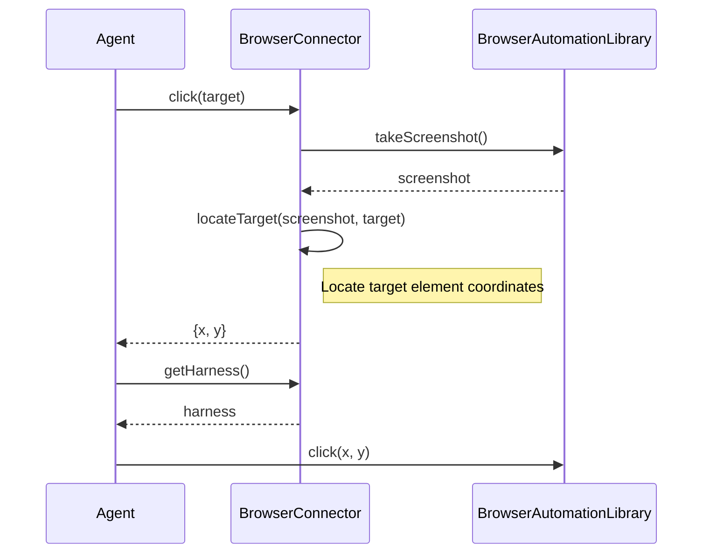
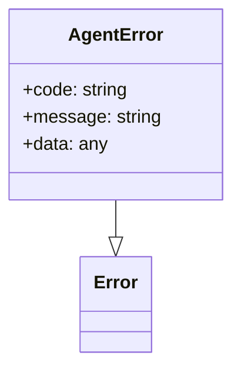

<details>
<summary>Relevant source files</summary>

The following files were used as context for generating this wiki page:

- [packages/magnitude-core/src/actions/webActions.ts](https://github.com/agattani123/magnitude/blob/main/packages/magnitude-core/src/actions/webActions.ts)
- [packages/magnitude-core/src/connectors/browserConnector.ts](https://github.com/agattani123/magnitude/blob/main/packages/magnitude-core/src/connectors/browserConnector.ts)
- [packages/magnitude-core/src/agent/index.ts](https://github.com/agattani123/magnitude/blob/main/packages/magnitude-core/src/agent/index.ts)
- [packages/magnitude-core/src/agent/errors.ts](https://github.com/agattani123/magnitude/blob/main/packages/magnitude-core/src/agent/errors.ts)
- [packages/magnitude-core/src/utils/zod.ts](https://github.com/agattani123/magnitude/blob/main/packages/magnitude-core/src/utils/zod.ts)
</details>

# Browser Automation

## Introduction

Browser Automation is a core feature of the Magnitude project that enables programmatic interaction with web browsers. It provides a set of actions and utilities to automate various browser tasks, such as navigating to websites, interacting with web elements, and capturing screenshots. This feature is essential for building automated testing frameworks, web scraping tools, or any application that requires controlled browser manipulation.

## Architecture Overview

The Browser Automation functionality is implemented within the `BrowserConnector` class, which serves as a connector between the Agent and the underlying browser automation library (e.g., Puppeteer, Selenium). The `BrowserConnector` manages the lifecycle of the browser instance and exposes methods for performing various browser-related operations.

```mermaid
classDiagram
    Agent ..> BrowserConnector
    BrowserConnector ..> BrowserAutomationLibrary
    class Agent {
        -connectors: Map~Connector~
        +require(connector: Connector): Connector
    }
    class BrowserConnector {
        -browser: BrowserInstance
        +navigate(url: string): Promise~void~
        +click(target: string): Promise~void~
        +getScreenshot(): Promise~Buffer~
        +locateTarget(screenshot: Buffer, target: string): Promise~{x, y}~
    }
    class BrowserAutomationLibrary {
        +launchBrowser(): BrowserInstance
        +navigateTo(url: string): Promise~void~
        +click(x: number, y: number): Promise~void~
        +takeScreenshot(): Promise~Buffer~
    }
```

Sources: [packages/magnitude-core/src/connectors/browserConnector.ts](), [packages/magnitude-core/src/agent/index.ts]()

## Web Actions

Web Actions are a set of predefined actions that can be executed by the Agent to interact with the browser. These actions are defined in the `webActions.ts` file and leverage the `BrowserConnector` to perform the desired operations.

### Click Action

The `click` action allows the Agent to click on a specific target element within the browser window. It takes a `target` parameter, which is a string describing the element to be clicked (e.g., "Submit button", "Login link").



Sources: [packages/magnitude-core/src/actions/webActions.ts:18-25]()

## Error Handling

The Browser Automation feature includes error handling mechanisms to gracefully handle and report errors that may occur during browser interactions. The `AgentError` class is used to represent errors specific to the Agent and its connectors.



Sources: [packages/magnitude-core/src/agent/errors.ts]()

## Input Validation

To ensure the integrity of the input data for web actions, the project utilizes the `zod` library for input validation. The `webActions.ts` file defines a schema for the `click` action, specifying the expected format and constraints for the `target` parameter.

```javascript
z.object({
    target: z.string().describe("Where exactly to click"),
})
```

Sources: [packages/magnitude-core/src/actions/webActions.ts:9](), [packages/magnitude-core/src/utils/zod.ts]()

## Conclusion

The Browser Automation feature in the Magnitude project provides a robust and extensible framework for programmatically interacting with web browsers. It leverages the `BrowserConnector` and various web actions to enable tasks such as navigation, element interaction, and screenshot capture. The feature also includes input validation and error handling mechanisms to ensure reliable and consistent behavior.