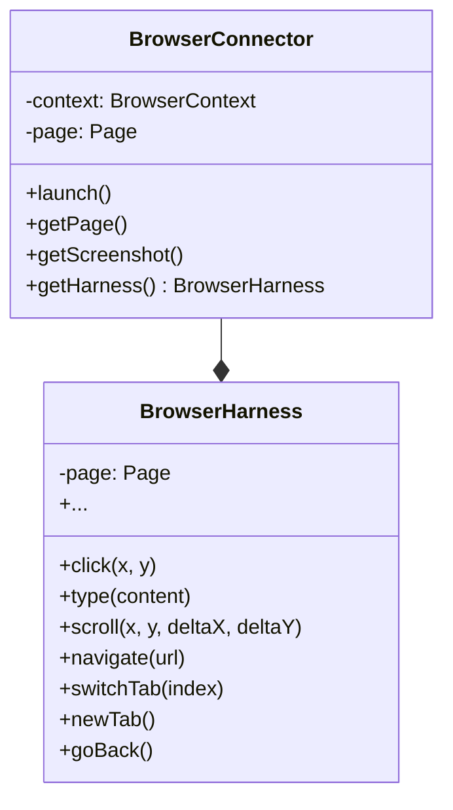
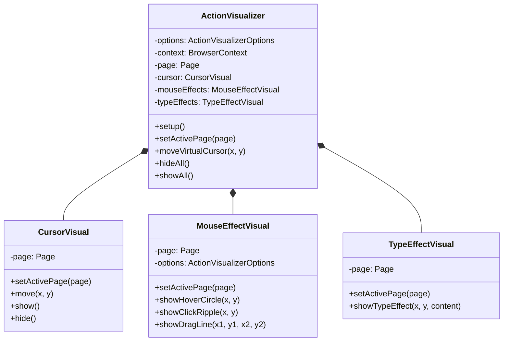
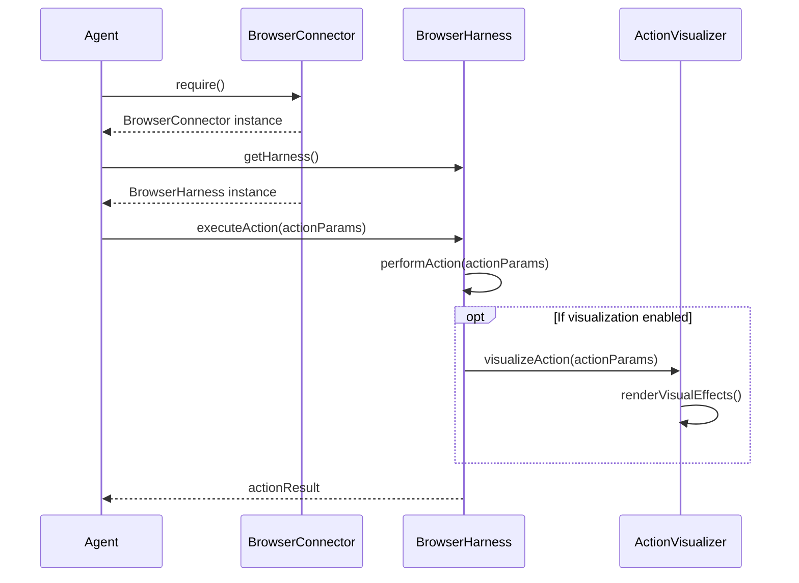

Relevant source files

The following files were used as context for generating this wiki page:

- [packages/magnitude-core/src/actions/webActions.ts](https://github.com/agattani123/magnitude/blob/main/packages/magnitude-core/src/actions/webActions.ts)
- [packages/magnitude-core/src/web/visualizer/index.ts](https://github.com/agattani123/magnitude/blob/main/packages/magnitude-core/src/web/visualizer/index.ts)
- [packages/magnitude-core/src/connectors/browserConnector.ts](https://github.com/agattani123/magnitude/blob/main/packages/magnitude-core/src/connectors/browserConnector.ts)
- [packages/magnitude-core/src/web/visualizer/cursor.ts](https://github.com/agattani123/magnitude/blob/main/packages/magnitude-core/src/web/visualizer/cursor.ts)
- [packages/magnitude-core/src/web/visualizer/mouseEffects.ts](https://github.com/agattani123/magnitude/blob/main/packages/magnitude-core/src/web/visualizer/mouseEffects.ts)

# Browser Automation

## Introduction

The "Browser Automation" functionality within the project provides a set of actions and utilities for interacting with web browsers programmatically. It allows for simulating user interactions such as clicking, typing, scrolling, and navigating within a browser context. This capability is crucial for automating web-based tasks, testing web applications, and enabling intelligent agents to interact with web interfaces.

The browser automation functionality is implemented using the Playwright library, which provides a high-level API for automating Chromium, Firefox, and WebKit browsers. The project defines various actions that can be executed within the browser context, such as clicking on specific targets, typing text, scrolling, switching tabs, and navigating to URLs.

## Architecture and Components

### Action Definitions

The project defines a set of actions related to browser automation in the `webActions.ts` file. These actions are created using the `createAction` utility, which allows for defining the action's name, description, input schema, and resolver function.

The following actions are defined for browser automation:

#### Target-based Actions

- `clickTargetAction`: Clicks on a specified target within the browser context.
- `scrollTargetAction`: Scrolls within a specified target container.

#### Coordinate-based Actions

- `clickCoordAction`: Clicks on a specific (x, y) coordinate within the browser context.
- `mouseDoubleClickAction`: Double-clicks on a specific (x, y) coordinate.
- `mouseRightClickAction`: Right-clicks on a specific (x, y) coordinate.
- `mouseDragAction`: Performs a drag operation from one coordinate to another.
- `scrollCoordAction`: Scrolls by a specified (deltaX, deltaY) amount at a given (x, y) coordinate.

#### Keyboard Actions

- `typeAction`: Types the specified text content.
- `keyboardEnterAction`: Simulates pressing the Enter key.
- `keyboardTabAction`: Simulates pressing the Tab key.
- `keyboardBackspaceAction`: Simulates pressing the Backspace key.
- `keyboardSelectAllAction`: Selects all text in the active text area.

#### Browser Navigation Actions

- `switchTabAction`: Switches to a specified tab index.
- `newTabAction`: Opens a new tab and switches to it.
- `navigateAction`: Navigates to a specified URL.
- `goBackAction`: Navigates back in the browser history.

#### Utility Action

- `waitAction`: Introduces a specified delay in seconds.

These actions are organized into three groups: `targetWebActions`, `coordWebActions`, and `agnosticWebActions`, which are exported as constants for use within the project.

### BrowserConnector

The `BrowserConnector` class, defined in `browserConnector.ts`, serves as the main interface for interacting with the browser context. It provides methods for launching a new browser instance, retrieving the current page, taking screenshots, and accessing the underlying Playwright `BrowserContext` and `Page` objects.

The `BrowserConnector` class also exposes a `getHarness` method, which returns a `BrowserHarness` instance. The `BrowserHarness` class encapsulates the logic for executing various browser automation actions, such as clicking, typing, scrolling, and navigating.

Sources: [packages/magnitude-core/src/connectors/browserConnector.ts](https://github.com/agattani123/magnitude/blob/main/packages/magnitude-core/src/connectors/browserConnector.ts)

### Action Visualizer

The `ActionVisualizer` class, defined in `visualizer/index.ts`, provides a visual representation of browser automation actions. It allows for displaying a virtual cursor, mouse effects (hover circle, click ripple, drag line), and type effects within the browser context.

The `ActionVisualizer` class is composed of several subcomponents:

- `CursorVisual`: Responsible for rendering and animating the virtual cursor.
- `MouseEffectVisual`: Handles the visual effects for mouse interactions (hover circle, click ripple, drag line).
- `TypeEffectVisual`: Visualizes the typing effect within text input areas.

Sources: [packages/magnitude-core/src/web/visualizer/index.ts](https://github.com/agattani123/magnitude/blob/main/packages/magnitude-core/src/web/visualizer/index.ts), [packages/magnitude-core/src/web/visualizer/cursor.ts](https://github.com/agattani123/magnitude/blob/main/packages/magnitude-core/src/web/visualizer/cursor.ts), [packages/magnitude-core/src/web/visualizer/mouseEffects.ts](https://github.com/agattani123/magnitude/blob/main/packages/magnitude-core/src/web/visualizer/mouseEffects.ts)

## Data Flow and Execution

The browser automation actions defined in `webActions.ts` are executed within the context of an `Agent` instance. The `Agent` class is responsible for managing the execution of actions and providing access to required connectors, such as the `BrowserConnector`.

When an action is executed, the following steps occur:

1. The `Agent` instance retrieves the `BrowserConnector` using the `require` method.
2. The `BrowserConnector` provides access to the underlying `BrowserHarness` instance.
3. The action's resolver function is invoked, which interacts with the `BrowserHarness` to perform the desired operation (e.g., clicking, typing, scrolling).
4. If visualization is enabled, the `ActionVisualizer` is used to render visual effects corresponding to the executed action.

Sources: [packages/magnitude-core/src/actions/webActions.ts](https://github.com/agattani123/magnitude/blob/main/packages/magnitude-core/src/actions/webActions.ts), [packages/magnitude-core/src/connectors/browserConnector.ts](https://github.com/agattani123/magnitude/blob/main/packages/magnitude-core/src/connectors/browserConnector.ts), [packages/magnitude-core/src/web/visualizer/index.ts](https://github.com/agattani123/magnitude/blob/main/packages/magnitude-core/src/web/visualizer/index.ts)

## Key Features and Components

| Feature/Component | Description |
| --- | --- |
| `clickTargetAction` | Clicks on a specified target within the browser context based on a target description. |
| `scrollTargetAction` | Scrolls within a specified target container by providing the target description and scroll deltas. |
| `clickCoordAction` | Clicks on a specific (x, y) coordinate within the browser context. |
| `mouseDoubleClickAction` | Double-clicks on a specific (x, y) coordinate. |
| `mouseRightClickAction` | Right-clicks on a specific (x, y) coordinate. |
| `mouseDragAction` | Performs a drag operation from one coordinate to another. |
| `scrollCoordAction` | Scrolls by a specified (deltaX, deltaY) amount at a given (x, y) coordinate. |
| `typeAction` | Types the specified text content into the active input area. |
| `keyboardEnterAction` | Simulates pressing the Enter key. |
| `keyboardTabAction` | Simulates pressing the Tab key. |
| `keyboardBackspaceAction` | Simulates pressing the Backspace key. |
| `keyboardSelectAllAction` | Selects all text in the active text area. |
| `switchTabAction` | Switches to a specified tab index within the browser context. |
| `newTabAction` | Opens a new tab and switches to it. |
| `navigateAction` | Navigates to a specified URL within the browser context. |
| `goBackAction` | Navigates back in the browser history. |
| `waitAction` | Introduces a specified delay in seconds. |
| `BrowserConnector` | Provides an interface for interacting with the browser context, launching a new instance, taking screenshots, and accessing the underlying Playwright objects. |
| `BrowserHarness` | Encapsulates the logic for executing various browser automation actions, such as clicking, typing, scrolling, and navigating. |
| `ActionVisualizer` | Renders visual effects corresponding to executed browser automation actions, including a virtual cursor, mouse effects, and type effects. |

Sources: [packages/magnitude-core/src/actions/webActions.ts](https://github.com/agattani123/magnitude/blob/main/packages/magnitude-core/src/actions/webActions.ts), [packages/magnitude-core/src/connectors/browserConnector.ts](https://github.com/agattani123/magnitude/blob/main/packages/magnitude-core/src/connectors/browserConnector.ts), [packages/magnitude-core/src/web/visualizer/index.ts](https://github.com/agattani123/magnitude/blob/main/packages/magnitude-core/src/web/visualizer/index.ts)

## Conclusion

The "Browser Automation" functionality within the project provides a comprehensive set of actions and utilities for programmatically interacting with web browsers. It enables simulating user interactions, automating web-based tasks, and facilitating intelligent agents to interact with web interfaces. The architecture is built around the Playwright library and includes components for defining actions, executing them within a browser context, and visualizing the effects of these actions. This functionality is a crucial part of the project, enabling a wide range of web automation scenarios.