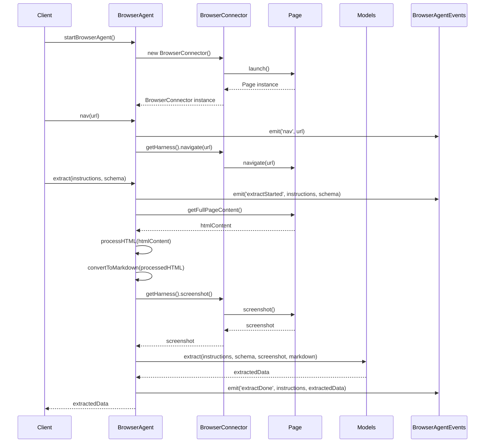

<details>
<summary>Relevant source files</summary>

The following files were used as context for generating this wiki page:

- [packages/magnitude-core/src/agent/browserAgent.ts](https://github.com/agattani123/magnitude/blob/main/packages/magnitude-core/src/agent/browserAgent.ts)

</details>

# Browser Automation

## Introduction

The Browser Automation feature in this project provides a way to interact with web pages and extract data from them using a combination of Playwright (a browser automation library) and Zod (a data validation library). It allows you to navigate to web pages, extract structured data based on defined schemas, and perform various operations on the page content.

The main component responsible for browser automation is the `BrowserAgent` class, which extends the `Agent` class and incorporates the `BrowserConnector` to interact with the browser. The `BrowserAgent` class provides methods for navigating to URLs, extracting data based on Zod schemas, and potentially performing other actions on the web page.

## Architecture and Components

### BrowserAgent

The `BrowserAgent` class is the central component for browser automation. It inherits from the `Agent` class and includes the `BrowserConnector` as one of its connectors. The `BrowserAgent` has the following key components and methods:

#### Constructor

```typescript
constructor({ agentOptions, browserOptions }: { agentOptions?: Partial<AgentOptions>, browserOptions?: BrowserConnectorOptions }) {
    super({
        ...agentOptions,
        connectors: [new BrowserConnector(browserOptions || {}), ...(agentOptions?.connectors ?? [])]
    });
}
```

The constructor takes optional `agentOptions` and `browserOptions` as parameters. It creates a new instance of the `BrowserConnector` and includes it in the list of connectors for the `Agent` class.

#### nav

```typescript
async nav(url: string): Promise<void> {
    this.browserAgentEvents.emit('nav', url);
    await this.require(BrowserConnector).getHarness().navigate(url);
}
```

The `nav` method is used to navigate to a specified URL. It emits a `'nav'` event with the URL and then calls the `navigate` method of the `BrowserConnector` to perform the actual navigation.

#### extract

```typescript
async extract<T extends Schema>(instructions: string, schema: T): Promise<z.infer<T>> {
    this.browserAgentEvents.emit('extractStarted', instructions, schema);
    const htmlContent = await getFullPageContent(this.page);
    // ... (omitted for brevity)
    const data = await this.models.extract(instructions, schema, screenshot, markdown);
    this.browserAgentEvents.emit('extractDone', instructions, data);
    return data;
}
```

The `extract` method is used to extract structured data from the current web page based on a provided Zod schema. It emits an `'extractStarted'` event with the instructions and schema, retrieves the full page content (including iframes), processes the HTML, converts it to Markdown, and then calls the `extract` method of the `models` object with the instructions, schema, screenshot, and Markdown content. Finally, it emits an `'extractDone'` event with the instructions and extracted data, and returns the extracted data.

Sources: [packages/magnitude-core/src/agent/browserAgent.ts:1-107]()

### BrowserConnector

The `BrowserConnector` is responsible for managing the browser instance and providing methods to interact with the web page. It is used by the `BrowserAgent` class to perform browser-related operations.

```typescript
import { BrowserContext, Page } from "playwright";
import { Agent, AgentOptions } from ".";
import { BrowserConnector, BrowserConnectorOptions } from "@/connectors/browserConnector";
```

The `BrowserConnector` is imported from the `@/connectors/browserConnector` module, and it likely interacts with the Playwright library to control the browser.

Sources: [packages/magnitude-core/src/agent/browserAgent.ts:2-4]()

### Data Extraction and Processing

The `extract` method in the `BrowserAgent` class involves several steps to extract data from the web page based on the provided Zod schema:

1. **Retrieve Full Page Content**: The `getFullPageContent` function is used to retrieve the full HTML content of the page, including the content of any iframes. It iterates through all iframe elements, retrieves their content, and replaces the iframe elements with their respective content.

```typescript
async function getFullPageContent(page: Page): Promise<string> {
    // ... (omitted for brevity)
}
```

Sources: [packages/magnitude-core/src/agent/browserAgent.ts:44-76]()

2. **Process HTML**: The HTML content is processed using the `partitionHtml` function from the `magnitude-extract` library. This function partitions the HTML into different elements and extracts various components like images, forms, and links.

```typescript
const partitionOptions: PartitionOptions = {
    // ... (omitted for brevity)
};
const result = partitionHtml(htmlContent, partitionOptions);
```

Sources: [packages/magnitude-core/src/agent/browserAgent.ts:83-93]()

3. **Convert to Markdown**: The processed HTML is then converted to Markdown format using the `serializeToMarkdown` function from the `magnitude-extract` library.

```typescript
const markdownOptions: MarkdownSerializerOptions = {
    // ... (omitted for brevity)
};
const markdown = serializeToMarkdown(result, markdownOptions);
```

Sources: [packages/magnitude-core/src/agent/browserAgent.ts:96-105]()

4. **Extract Data**: The `extract` method of the `models` object is called with the instructions, Zod schema, screenshot, and Markdown content. This method likely performs the actual data extraction based on the provided schema and returns the extracted data.

```typescript
const screenshot = await this.require(BrowserConnector).getHarness().screenshot();
const data = await this.models.extract(instructions, schema, screenshot, markdown);
```

Sources: [packages/magnitude-core/src/agent/browserAgent.ts:107-108]()

### Event Handling

The `BrowserAgent` class uses an `EventEmitter` instance (`browserAgentEvents`) to emit events during various stages of the data extraction process. The following events are defined in the `BrowserAgentEvents` interface:

```typescript
export interface BrowserAgentEvents {
    'nav': (url: string) => void;
    'extractStarted': (instructions: string, schema: ZodSchema) => void;
    'extractDone': (instructions: string, data: ExtractedOutput) => void;
}
```

- `'nav'`: Emitted when navigating to a URL, with the URL as the argument.
- `'extractStarted'`: Emitted when the data extraction process starts, with the instructions and Zod schema as arguments.
- `'extractDone'`: Emitted when the data extraction process is completed, with the instructions and extracted data as arguments.

Sources: [packages/magnitude-core/src/agent/browserAgent.ts:30-33]()

## Data Flow

The data flow for the browser automation process can be represented using the following sequence diagram:



1. The client calls `startBrowserAgent()` to create a new instance of `BrowserAgent`.
2. The `BrowserAgent` creates a new instance of `BrowserConnector` and launches a new browser page.
3. The client calls `nav(url)` to navigate to a specific URL.
4. The `BrowserAgent` emits a `'nav'` event and calls the `navigate` method of the `BrowserConnector`, which in turn navigates the browser page to the specified URL.
5. The client calls `extract(instructions, schema)` to extract data from the current page based on the provided instructions and Zod schema.
6. The `BrowserAgent` emits an `'extractStarted'` event and retrieves the full page content, including the content of iframes.
7. The `BrowserAgent` processes the HTML content and converts it to Markdown format.
8. The `BrowserAgent` captures a screenshot of the page through the `BrowserConnector`.
9. The `BrowserAgent` calls the `extract` method of the `Models` object, passing the instructions, schema, screenshot, and Markdown content.
10. The `Models` object performs the data extraction and returns the extracted data to the `BrowserAgent`.
11. The `BrowserAgent` emits an `'extractDone'` event with the instructions and extracted data, and returns the extracted data to the client.

Sources: [packages/magnitude-core/src/agent/browserAgent.ts]()

## Configuration and Options

The `BrowserAgent` and `BrowserConnector` classes can be configured with various options:

### AgentOptions

The `AgentOptions` interface defines the options for the `Agent` class, which is extended by the `BrowserAgent`. It likely includes options related to the agent's behavior, such as logging, caching, and other settings.

### BrowserConnectorOptions

The `BrowserConnectorOptions` interface defines the options specific to the `BrowserConnector`. These options may include settings for the browser instance, such as the browser type, headless mode, and other Playwright-related configurations.

```typescript
import { BrowserConnector, BrowserConnectorOptions } from "@/connectors/browserConnector";
```

The `BrowserConnectorOptions` interface is imported from the `@/connectors/browserConnector` module, but its specific properties are not defined in the provided source file.

Sources: [packages/magnitude-core/src/agent/browserAgent.ts:4]()

## Conclusion

The Browser Automation feature in this project provides a powerful way to interact with web pages, extract structured data based on defined schemas, and perform various operations on the page content. It leverages the Playwright library for browser automation and the Zod library for data validation and extraction.

The `BrowserAgent` class serves as the central component for browser automation, providing methods for navigating to URLs, extracting data based on Zod schemas, and potentially performing other actions on the web page. It works in conjunction with the `BrowserConnector` to manage the browser instance and interact with the web page.

The data extraction process involves retrieving the full page content, processing the HTML, converting it to Markdown format, and then extracting the data based on the provided Zod schema. The `BrowserAgent` also emits events at various stages of the data extraction process, allowing for event-driven workflows and monitoring.

Overall, the Browser Automation feature provides a flexible and extensible way to automate web interactions and data extraction, making it a valuable component in the project's ecosystem.