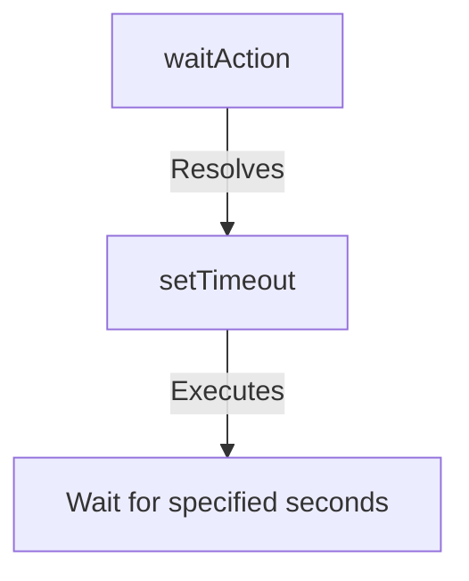

<details>
<summary>Relevant source files</summary>

The following files were used as context for generating this wiki page:

- [packages/magnitude-core/src/actions/webActions.ts](https://github.com/agattani123/magnitude/blob/main/packages/magnitude-core/src/actions/webActions.ts)

</details>

# Browser Automation

## Introduction

The "Browser Automation" module within the project provides a set of actions and utilities for interacting with web browsers programmatically. These actions enable tasks such as clicking elements, typing text, scrolling, navigating between pages, and managing browser tabs. The module is designed to work in conjunction with a `BrowserConnector` component, which serves as an interface for controlling the browser.

## Action Definitions

The module defines several action types, each representing a specific browser interaction. These actions are created using the `createAction` function and are categorized based on their functionality.

### Mouse Actions

#### `clickCoordAction`

This action simulates a mouse click at a specified coordinate on the screen.

```mermaid
flowchart TD
    A[clickCoordAction] -->|Resolves| B[BrowserConnector.getHarness().click]
    B -->|Executes| C[Click at (x, y) coordinates]
```

Sources: [webActions.ts:39-47]()

#### `mouseDoubleClickAction`

This action performs a double-click at a specified coordinate on the screen.

```mermaid
flowchart TD
    A[mouseDoubleClickAction] -->|Resolves| B[BrowserConnector.getHarness().doubleClick]
    B -->|Executes| C[Double-click at (x, y) coordinates]
```

Sources: [webActions.ts:49-58]()

#### `mouseRightClickAction`

This action simulates a right-click at a specified coordinate on the screen.

```mermaid
flowchart TD
    A[mouseRightClickAction] -->|Resolves| B[BrowserConnector.getHarness().rightClick]
    B -->|Executes| C[Right-click at (x, y) coordinates]
```

Sources: [webActions.ts:60-69]()

#### `mouseDragAction`

This action simulates a mouse drag operation, where the mouse is clicked and held at one coordinate, then released at another coordinate.

```mermaid
flowchart TD
    A[mouseDragAction] -->|Resolves| B[BrowserConnector.getHarness().drag]
    B -->|Executes| C[Drag from (x1, y1) to (x2, y2) coordinates]
```

Sources: [webActions.ts:71-82]()

### Keyboard Actions

#### `typeAction`

This action types the specified text content into the currently focused element.

```mermaid
flowchart TD
    A[typeAction] -->|Resolves| B[BrowserConnector.getHarness().type]
    B -->|Executes| C[Type specified content]
```

Sources: [webActions.ts:84-93]()

#### `keyboardEnterAction`

This action simulates pressing the Enter key.

```mermaid
flowchart TD
    A[keyboardEnterAction] -->|Resolves| B[BrowserConnector.getHarness().enter]
    B -->|Executes| C[Press Enter key]
```

Sources: [webActions.ts:95-101]()

#### `keyboardTabAction`

This action simulates pressing the Tab key.

```mermaid
flowchart TD
    A[keyboardTabAction] -->|Resolves| B[BrowserConnector.getHarness().tab]
    B -->|Executes| C[Press Tab key]
```

Sources: [webActions.ts:103-109]()

#### `keyboardBackspaceAction`

This action simulates pressing the Backspace key.

```mermaid
flowchart TD
    A[keyboardBackspaceAction] -->|Resolves| B[BrowserConnector.getHarness().backspace]
    B -->|Executes| C[Press Backspace key]
```

Sources: [webActions.ts:111-117]()

#### `keyboardSelectAllAction`

This action selects all content in the currently focused text area by simulating the "Select All" keyboard shortcut (typically Ctrl+A).

```mermaid
flowchart TD
    A[keyboardSelectAllAction] -->|Resolves| B[BrowserConnector.getHarness().selectAll]
    B -->|Executes| C[Select all content in focused text area]
```

Sources: [webActions.ts:119-127]()

### Scrolling Actions

#### `scrollCoordAction`

This action scrolls the page by a specified number of pixels horizontally and vertically, starting from a given coordinate.

```mermaid
flowchart TD
    A[scrollCoordAction] -->|Resolves| B[BrowserConnector.getHarness().scroll]
    B -->|Executes| C[Scroll (deltaX, deltaY) pixels from (x, y) coordinates]
```

Sources: [webActions.ts:129-140]()

### Tab Management Actions

#### `switchTabAction`

This action switches the browser to a specified tab index.

```mermaid
flowchart TD
    A[switchTabAction] -->|Resolves| B[BrowserConnector.getHarness().switchTab]
    B -->|Executes| C[Switch to tab at specified index]
```

Sources: [webActions.ts:142-151]()

#### `newTabAction`

This action opens a new tab in the browser and switches to it.

```mermaid
flowchart TD
    A[newTabAction] -->|Resolves| B[BrowserConnector.getHarness().newTab]
    B -->|Executes| C[Open and switch to new tab]
```

Sources: [webActions.ts:153-160]()

### Navigation Actions

#### `navigateAction`

This action navigates the browser to a specified URL.

```mermaid
flowchart TD
    A[navigateAction] -->|Resolves| B[BrowserConnector.getHarness().navigate]
    B -->|Executes| C[Navigate to specified URL]
```

Sources: [webActions.ts:162-171]()

#### `goBackAction`

This action navigates the browser back to the previous page in the history.

```mermaid
flowchart TD
    A[goBackAction] -->|Resolves| B[BrowserConnector.getHarness().goBack]
    B -->|Executes| C[Navigate back to previous page]
```

Sources: [webActions.ts:173-180]()

### Utility Actions

#### `waitAction`

This action introduces a delay by waiting for a specified number of seconds before continuing execution.



Sources: [webActions.ts:182-191]()

## Action Groups

The module exports several groups of actions, categorized based on their functionality and grounding requirements.

### `agnosticWebActions`

This group contains actions that are agnostic to grounding, meaning they do not require any specific visual or contextual information from the browser. These actions include:

- `newTabAction`
- `switchTabAction`
- `navigateAction`
- `typeAction`
- `keyboardEnterAction`
- `keyboardTabAction`
- `keyboardBackspaceAction`
- `keyboardSelectAllAction`
- `waitAction`

Sources: [webActions.ts:195-197]()

### `coordWebActions`

This group contains actions that operate on specific screen coordinates. These actions include:

- `clickCoordAction`
- `mouseDoubleClickAction`
- `mouseRightClickAction`
- `scrollCoordAction`
- `mouseDragAction`

Sources: [webActions.ts:200-202]()

### `targetWebActions`

This group contains actions that require grounding, meaning they need to locate and interact with specific targets on the screen based on visual or contextual information. These actions include:

- `clickTargetAction`
- `scrollTargetAction`

Sources: [webActions.ts:205-207]()

## Conclusion

The "Browser Automation" module provides a comprehensive set of actions for interacting with web browsers programmatically. These actions cover a wide range of functionalities, including mouse and keyboard interactions, scrolling, tab management, and navigation. The module is designed to work in conjunction with the `BrowserConnector` component, which serves as an interface for controlling the browser. By categorizing actions based on their grounding requirements, the module allows for efficient and targeted browser automation tasks.