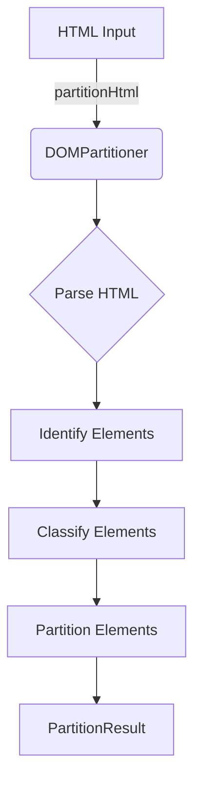
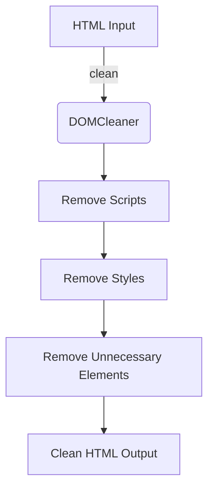
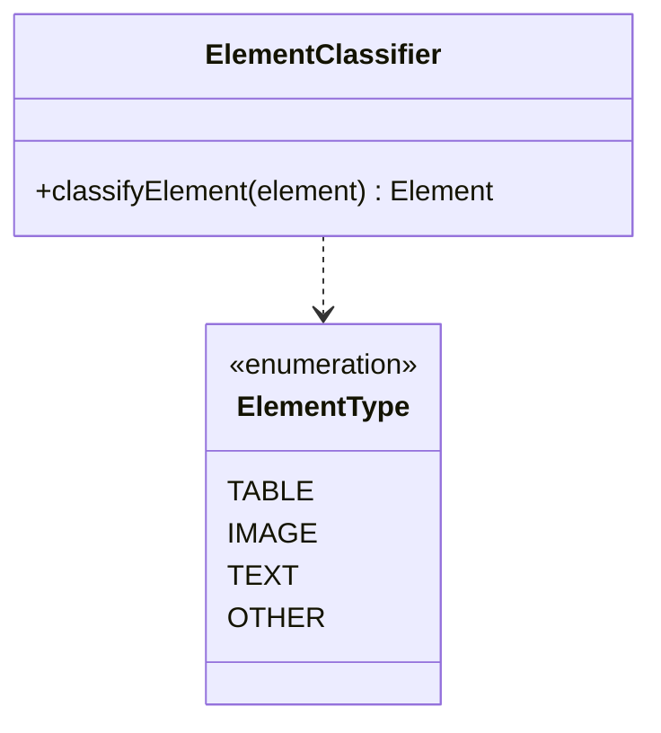
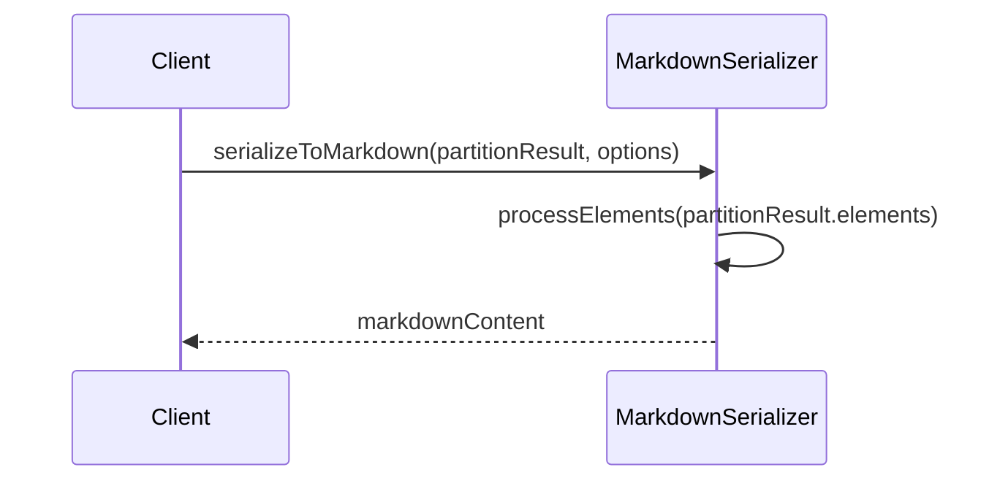
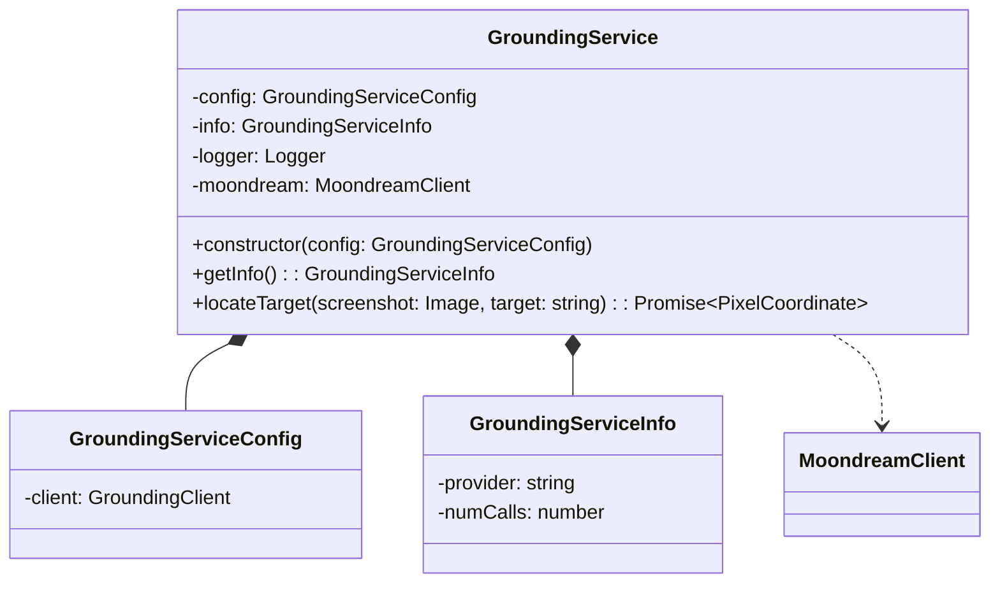

Relevant source files

The following files were used as context for generating this wiki page:

- [packages/magnitude-extract/src/index.ts](https://github.com/agattani123/magnitude/blob/main/packages/magnitude-extract/src/index.ts)
- [packages/magnitude-core/src/ai/grounding.ts](https://github.com/agattani123/magnitude/blob/main/packages/magnitude-core/src/ai/grounding.ts)

# Data Extraction

## Introduction

The "Data Extraction" feature in this project focuses on extracting structured data from unstructured HTML content. It provides a set of utilities and classes for cleaning, partitioning, and serializing HTML documents into a structured format suitable for further processing or analysis.

The main entry point for this feature is the `packages/magnitude-extract/src/index.ts` file, which exports various classes and functions related to HTML parsing, cleaning, and serialization. These include `DOMPartitioner`, `DOMCleaner`, `ElementClassifier`, `ContentHandlers`, and `MarkdownSerializer`.

Sources: [packages/magnitude-extract/src/index.ts](https://github.com/agattani123/magnitude/blob/main/packages/magnitude-extract/src/index.ts)

## HTML Partitioning

The `DOMPartitioner` class is responsible for partitioning an HTML document into a structured representation. It analyzes the document's structure and identifies different types of elements, such as tables, images, and text content.

The partitioning process can be summarized as follows:

1. The `partitionHtml` function creates a new instance of `DOMPartitioner` and calls its `partition` method with the input HTML.
2. The `DOMPartitioner` parses the HTML and identifies various elements within the document.
3. Each identified element is classified using the `ElementClassifier` to determine its type (e.g., table, image, text).
4. The classified elements are partitioned into a structured `PartitionResult` object, which contains the extracted data organized by element type.

Sources: [packages/magnitude-extract/src/index.ts](https://github.com/agattani123/magnitude/blob/main/packages/magnitude-extract/src/index.ts)

## HTML Cleaning

The `DOMCleaner` class is responsible for cleaning and sanitizing the HTML content before partitioning. It removes unnecessary elements, scripts, and styles, ensuring that the resulting HTML is clean and focused on the relevant content.

The cleaning process involves the following steps:

1. Remove script elements and inline scripts from the HTML.
2. Remove style elements and inline styles from the HTML.
3. Remove unnecessary elements based on predefined rules or configurations.
4. Return the cleaned HTML content.

Sources: [packages/magnitude-extract/src/index.ts](https://github.com/agattani123/magnitude/blob/main/packages/magnitude-extract/src/index.ts)

## Element Classification

The `ElementClassifier` class is responsible for classifying HTML elements into different types, such as tables, images, and text content. It uses a set of rules and heuristics to determine the element type based on its structure, attributes, and content.

The `classifyElement` method takes an HTML element as input and returns an `Element` object with the classified type and additional metadata.

Sources: [packages/magnitude-extract/src/index.ts](https://github.com/agattani123/magnitude/blob/main/packages/magnitude-extract/src/index.ts)

## Content Handlers

The `ContentHandlers` module provides a set of functions for handling different types of content extracted from the HTML. These functions can be used to process and transform the extracted data as needed.

| Function | Description |
| --- | --- |
| `handleTable` | Handles table elements by extracting data from rows and columns. |
| `handleImage` | Handles image elements by extracting image URLs and metadata. |
| `handleText` | Handles text elements by extracting and cleaning the text content. |

These content handlers can be customized or extended to meet specific requirements for processing different types of content.

Sources: [packages/magnitude-extract/src/index.ts](https://github.com/agattani123/magnitude/blob/main/packages/magnitude-extract/src/index.ts)

## Markdown Serialization

The `MarkdownSerializer` class is responsible for serializing the structured data extracted from the HTML into Markdown format. It provides a convenient way to represent the extracted data in a human-readable and portable format.

The `serializeToMarkdown` function takes a `PartitionResult` object and optional `MarkdownSerializerOptions` as input, and returns the serialized Markdown content.

The serialization process involves iterating over the extracted elements and converting them into their corresponding Markdown representations based on their types (e.g., tables, images, text).

Sources: [packages/magnitude-extract/src/index.ts](https://github.com/agattani123/magnitude/blob/main/packages/magnitude-extract/src/index.ts)

## Grounding Service

The `GroundingService` class, located in `packages/magnitude-core/src/ai/grounding.ts`, is responsible for translating high-level web actions into precise, executable actions. It uses the Moondream vision model to locate targets on a webpage with pixel precision.

The `locateTarget` method takes a screenshot and a target description as input, and returns the pixel coordinates of the target on the webpage. It uses the Moondream API to locate the target based on the provided description.

Sources: [packages/magnitude-core/src/ai/grounding.ts](https://github.com/agattani123/magnitude/blob/main/packages/magnitude-core/src/ai/grounding.ts)

## Conclusion

The "Data Extraction" feature in this project provides a comprehensive set of utilities for extracting structured data from unstructured HTML content. It includes functionality for cleaning, partitioning, classifying, and serializing HTML documents into a structured format suitable for further processing or analysis. Additionally, the `GroundingService` class enables translating high-level web actions into precise, executable actions using the Moondream vision model.