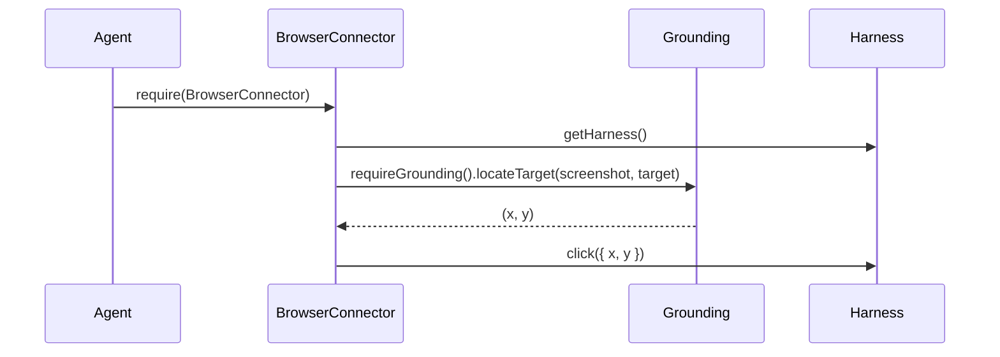
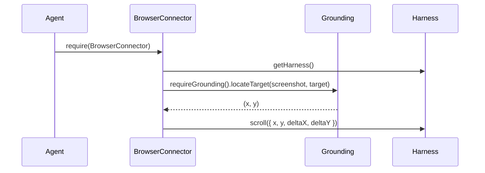
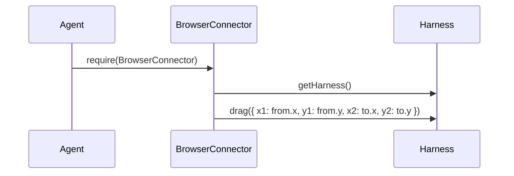
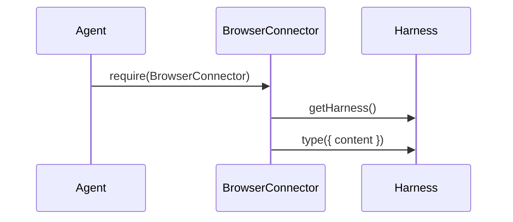
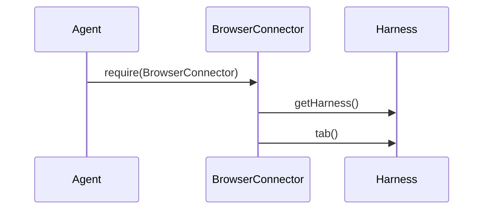
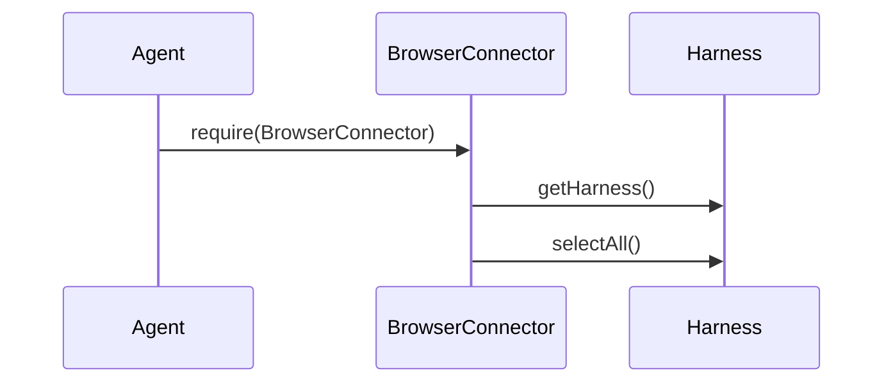
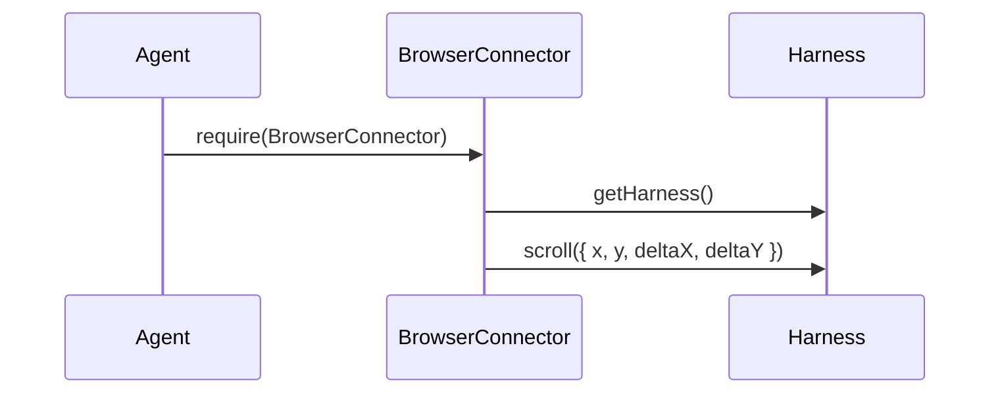
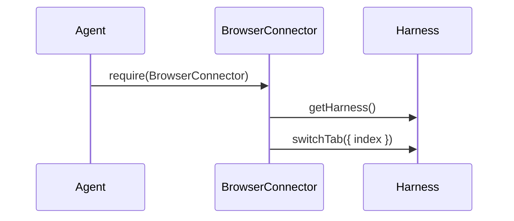
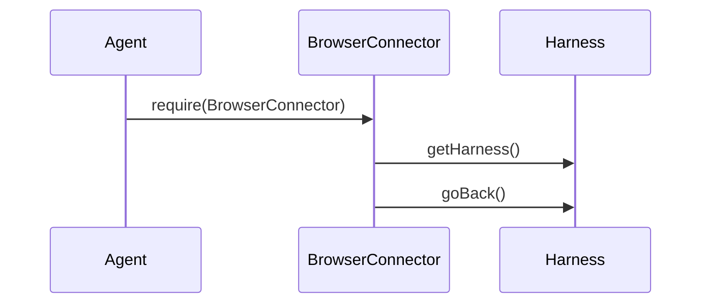
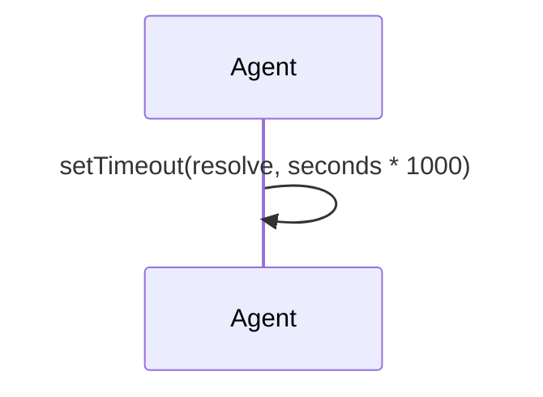

Relevant source files

The following files were used as context for generating this wiki page:

- [packages/magnitude-core/src/actions/webActions.ts](https://github.com/agattani123/magnitude/blob/main/packages/magnitude-core/src/actions/webActions.ts)

# Navigation and Interaction

## Introduction

The "Navigation and Interaction" module within the project provides a set of actions and utilities for interacting with web browsers and web applications. These actions enable tasks such as clicking, scrolling, typing, navigating between pages, and managing browser tabs. The module is designed to work in conjunction with the `BrowserConnector` and a browser automation harness, allowing for programmatic control and automation of web-based tasks.

## Action Definitions

The module defines several action types, each with its own schema, resolver function, and optional rendering function. These actions are created using the `createAction` utility function.

### Mouse Actions

#### `clickTargetAction`

This action allows clicking on a specific target element on the web page, identified by a string description. It requires the `BrowserConnector` and uses the `locateTarget` function from the grounding module to determine the coordinates of the target element. The action then calls the `click` method of the browser harness with the calculated coordinates.

Sources: [webActions.ts:14-24]()

#### `scrollTargetAction`

This action allows scrolling within a specific target element on the web page, identified by a string description. It requires the `BrowserConnector` and uses the `locateTarget` function from the grounding module to determine the coordinates of the target element. The action then calls the `scroll` method of the browser harness with the calculated coordinates and the specified scroll deltas.

Sources: [webActions.ts:41-54]()

#### `clickCoordAction`

This action allows clicking on a specific set of coordinates on the web page. It requires the `BrowserConnector` and calls the `click` method of the browser harness with the provided coordinates.

Sources: [webActions.ts:57-67]()

#### `mouseDoubleClickAction`

This action allows double-clicking on a specific set of coordinates on the web page. It requires the `BrowserConnector` and calls the `doubleClick` method of the browser harness with the provided coordinates.

Sources: [webActions.ts:70-79]()

#### `mouseRightClickAction`

This action allows right-clicking on a specific set of coordinates on the web page. It requires the `BrowserConnector` and calls the `rightClick` method of the browser harness with the provided coordinates.

Sources: [webActions.ts:82-91]()

#### `mouseDragAction`

This action allows dragging the mouse from one set of coordinates to another on the web page. It requires the `BrowserConnector` and calls the `drag` method of the browser harness with the provided start and end coordinates.

Sources: [webActions.ts:94-106]()

### Keyboard Actions

#### `typeAction`

This action allows typing a string of text into the currently focused element on the web page. It requires the `BrowserConnector` and calls the `type` method of the browser harness with the provided text content.

Sources: [webActions.ts:109-119]()

#### `keyboardEnterAction`

This action simulates pressing the "Enter" key on the keyboard. It requires the `BrowserConnector` and calls the `enter` method of the browser harness.

Sources: [webActions.ts:122-128]()

#### `keyboardTabAction`

This action simulates pressing the "Tab" key on the keyboard. It requires the `BrowserConnector` and calls the `tab` method of the browser harness.

Sources: [webActions.ts:131-137]()

#### `keyboardBackspaceAction`

This action simulates pressing the "Backspace" key on the keyboard. It requires the `BrowserConnector` and calls the `backspace` method of the browser harness.

Sources: [webActions.ts:140-146]()

#### `keyboardSelectAllAction`

This action selects all text in the currently focused text area or input field, typically by simulating the "Ctrl+A" keyboard shortcut. It requires the `BrowserConnector` and calls the `selectAll` method of the browser harness.

Sources: [webActions.ts:149-157]()

### Scrolling Actions

#### `scrollCoordAction`

This action allows scrolling within a specific set of coordinates on the web page. It requires the `BrowserConnector` and calls the `scroll` method of the browser harness with the provided coordinates and scroll deltas.

Sources: [webActions.ts:173-184]()

### Tab Management Actions

#### `switchTabAction`

This action allows switching to a specific tab index within the browser. It requires the `BrowserConnector` and calls the `switchTab` method of the browser harness with the provided tab index.

Sources: [webActions.ts:189-198]()

#### `newTabAction`

This action opens a new tab in the browser and switches to it. It requires the `BrowserConnector` and calls the `newTab` method of the browser harness.

Sources: [webActions.ts:201-209]()

### Navigation Actions

#### `navigateAction`

This action navigates the browser to a specified URL. It requires the `BrowserConnector` and calls the `navigate` method of the browser harness with the provided URL.

Sources: [webActions.ts:212-221]()

#### `goBackAction`

This action navigates the browser back to the previous page in the history. It requires the `BrowserConnector` and calls the `goBack` method of the browser harness.

Sources: [webActions.ts:224-232]()

### Utility Actions

#### `waitAction`

This action introduces a delay or wait for a specified number of seconds. It is intended to be used when additional waiting time is required beyond the built-in waiting mechanisms of other actions.

Sources: [webActions.ts:237-246]()

## Action Groups

The module exports several groups of actions, each serving a different purpose or grounding strategy:

| Action Group | Description |
| --- | --- |
| `agnosticWebActions` | A collection of actions that are grounding-agnostic, meaning they do not rely on visual or target-based grounding. These actions include tab management, navigation, and keyboard input. |
| `coordWebActions` | A collection of actions that operate on specific coordinates on the web page. These actions include clicking, scrolling, and mouse interactions. |
| `targetWebActions` | A collection of actions that rely on target-based grounding, where the target element is identified by a string description. These actions include clicking and scrolling within specific target elements. |

Sources: [webActions.ts:252-263]()

## Conclusion

The "Navigation and Interaction" module provides a comprehensive set of actions and utilities for interacting with web browsers and web applications. It supports various types of interactions, including mouse and keyboard input, scrolling, tab management, and navigation. The module is designed to work with the `BrowserConnector` and a browser automation harness, enabling programmatic control and automation of web-based tasks.