

Relevant source files

The following files were used as context for generating this wiki page:

- [packages/magnitude-test/src/runner/testSuiteRunner.ts](https://github.com/agattani123/magnitude/blob/main/packages/magnitude-test/src/runner/testSuiteRunner.ts)
- [packages/magnitude-test/src/runner/workerPool.ts](https://github.com/agattani123/magnitude/blob/main/packages/magnitude-test/src/runner/workerPool.ts)
- [packages/magnitude-test/src/worker/nodeTestWorker.ts](https://github.com/agattani123/magnitude/blob/main/packages/magnitude-test/src/worker/nodeTestWorker.ts)
- [packages/magnitude-test/src/worker/bunTestWorker.ts](https://github.com/agattani123/magnitude/blob/main/packages/magnitude-test/src/worker/bunTestWorker.ts)
- [packages/magnitude-test/src/worker/util.ts](https://github.com/agattani123/magnitude/blob/main/packages/magnitude-test/src/worker/util.ts)

# Testing Framework

## Introduction

The Testing Framework is a core component of the Magnitude project, responsible for executing and managing test cases across various environments and configurations. It provides a structured approach to defining, running, and reporting on tests, ensuring the reliability and correctness of the overall system.

The framework is designed to be extensible and configurable, allowing developers to customize test execution, integrate with different rendering engines, and leverage worker threads for efficient parallel test execution. It supports running tests in both Node.js and Bun environments, catering to diverse project requirements.

## Architecture Overview

The Testing Framework follows a modular architecture, consisting of several key components that work together to facilitate test execution and reporting. The main components are:

1. **TestSuiteRunner**: This class serves as the entry point for running test suites. It manages the loading of test files, test execution, and result reporting.
2. **WorkerPool**: A utility class that enables parallel execution of tasks (tests) using worker threads, improving overall performance and efficiency.
3. **TestWorkers**: These are separate worker threads responsible for executing individual tests. The framework supports two types of test workers: `NodeTestWorker` for Node.js environments and `BunTestWorker` for Bun environments.
4. **TestRenderer**: An abstract class that defines the interface for rendering test results and progress. Developers can implement custom renderers to suit their specific requirements.

The following sequence diagram illustrates the high-level flow of test execution within the Testing Framework:

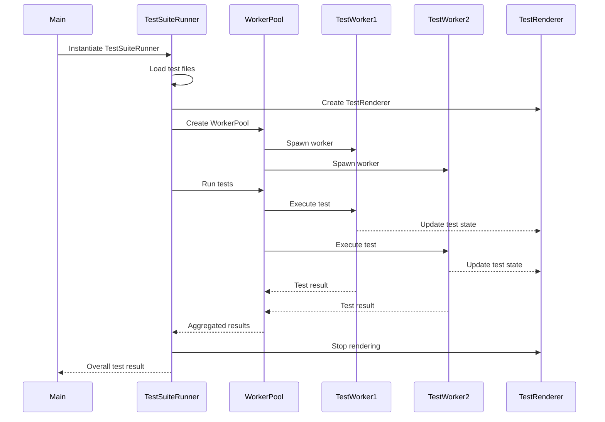

Sources: [packages/magnitude-test/src/runner/testSuiteRunner.ts](https://github.com/agattani123/magnitude/blob/main/packages/magnitude-test/src/runner/testSuiteRunner.ts)

## Test Suite Runner

The `TestSuiteRunner` class is the central orchestrator of the Testing Framework. It is responsible for loading test files, managing test execution, and reporting results. Here are the key aspects of the `TestSuiteRunner`:

### Configuration

The `TestSuiteRunner` is configured using the `TestSuiteRunnerConfig` interface, which includes the following properties:

- `workerCount`: The number of worker threads to spawn for parallel test execution.
- `createRenderer`: A function that creates a `TestRenderer` instance for rendering test results.
- `config`: The `MagnitudeConfig` object containing global configuration options.
- `failFast` (optional): A boolean flag indicating whether to stop test execution upon the first failure.

### Test Loading

The `loadTestFile` method is used to load test files and register the tests within them. It accepts the absolute and relative file paths as arguments and performs the following steps:

1. Create a `TestWorkerData` object containing the file paths and active test options.
2. Spawn a worker thread (`NodeTestWorker` or `BunTestWorker`) based on the environment.
3. Retrieve the registered tests and a closed test executor from the worker.
4. Store the tests and executors in internal data structures for later execution.

### Test Execution

The `runTests` method orchestrates the execution of registered tests. It follows these steps:

1. Create a `TestRenderer` instance using the configured `createRenderer` function.
2. Instantiate a `WorkerPool` with the specified `workerCount`.
3. Map each registered test to a task function that executes the test using its corresponding executor.
4. Run the tasks in the `WorkerPool`, optionally aborting upon the first failure if `failFast` is enabled.
5. Collect and aggregate the test results from the `WorkerPool`.
6. Stop the `TestRenderer` and return the overall test result.

### Test State Rendering

During test execution, the `TestSuiteRunner` updates the `TestRenderer` with the current state of each test. This is achieved by passing a callback function to the test executor, which is invoked whenever the test state changes. The `TestRenderer` can then use this information to provide real-time updates or generate reports.

## Worker Pool

The `WorkerPool` class is a utility component that enables parallel execution of tasks using worker threads. It provides a simple interface for running a collection of tasks concurrently, with the option to abort the execution upon a specific condition.

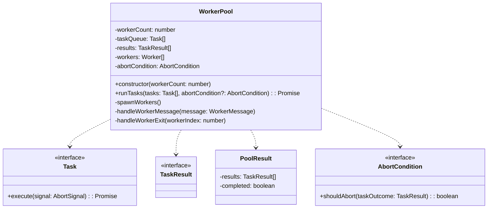

Sources: [packages/magnitude-test/src/runner/workerPool.ts](https://github.com/agattani123/magnitude/blob/main/packages/magnitude-test/src/runner/workerPool.ts)

The `WorkerPool` class provides the following key functionality:

- **Task Execution**: The `runTasks` method accepts an array of tasks (`Task` interface) and an optional `AbortCondition` function. It spawns the specified number of worker threads and distributes the tasks among them for parallel execution.
- **Result Aggregation**: As tasks complete, the `WorkerPool` collects and aggregates the results in the `results` array.
- **Abort Condition**: If an `AbortCondition` function is provided, the `WorkerPool` evaluates it after each task completion. If the condition is met (e.g., a test failure), the remaining tasks are aborted, and the pool execution is terminated.
- **Worker Management**: The `WorkerPool` handles worker creation, message passing, and worker exit events, ensuring proper resource cleanup and error handling.

## Test Workers

The Testing Framework supports two types of test workers: `NodeTestWorker` and `BunTestWorker`. These workers are responsible for executing individual tests in their respective environments (Node.js and Bun).

### Node Test Worker

The `NodeTestWorker` is a worker thread that runs in a Node.js environment. It is responsible for executing tests and communicating with the main thread (`TestSuiteRunner`) using the `worker_threads` module.

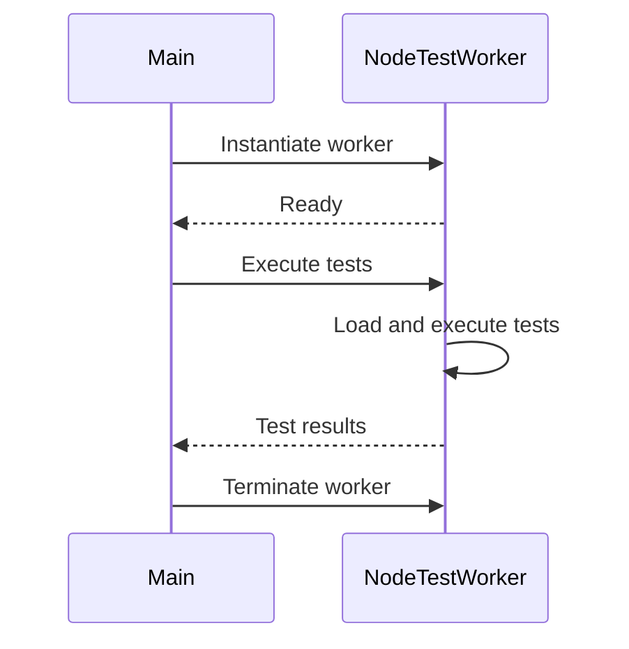

Sources: [packages/magnitude-test/src/worker/nodeTestWorker.ts](https://github.com/agattani123/magnitude/blob/main/packages/magnitude-test/src/worker/nodeTestWorker.ts)

### Bun Test Worker

The `BunTestWorker` is a worker thread that runs in a Bun environment. It is responsible for executing tests and communicating with the main thread (`TestSuiteRunner`) using the Bun worker API.

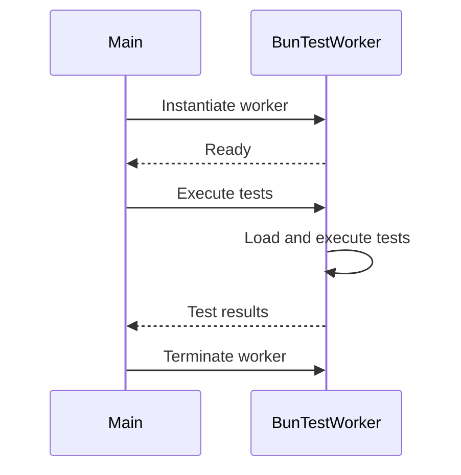

Sources: [packages/magnitude-test/src/worker/bunTestWorker.ts](https://github.com/agattani123/magnitude/blob/main/packages/magnitude-test/src/worker/bunTestWorker.ts)

Both `NodeTestWorker` and `BunTestWorker` follow a similar pattern:

1. Receive test file paths and configuration options from the main thread.
2. Load and execute the tests in the respective environment.
3. Communicate test results and state updates back to the main thread.
4. Handle termination signals and clean up resources.

## Test Rendering

The Testing Framework provides an abstract `TestRenderer` class that defines the interface for rendering test results and progress. Developers can implement custom renderers by extending this class and overriding the relevant methods.

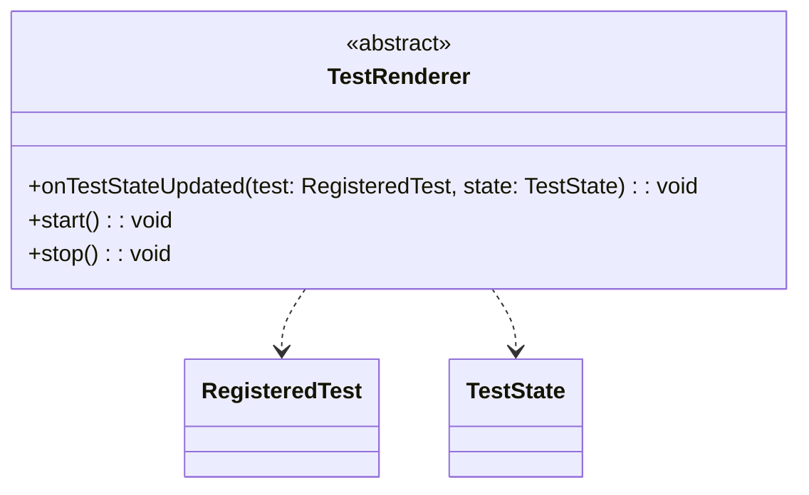

Sources: [packages/magnitude-test/src/renderer/index.ts](https://github.com/agattani123/magnitude/blob/main/packages/magnitude-test/src/renderer/index.ts)

The `TestRenderer` class defines the following methods:

- `onTestStateUpdated(test, state)`: This method is called whenever the state of a test changes during execution. Implementations can use this method to update the rendered output or perform any necessary actions based on the test state.
- `start()`: This method is called before test execution begins. Implementations can use this method to initialize any necessary resources or set up the rendering environment.
- `stop()`: This method is called after all tests have completed execution. Implementations can use this method to clean up resources, finalize rendering, or perform any necessary post-execution tasks.

Developers can create custom renderers by extending the `TestRenderer` class and implementing the desired rendering logic. These custom renderers can then be passed to the `TestSuiteRunner` through the `createRenderer` function in the `TestSuiteRunnerConfig`.

## Conclusion

The Testing Framework in the Magnitude project provides a comprehensive and extensible solution for executing and managing tests across various environments. Its modular architecture, support for parallel execution, and customizable rendering capabilities make it a powerful tool for ensuring the reliability and correctness of the overall system.

By leveraging the `TestSuiteRunner`, `WorkerPool`, test workers (`NodeTestWorker` and `BunTestWorker`), and custom `TestRenderer` implementations, developers can efficiently run tests, monitor their progress, and generate reports tailored to their specific needs.

Relevant source files

The following files were used as context for generating this wiki page:

- [packages/magnitude-test/src/runner/testSuiteRunner.ts](https://github.com/agattani123/magnitude/blob/main/packages/magnitude-test/src/runner/testSuiteRunner.ts)
- [packages/magnitude-test/src/worker/readTest.ts](https://github.com/agattani123/magnitude/blob/main/packages/magnitude-test/src/worker/readTest.ts)
- [packages/magnitude-test/src/worker/worker.ts](https://github.com/agattani123/magnitude/blob/main/packages/magnitude-test/src/worker/worker.ts)
- [packages/magnitude-test/src/runner/createTestWorker.ts](https://github.com/agattani123/magnitude/blob/main/packages/magnitude-test/src/runner/createTestWorker.ts)
- [packages/magnitude-test/src/runner/testSuiteRunner.types.ts](https://github.com/agattani123/magnitude/blob/main/packages/magnitude-test/src/runner/testSuiteRunner.types.ts)

# Testing Framework

## Introduction

The Testing Framework is a core component of the Magnitude project, designed to facilitate the execution and management of tests across various environments and configurations. It provides a robust and scalable architecture for running tests in parallel, leveraging worker processes to isolate test execution and ensure reliable results.

The framework consists of several key modules and components that work together to orchestrate the testing process, including test suite runners, worker processes, and test execution handlers. It supports different runtime environments, such as Node.js and Bun, allowing for flexible and efficient test execution.

Sources: [packages/magnitude-test/src/runner/testSuiteRunner.ts](), [packages/magnitude-test/src/runner/createTestWorker.ts]()

## Architecture Overview

The Testing Framework follows a modular design, with distinct components responsible for different aspects of the testing process. The high-level architecture can be represented as follows:

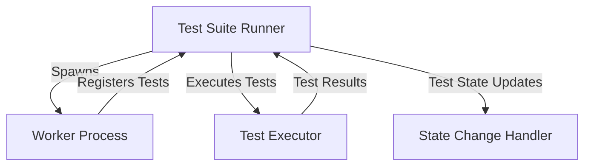

1. **Test Suite Runner**: This component is responsible for orchestrating the overall testing process. It spawns worker processes, receives registered tests from them, and coordinates test execution and state management.

2. **Worker Process**: Each worker process is an isolated environment that loads and registers tests from a specific test file or module. It communicates with the Test Suite Runner to register tests and handle test execution requests.

3. **Test Executor**: The Test Executor is a function that handles the actual execution of individual tests. It receives test execution messages from the Test Suite Runner and manages the test lifecycle, including state changes and result reporting.

4. **State Change Handler**: This component receives updates on the state of test execution (e.g., started, passed, failed) from the Test Executor and handles any necessary actions or reporting based on the state changes.

Sources: [packages/magnitude-test/src/runner/testSuiteRunner.ts:1-50](), [packages/magnitude-test/src/runner/createTestWorker.ts:1-100]()

## Worker Process Creation

The Testing Framework supports different runtime environments, such as Node.js and Bun. The `createTestWorker` function is responsible for creating a worker process based on the target environment.

### Node.js Worker Process

For Node.js environments, the `createNodeTestWorker` function is used to create a new `Worker` instance. The worker process is spawned with the appropriate configuration, including environment variables and command-line arguments.

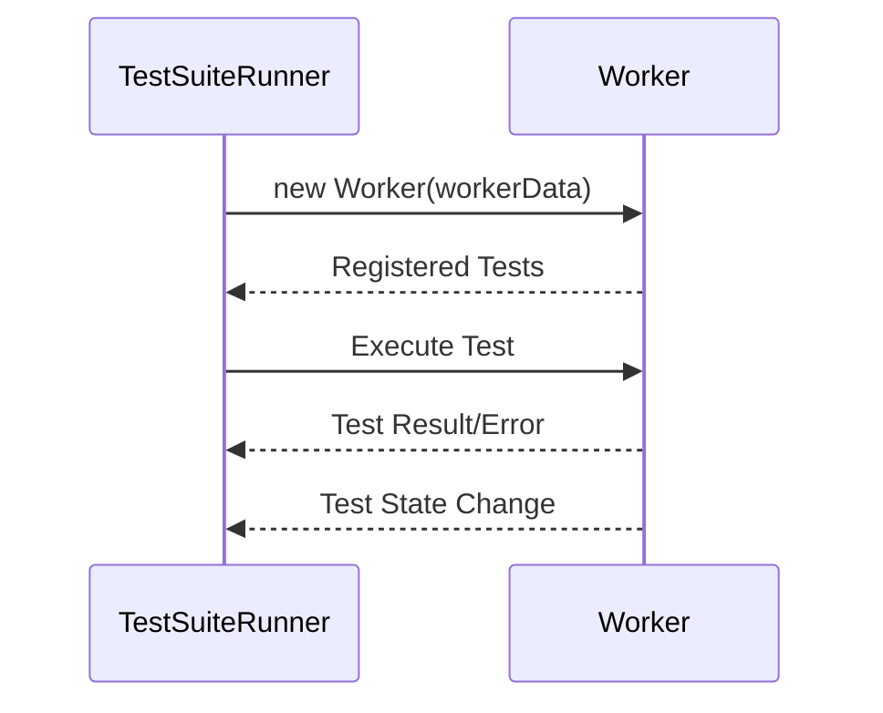

The worker process communicates with the Test Suite Runner using the `message` event, sending registered tests, test results, errors, and state changes.

Sources: [packages/magnitude-test/src/runner/createTestWorker.ts:1-100]()

### Bun Worker Process

For Bun environments, the `createBunTestWorker` function is used to create a new Bun process using the `Bun.spawn` method. The worker process is configured with the appropriate environment variables and serialization settings.

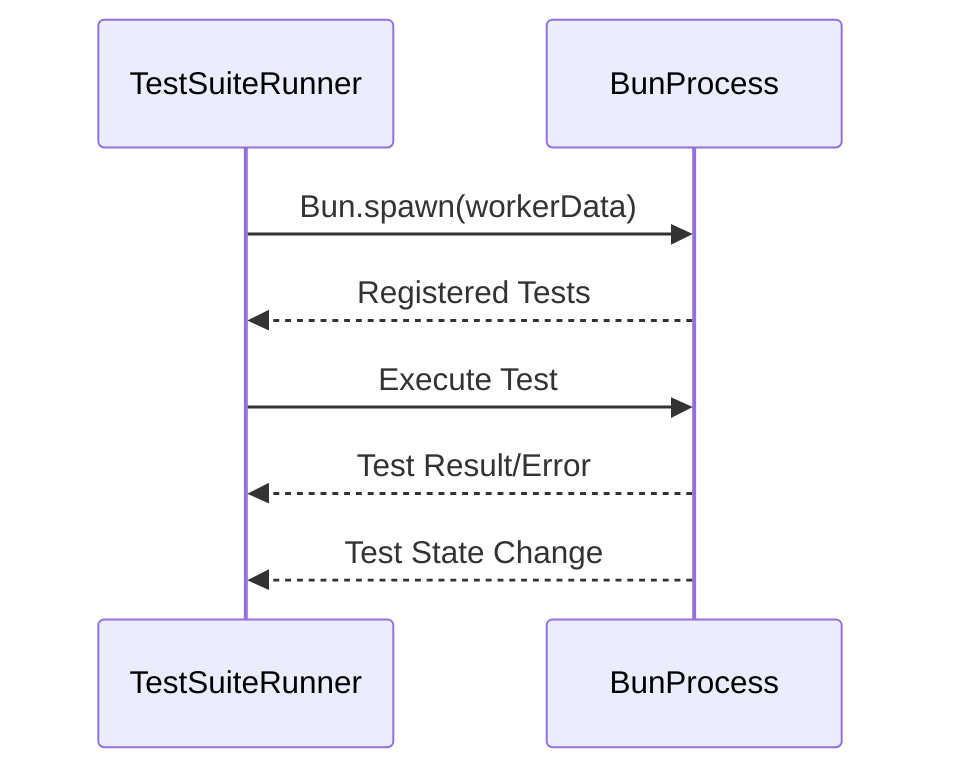

The Bun worker process communicates with the Test Suite Runner using an event emitter and the `ipc` option, sending registered tests, test results, errors, and state changes.

Sources: [packages/magnitude-test/src/runner/createTestWorker.ts:101-200]()

## Test Execution

The Test Suite Runner coordinates the execution of tests by sending execution messages to the worker processes. The `executor` function is responsible for handling the test execution lifecycle, including state changes and result reporting.

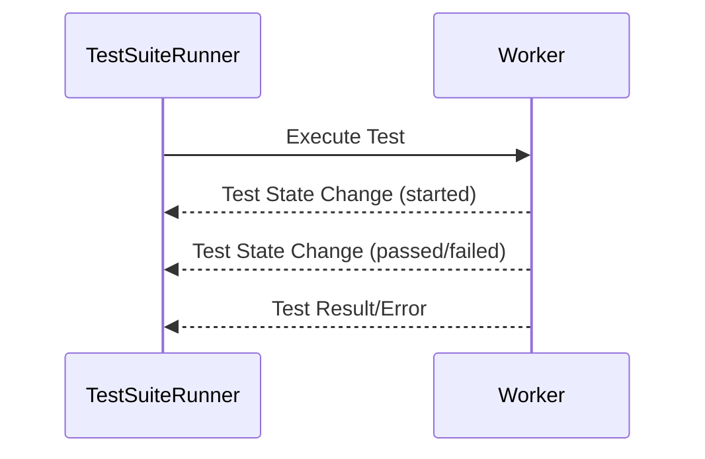

The `executor` function is a closure that captures the necessary context and state for executing a specific test. It communicates with the worker process using the `message` event, sending the test execution message and handling the corresponding responses (test state changes, results, and errors).

Sources: [packages/magnitude-test/src/runner/createTestWorker.ts:30-60](), [packages/magnitude-test/src/runner/createTestWorker.ts:130-160]()

## Test Registration

When a worker process loads a test file or module, it registers the tests found within that file or module with the Test Suite Runner. The registration process involves sending a `registered` message containing the test metadata.

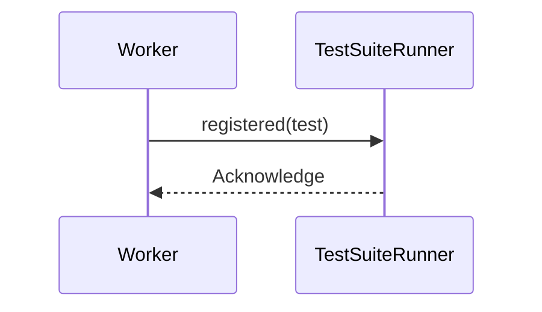

The Test Suite Runner maintains a list of registered tests received from the worker processes. If no tests are registered for a particular file or module, an error is raised.

Sources: [packages/magnitude-test/src/runner/createTestWorker.ts:70-90](), [packages/magnitude-test/src/runner/createTestWorker.ts:170-190]()

## Error Handling

The Testing Framework includes error handling mechanisms to ensure reliable and robust test execution.

### Worker Process Errors

If the worker process encounters an error during the loading or execution of tests, it sends an appropriate error message to the Test Suite Runner.

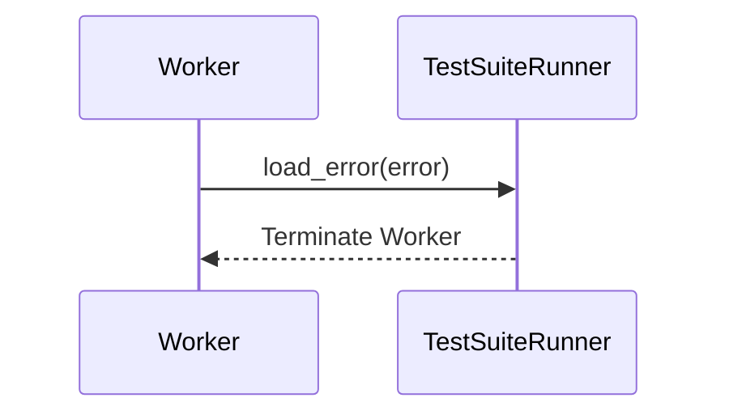

The Test Suite Runner handles these errors by terminating the worker process and propagating the error for further handling or reporting.

Sources: [packages/magnitude-test/src/runner/createTestWorker.ts:80-85](), [packages/magnitude-test/src/runner/createTestWorker.ts:180-185]()

### Test Execution Errors

If an error occurs during the execution of a specific test, the `executor` function handles the error and reports it back to the Test Suite Runner.

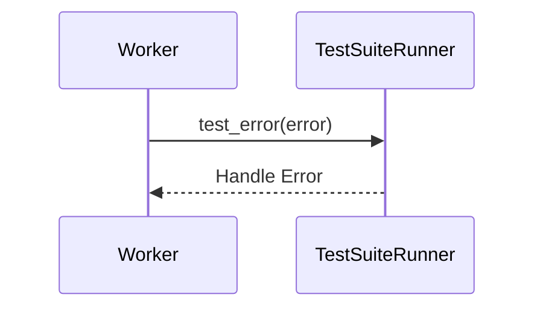

The Test Suite Runner can then handle the error appropriately, such as logging or reporting it, and continue with the execution of other tests.

Sources: [packages/magnitude-test/src/runner/createTestWorker.ts:45-50](), [packages/magnitude-test/src/runner/createTestWorker.ts:145-150]()

### Timeouts

The Testing Framework includes a timeout mechanism to prevent indefinite waiting for test file loading or execution. If a test file takes too long to load or a test execution takes too long, a timeout error is raised, and the worker process is terminated.

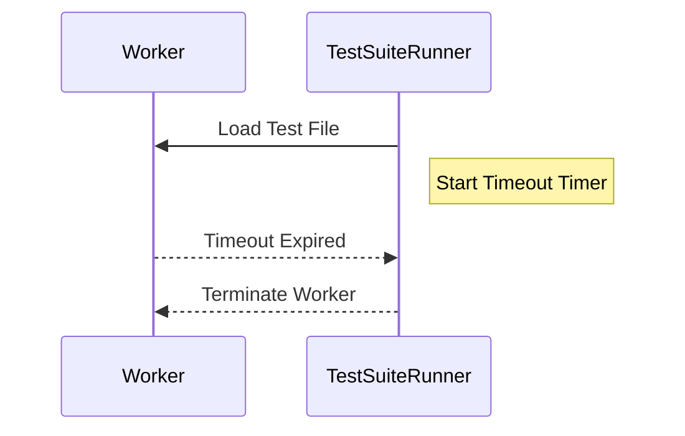

Sources: [packages/magnitude-test/src/runner/createTestWorker.ts:90-95](), [packages/magnitude-test/src/runner/createTestWorker.ts:190-195]()

## Configuration

The Testing Framework supports various configuration options to customize its behavior and adapt to different project requirements.

| Option | Type | Description | Default Value |
| --- | --- | --- | --- |
| `TEST_FILE_LOADING_TIMEOUT` | `number` | The maximum time (in milliseconds) to wait for a test file to load before raising a timeout error. | `10000` (10 seconds) |

Sources: [packages/magnitude-test/src/runner/testSuiteRunner.types.ts:1-5]()

## Data Structures

The Testing Framework utilizes the following key data structures:

| Data Structure | Description |
| --- | --- |
| `RegisteredTest` | Represents the metadata of a registered test, including its ID, name, and other relevant information. |
| `TestWorkerOutgoingMessage` | An interface defining the structure of messages sent from the worker process to the Test Suite Runner, including test registration, results, errors, and state changes. |
| `ClosedTestExecutor` | A function type that encapsulates the logic for executing a specific test, handling state changes, and reporting results or errors. |

Sources: [packages/magnitude-test/src/runner/testSuiteRunner.types.ts:7-30]()

## Conclusion

The Testing Framework provides a robust and scalable architecture for executing tests in parallel across different runtime environments. It leverages worker processes to isolate test execution, ensuring reliable and consistent results. The framework includes mechanisms for test registration, execution, state management, error handling, and configuration, making it a powerful and flexible solution for testing in the Magnitude project.