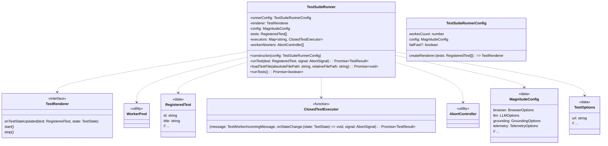
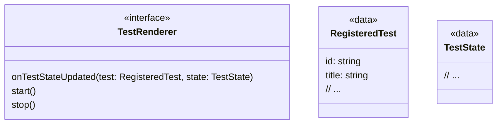
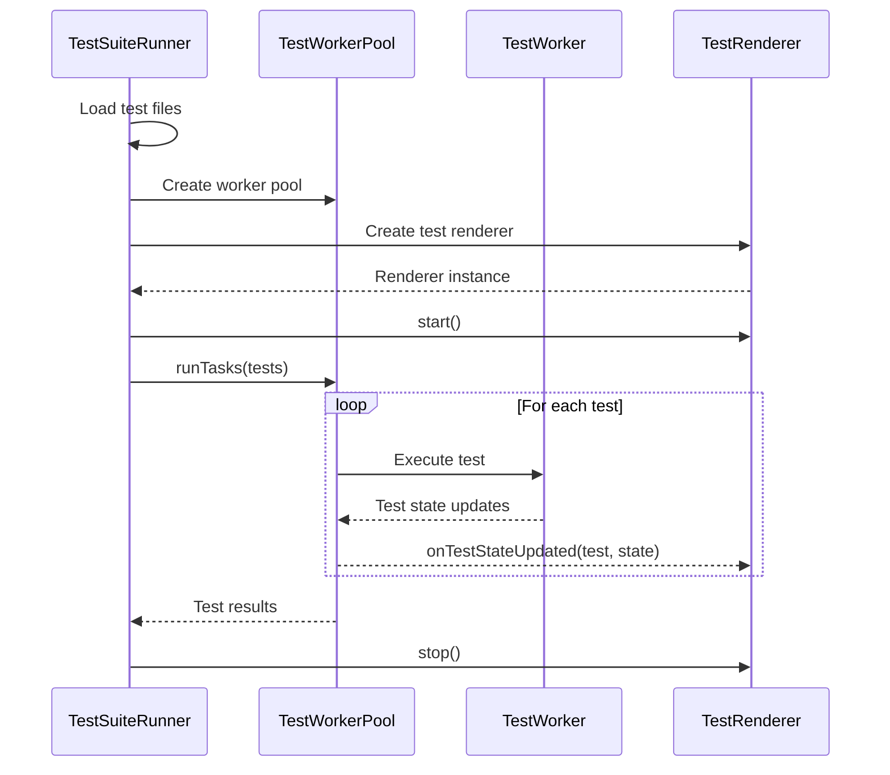
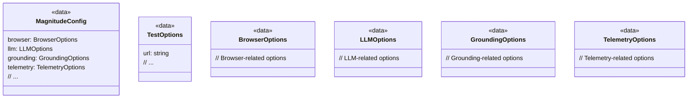

<details>
<summary>Relevant source files</summary>

The following files were used as context for generating this wiki page:

- [packages/magnitude-test/src/index.ts](https://github.com/agattani123/magnitude/blob/main/packages/magnitude-test/src/index.ts)
- [packages/magnitude-test/src/runner/testSuiteRunner.ts](https://github.com/agattani123/magnitude/blob/main/packages/magnitude-test/src/runner/testSuiteRunner.ts)
- [packages/magnitude-test/src/util.ts](https://github.com/agattani123/magnitude/blob/main/packages/magnitude-test/src/util.ts)
- [packages/magnitude-test/src/worker/readTest.ts](https://github.com/agattani123/magnitude/blob/main/packages/magnitude-test/src/worker/readTest.ts)
- [packages/magnitude-test/src/worker/testDeclaration.ts](https://github.com/agattani123/magnitude/blob/main/packages/magnitude-test/src/worker/testDeclaration.ts)
</details>

# Testing Framework

## Introduction

The Testing Framework is a core component of the Magnitude project, designed to facilitate the execution and management of tests for web applications. It provides a structured approach to defining, running, and reporting test cases, enabling developers to ensure the quality and correctness of their applications.

The framework is built around the concept of "test suites," which are collections of individual test cases. Each test case is defined using a declarative syntax and can include various assertions, interactions, and validations specific to the application under test.

Sources: [packages/magnitude-test/src/runner/testSuiteRunner.ts](), [packages/magnitude-test/src/worker/testDeclaration.ts]()

## Architecture Overview

The Testing Framework consists of several key components that work together to orchestrate the test execution process:

1. **Test Suite Runner**: This component is responsible for loading and executing test suites. It manages the lifecycle of test cases, including test discovery, parallel execution, and result reporting.

2. **Test Worker Pool**: The Test Suite Runner utilizes a worker pool to distribute and execute test cases concurrently. This approach improves overall test execution performance by leveraging parallel processing capabilities.

3. **Test Renderer**: The Test Renderer is responsible for presenting test results and progress to the user in a human-readable format. It can be customized to suit different output requirements, such as console output or integration with external reporting tools.

4. **Test Declaration**: This module provides a declarative syntax for defining test cases. Developers can use this syntax to describe the expected behavior of their application, including assertions, interactions, and validations.

Sources: [packages/magnitude-test/src/runner/testSuiteRunner.ts](), [packages/magnitude-test/src/worker/testDeclaration.ts]()

## Test Suite Runner

The `TestSuiteRunner` class is the central orchestrator of the Testing Framework. It manages the overall execution of test suites and coordinates the various components involved in the process.



The `TestSuiteRunner` class has the following key responsibilities:

1. **Loading Test Files**: The `loadTestFile` method is responsible for loading test files and registering the tests defined within them. It uses a worker process to load the test file and extract the registered tests.

2. **Test Execution**: The `runTests` method orchestrates the execution of all registered tests. It creates a `TestRenderer` instance and a `WorkerPool` to distribute and execute the tests concurrently.

3. **Test Result Handling**: The `runTest` method is responsible for executing an individual test case. It retrieves the appropriate `ClosedTestExecutor` for the test and executes it, handling any errors or failures that may occur during the test execution.

The `TestSuiteRunner` also manages various configuration options, such as the number of worker threads to use, the test renderer implementation, and the overall Magnitude configuration.

Sources: [packages/magnitude-test/src/runner/testSuiteRunner.ts]()

## Test Worker Pool

The `WorkerPool` class is a utility component responsible for executing tasks concurrently using a pool of worker threads. It is used by the `TestSuiteRunner` to distribute and execute test cases in parallel, improving overall test execution performance.

```mermaid
classDiagram
    class WorkerPool {
        +runTasks(tasks: Task[], shouldAbort: (taskOutcome: TaskOutcome) => boolean): Promise~PoolResult~
    }
    
    class Task {
        <<function>>
        (signal: AbortSignal): Promise~TaskOutcome~
    }
    
    class TaskOutcome {
        <<data>>
    }
    
    class PoolResult {
        <<data>>
        results: TaskOutcome[]
        completed: boolean
    }
```

The `WorkerPool` class exposes a single `runTasks` method, which takes an array of `Task` functions and an optional `shouldAbort` function. The `Task` functions are executed concurrently, and their results are collected in the `PoolResult` object.

The `shouldAbort` function is an optional callback that can be provided to determine if the pool execution should be aborted based on the outcome of a task. This is useful in scenarios where the test execution should stop as soon as a failure is encountered (e.g., "fail-fast" mode).

Sources: [packages/magnitude-test/src/runner/testSuiteRunner.ts]()

## Test Renderer

The `TestRenderer` is an interface that defines the contract for rendering test results and progress. It allows for different implementations to be used for presenting test output in various formats, such as console output or integration with external reporting tools.



The `TestRenderer` interface defines the following methods:

- `onTestStateUpdated(test, state)`: This method is called whenever the state of a test case changes during execution. It allows the renderer to update its output based on the current test state.

- `start()`: This method is called before the test execution begins, allowing the renderer to perform any necessary setup or initialization.

- `stop()`: This method is called after all tests have completed execution, giving the renderer an opportunity to finalize its output or perform any necessary cleanup.

Developers can implement their own `TestRenderer` class to customize the test output format and integrate with various reporting tools or frameworks.

Sources: [packages/magnitude-test/src/runner/testSuiteRunner.ts]()

## Test Declaration

The `testDeclaration` module provides a declarative syntax for defining test cases within the Testing Framework. It allows developers to describe the expected behavior of their application using a structured and readable format.

```mermaid
classDiagram
    class TestDeclaration {
        <<utility>>
        +test(title: string, fn: TestFunction): RegisteredTest
    }
    
    class TestFunction {
        <<function>>
        (t: TestContext): Promise~void~
    }
    
    class TestContext {
        <<utility>>
        // Methods for defining test steps, assertions, interactions, etc.
    }
    
    class RegisteredTest {
        <<data>>
        id: string
        title: string
        // ...
    }
```

The `test` function is the entry point for defining a new test case. It takes a `title` string and a `TestFunction` as arguments, and returns a `RegisteredTest` object representing the defined test case.

The `TestFunction` is a callback function that receives a `TestContext` object as its argument. The `TestContext` provides various methods and utilities for defining the test steps, assertions, interactions, and validations within the test case.

Here's an example of how a test case might be defined using the `testDeclaration` module:

```typescript
import { test } from '@/worker/testDeclaration';

test('Login form validation', async (t) => {
  await t.visit('/login');
  await t.type('#username', 'user@example.com');
  await t.type('#password', 'invalidPassword');
  await t.click('#submit');
  await t.assertVisible('.error-message');
});
```

In this example, a new test case titled "Login form validation" is defined. The test function navigates to the `/login` page, enters an email and an invalid password, clicks the submit button, and asserts that an error message is visible on the page.

Sources: [packages/magnitude-test/src/worker/testDeclaration.ts]()

## Test Execution Flow

The overall flow of test execution within the Testing Framework can be summarized as follows:



1. The `TestSuiteRunner` loads the test files and registers the tests defined within them.
2. The `TestSuiteRunner` creates a `TestWorkerPool` and a `TestRenderer` instance.
3. The `TestRenderer` is started, and the `TestSuiteRunner` passes the registered tests to the `TestWorkerPool` for execution.
4. For each test, the `TestWorkerPool` assigns a worker thread to execute the test.
5. During test execution, the worker thread sends test state updates to the `TestWorkerPool`, which forwards them to the `TestRenderer` for output.
6. After all tests have completed, the `TestWorkerPool` returns the test results to the `TestSuiteRunner`.
7. The `TestSuiteRunner` stops the `TestRenderer`, allowing it to finalize its output or perform any necessary cleanup.

Sources: [packages/magnitude-test/src/runner/testSuiteRunner.ts](), [packages/magnitude-test/src/worker/readTest.ts]()

## Configuration and Options

The Testing Framework supports various configuration options that can be specified to customize its behavior. These options are defined in the `MagnitudeConfig` and `TestOptions` interfaces.



The `MagnitudeConfig` interface defines the following configuration options:

- `browser`: Options related to the browser environment used for test execution.
- `llm`: Options related to the language model used for test generation or analysis.
- `grounding`: Options related to the grounding mechanism used for test generation or analysis.
- `telemetry`: Options related to telemetry data collection and reporting.

The `TestOptions` interface defines options specific to individual test cases, such as the `url` of the application under test.

These configuration options can be specified when creating the `TestSuiteRunner` instance or when executing individual tests.

Sources: [packages/magnitude-test/src/index.ts](), [packages/magnitude-test/src/runner/testSuiteRunner.ts]()

## Conclusion

The Testing Framework provided by the Magnitude project offers a comprehensive solution for defining, executing, and reporting tests for web applications. Its modular architecture and declarative syntax allow developers to write structured and readable test cases, while its parallel execution capabilities and customizable rendering options enable efficient and flexible test output.

By leveraging the Testing Framework, developers can ensure the quality and correctness of their applications, streamline the testing process, and integrate with various tools and frameworks as needed.