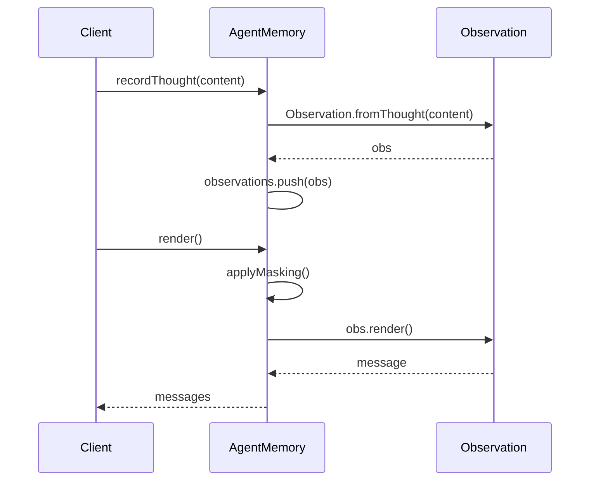
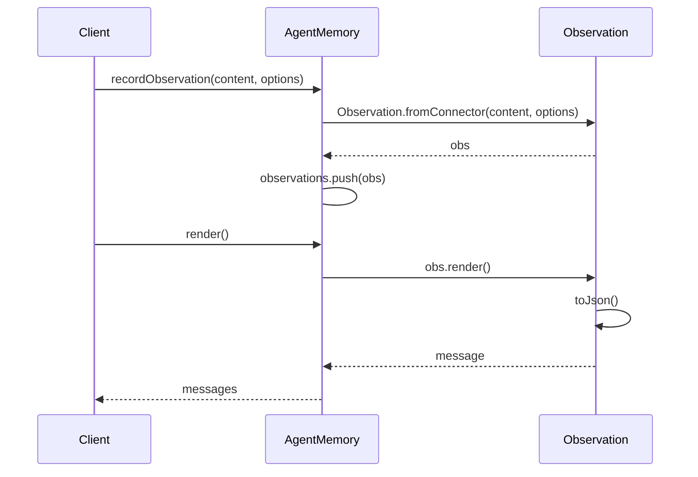
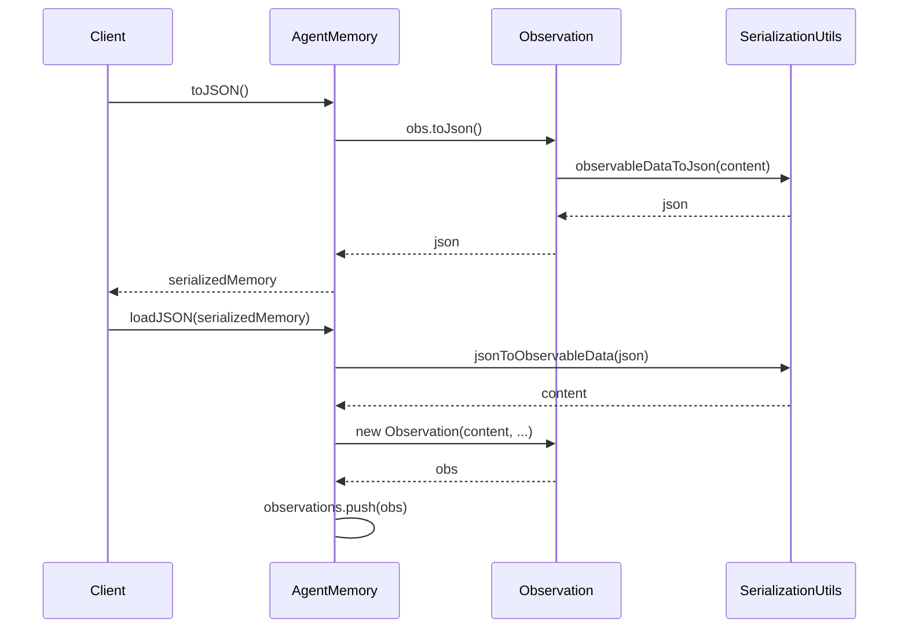

<details>
<summary>Relevant source files</summary>

The following files were used as context for generating this wiki page:

- [packages/magnitude-core/src/memory/agentMemory.ts](https://github.com/agattani123/magnitude/blob/main/packages/magnitude-core/src/memory/agentMemory.ts)
- [packages/magnitude-core/src/memory/observation.ts](https://github.com/agattani123/magnitude/blob/main/packages/magnitude-core/src/memory/observation.ts)
- [packages/magnitude-core/src/memory/serde.ts](https://github.com/agattani123/magnitude/blob/main/packages/magnitude-core/src/memory/serde.ts)
- [packages/magnitude-core/src/memory/masking.ts](https://github.com/agattani123/magnitude/blob/main/packages/magnitude-core/src/memory/masking.ts)
- [packages/magnitude-core/src/memory/rendering.ts](https://github.com/agattani123/magnitude/blob/main/packages/magnitude-core/src/memory/rendering.ts)
</details>

# Memory Management

## Introduction

The Memory Management system in this project is responsible for managing the storage and retrieval of observations, which are multimedia data structures representing various inputs, outputs, and internal states of the system. It provides a centralized mechanism for recording, rendering, and manipulating these observations, enabling effective communication and context sharing between different components.

The core classes involved in Memory Management are `AgentMemory` and `Observation`. `AgentMemory` acts as a container for storing and managing a collection of `Observation` instances, while `Observation` represents a single multimedia data point with associated metadata, such as its source, role, timestamp, and retention options.

Sources: [packages/magnitude-core/src/memory/agentMemory.ts](), [packages/magnitude-core/src/memory/observation.ts]()

## AgentMemory

The `AgentMemory` class is the central component of the Memory Management system. It provides methods for recording, rendering, and serializing observations, as well as managing memory retention and caching strategies.

### Architecture and Components

#### AgentMemoryOptions

The `AgentMemoryOptions` interface defines the configuration options for an `AgentMemory` instance:

```typescript
export interface AgentMemoryOptions {
    instructions?: string | null,
    promptCaching?: boolean,
    thoughtLimit?: number,
}
```

- `instructions`: Optional string representing custom instructions related to the memory instance.
- `promptCaching`: Boolean flag indicating whether prompt caching should be enabled.
- `thoughtLimit`: Maximum number of "thought" observations to retain in memory.

Sources: [packages/magnitude-core/src/memory/agentMemory.ts:19-25]()

#### SerializedAgentMemory

The `SerializedAgentMemory` interface represents the serialized format of an `AgentMemory` instance, which can be used for storage or transmission:

```typescript
export interface SerializedAgentMemory {
    instructions?: string;
    observations: {
        source: ObservationSource,
        role: ObservationRole,
        timestamp: number,
        data: MultiMediaJson,
        options?: ObservationRetentionOptions,
    }[];
}
```

It contains an optional `instructions` field and an array of `observations`, each consisting of various properties such as `source`, `role`, `timestamp`, `data` (serialized multimedia content), and optional `options` for retention.

Sources: [packages/magnitude-core/src/memory/agentMemory.ts:12-20]()

### Key Methods and Data Structures

#### Constructor

The `AgentMemory` constructor initializes a new instance with the provided options:

```typescript
constructor(options?: AgentMemoryOptions) {
    this.options = {
        instructions: options?.instructions ?? null,
        promptCaching: options?.promptCaching ?? false,
        thoughtLimit: options?.thoughtLimit ?? 20
    };
}
```

It sets the `instructions`, `promptCaching`, and `thoughtLimit` properties based on the provided options or default values.

Sources: [packages/magnitude-core/src/memory/agentMemory.ts:29-37]()

#### render

The `render` method is responsible for rendering the observations stored in the `AgentMemory` instance as an array of `MultiMediaMessage` objects:

```typescript
public async render(options?: MemoryRenderOptions): Promise<MultiMediaMessage[]>
```

It applies observation masking and caching strategies based on the configured options, and generates a list of messages representing the visible observations.

Sources: [packages/magnitude-core/src/memory/agentMemory.ts:39-72]()

#### simpleRender

The `simpleRender` method provides a simplified rendering of observations without any filtering, masking, or caching:

```typescript
public async simpleRender(): Promise<(BamlImage | string)[]>
```

It returns an array of `BamlImage` or `string` objects representing the content of each observation.

Sources: [packages/magnitude-core/src/memory/agentMemory.ts:74-86]()

#### recordThought and recordObservation

These methods are used to add new observations to the `AgentMemory` instance:

```typescript
public recordThought(content: string): void
public recordObservation(obs: Observation): void
```

`recordThought` creates a new `Observation` instance from the provided string content with a source of `'thought'`, while `recordObservation` directly adds an existing `Observation` instance to the memory.

Sources: [packages/magnitude-core/src/memory/agentMemory.ts:88-95]()

#### toJSON and loadJSON

The `toJSON` and `loadJSON` methods are used for serializing and deserializing the `AgentMemory` instance to and from a JSON format, respectively:

```typescript
public async toJSON(): Promise<SerializedAgentMemory>
public async loadJSON(data: SerializedAgentMemory)
```

The `toJSON` method converts the observations and instructions to a `SerializedAgentMemory` object, while `loadJSON` reconstructs the `AgentMemory` instance from the provided serialized data.

Sources: [packages/magnitude-core/src/memory/agentMemory.ts:98-127]()

### Data Flow and Sequence Diagrams

The following sequence diagram illustrates the typical flow of recording and rendering observations in the `AgentMemory` system:



1. The client records a thought by calling `recordThought` on the `AgentMemory` instance.
2. `AgentMemory` creates a new `Observation` instance using `Observation.fromThought`.
3. The new `Observation` is added to the `observations` array in `AgentMemory`.
4. When the client requests to render the observations, `AgentMemory` applies masking and caching strategies.
5. For each visible observation, `AgentMemory` calls the `render` method on the `Observation` instance.
6. The rendered `MultiMediaMessage` is collected and returned to the client.

Sources: [packages/magnitude-core/src/memory/agentMemory.ts](), [packages/magnitude-core/src/memory/observation.ts]()

## Observation

The `Observation` class represents a single multimedia data point with associated metadata, such as its source, role, timestamp, and retention options.

### Key Properties and Data Structures

```typescript
export class Observation {
    public readonly source: ObservationSource;
    public readonly role: ObservationRole;
    public readonly timestamp: number;
    public readonly content: RenderableContent;
    public readonly retention?: ObservationRetentionOptions;
}
```

- `source`: A string identifying the source of the observation (e.g., `'connector:id'`, `'action:taken:id'`, `'action:result:id'`, or `'thought'`).
- `role`: The role of the observation, either `'user'` or `'assistant'`.
- `timestamp`: The timestamp when the observation was created.
- `content`: The multimedia content of the observation, represented as a `RenderableContent` type (which can be a primitive, array, or object).
- `retention`: Optional retention options for the observation, defining its deduplication and limiting behavior.

Sources: [packages/magnitude-core/src/memory/observation.ts:29-37]()

#### ObservationRetentionOptions

The `ObservationRetentionOptions` interface defines the retention policy for an `Observation`:

```typescript
export interface ObservationRetentionOptions {
    type: string;
    limit?: number;
    dedupe?: boolean;
}
```

- `type`: A unique string identifier used for deduplication and limiting logic.
- `limit`: An optional maximum number of observations of this type to retain in memory.
- `dedupe`: An optional boolean flag indicating whether adjacent identical observations of the same type should be deduplicated.

Sources: [packages/magnitude-core/src/memory/observation.ts:14-18]()

### Key Methods

#### Constructor

The `Observation` constructor creates a new instance with the provided source, role, content, retention options, and optional timestamp:

```typescript
constructor(source: ObservationSource, role: ObservationRole, content: RenderableContent, retention?: ObservationRetentionOptions, timestamp?: number)
```

Sources: [packages/magnitude-core/src/memory/observation.ts:39-45]()

#### Static Factory Methods

The `Observation` class provides several static factory methods for creating instances from different sources:

- `fromConnector`: Creates an observation from a connector with the provided connector ID, content, and optional retention options.
- `fromActionTaken`: Creates an observation representing an action taken, with the provided action ID, content, and optional retention options.
- `fromActionResult`: Creates an observation representing the result of an action, with the provided action ID, content, and optional retention options.
- `fromThought`: Creates an observation representing a thought, with the provided content and optional retention options.

Sources: [packages/magnitude-core/src/memory/observation.ts:47-62]()

#### render

The `render` method asynchronously renders the observation's content as a `MultiMediaMessage` object:

```typescript
async render(options?: { prefix?: MultiMediaContentPart[], postfix?: MultiMediaContentPart[], cacheControl?: boolean }): Promise<MultiMediaMessage>
```

It allows specifying optional prefixes, postfixes, and cache control options for the rendered message.

Sources: [packages/magnitude-core/src/memory/observation.ts:72-79]()

#### toJson

The `toJson` method asynchronously converts the observation's content to a `MultiMediaJson` representation:

```typescript
async toJson(): Promise<MultiMediaJson>
```

Sources: [packages/magnitude-core/src/memory/observation.ts:68-70]()

#### hash and equals

The `hash` and `equals` methods are used for generating a hash of the observation's content and comparing the equality of two observations, respectively:

```typescript
async hash(): Promise<string>
async equals(obs: Observation): Promise<boolean>
```

Sources: [packages/magnitude-core/src/memory/observation.ts:81-91]()

### Data Flow and Sequence Diagrams

The following sequence diagram illustrates the typical flow of creating and rendering an `Observation` instance:



1. The client records an observation by calling `recordObservation` on the `AgentMemory` instance, providing the content and optional retention options.
2. `AgentMemory` creates a new `Observation` instance using the appropriate static factory method (e.g., `Observation.fromConnector`).
3. The new `Observation` is added to the `observations` array in `AgentMemory`.
4. When the client requests to render the observations, `AgentMemory` calls the `render` method on each `Observation` instance.
5. The `Observation` instance converts its content to a `MultiMediaJson` representation using the `toJson` method.
6. The rendered `MultiMediaMessage` is returned to `AgentMemory` and collected for the client.

Sources: [packages/magnitude-core/src/memory/agentMemory.ts](), [packages/magnitude-core/src/memory/observation.ts]()

## Serialization and Deserialization

The Memory Management system provides mechanisms for serializing and deserializing `AgentMemory` instances to and from a JSON format, allowing for storage and transmission of memory data.

### MultiMediaJson

The `MultiMediaJson` type represents the serialized format of multimedia content, which can be used for storage or transmission:

```typescript
export type MultiMediaJson =
    | string
    | number
    | boolean
    | null
    | ImageJson
    | MultiMediaJson[]
    | { [key: string]: MultiMediaJson };
```

It supports various data types, including strings, numbers, booleans, null values, serialized image data (`ImageJson`), arrays, and objects.

Sources: [packages/magnitude-core/src/memory/serde.ts:5-12]()

### Serialization and Deserialization Functions

The `serde` module provides functions for converting between `RenderableContent` (the internal multimedia data structure) and `MultiMediaJson` (the serialized format):

```typescript
export async function observableDataToJson(data: RenderableContent): Promise<MultiMediaJson>
export async function jsonToObservableData(json: MultiMediaJson): Promise<RenderableContent>
```

- `observableDataToJson`: Asynchronously converts a `RenderableContent` instance to its `MultiMediaJson` representation.
- `jsonToObservableData`: Asynchronously converts a `MultiMediaJson` representation back to a `RenderableContent` instance.

These functions handle the serialization and deserialization of various data types, including images, arrays, and objects.

Sources: [packages/magnitude-core/src/memory/serde.ts:14-16]()

### Serialization and Deserialization Flow

The following sequence diagram illustrates the serialization and deserialization flow for `AgentMemory` instances:



1. The client requests serialization of the `AgentMemory` instance by calling `toJSON`.
2. `AgentMemory` iterates over its `observations` and calls `toJson` on each `Observation` instance.
3. The `Observation` instance converts its `content` to a `MultiMediaJson` representation using the `observableDataToJson` function from the `SerializationUtils` module.
4. The serialized `MultiMediaJson` data is returned to `AgentMemory` and included in the `SerializedAgentMemory` object.
5. The serialized memory data is returned to the client.
6. To deserialize, the client calls `loadJSON` on the `AgentMemory` instance, providing the serialized data.