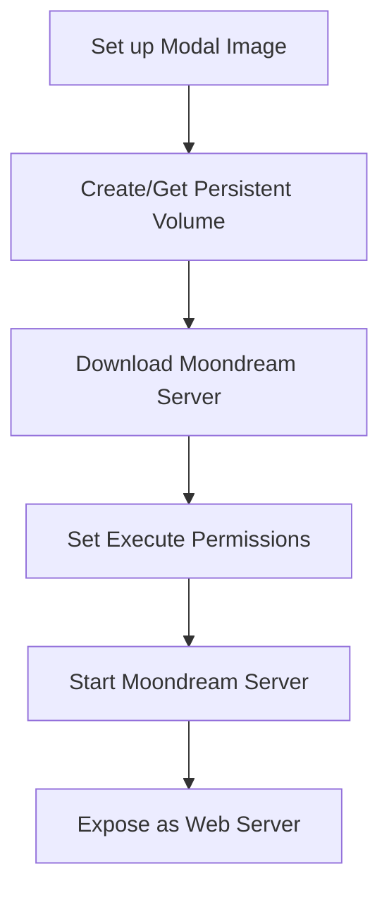

<details>
<summary>Relevant source files</summary>

The following files were used as context for generating this wiki page:

- [infra/README.md](https://github.com/agattani123/magnitude/blob/main/infra/README.md)
- [infra/moondream.py](https://github.com/agattani123/magnitude/blob/main/infra/moondream.py)
</details>

# Deployment and Infrastructure

## Introduction

The "Deployment and Infrastructure" component of the project focuses on providing a streamlined and scalable way to self-host the Moondream server, which is a crucial component for running Magnitude tests. The provided source files outline the steps to deploy the Moondream server on the Modal cloud platform, leveraging its serverless infrastructure and GPU capabilities.

The deployment process involves setting up a Modal account, installing the necessary dependencies, and running a deployment script (`moondream.py`) that automates the process of downloading the Moondream server and model weights, configuring a persistent volume, and deploying the server as a web endpoint. Once deployed, the Moondream endpoint can be accessed via a provided URL, enabling Magnitude tests to be executed using the hosted Moondream server.

## Modal Setup

The first step in the deployment process is to set up a Modal account and install the required Modal Python package. This is outlined in the `infra/README.md` file, which provides the following steps:

1. Create an account at [modal.com](https://modal.com).
2. Install the Modal Python package by running `pip install modal`.
3. Authenticate with Modal by running `modal setup` (or `python -m modal setup` if the previous command doesn't work).

Modal offers $30 in free credits per month, making it an attractive option for self-hosting the Moondream server.

Sources: [infra/README.md:5-10]()

## Moondream Deployment

The core deployment logic is encapsulated in the `moondream.py` script, which is executed using the `modal deploy` command. This script performs the following tasks:

1. Clones the Magnitude repository from GitHub.
2. Navigates to the `infra` directory.
3. Deploys the `moondream.py` script to Modal.

The deployment script itself is a Modal function that performs the following steps:



1. **Set up Modal Image**: The script defines a Modal image based on Debian Slim with Python 3.11, installs necessary dependencies (libvips-dev, pkg-config, and requests), and configures the GPU (A10G by default).

2. **Create/Get Persistent Volume**: A Modal volume named "moondream" is created or retrieved. This volume is used to store the downloaded Moondream server and cache files.

3. **Download Moondream Server**: If the Moondream server binary is not present in the volume, the script downloads it from a specified URL and commits the downloaded file to the persistent volume.

4. **Set Execute Permissions**: The script sets the execute permissions on the downloaded Moondream server binary.

5. **Start Moondream Server**: The Moondream server binary is executed as a subprocess.

6. **Expose as Web Server**: The Modal function is configured as a web server, exposing the running Moondream server as an HTTP endpoint.

Sources: [infra/moondream.py:1-56]()

## Deployment Configuration

The `moondream.py` script provides several configuration options that can be modified based on specific requirements:

- `gpu`: Specifies the GPU configuration to be used for the deployment. Different GPU options (H100, A100, A10G, T4) are available on Modal, with varying performance and cost implications. The README provides a comparison table to help choose the appropriate GPU based on inference speed and cost.
- `scaledown_window`: Determines the time (in seconds) a container will wait before shutting down after receiving no requests. A higher value allows tests to run after longer periods without triggering a cold start.
- `min_containers`: By setting this option, a minimum number of containers can be kept open to handle requests. This eliminates cold starts but incurs additional costs as Modal bills for the running containers.

Sources: [infra/README.md:28-42](), [infra/moondream.py:10]()

## Post-Deployment Configuration

After deploying the Moondream server, the `magnitude.config.ts` file needs to be updated with the base URL of the deployed endpoint. This configuration allows Magnitude tests to communicate with the self-hosted Moondream server:

```ts
import { type MagnitudeConfig } from 'magnitude-test';

export default {
    url: "http://localhost:5173",
    executor: {
        provider: 'moondream',
        options: {
            baseUrl: 'https://<your-modal-username>--moondream.modal.run/v1'
        }
    }
} satisfies MagnitudeConfig;
```

Sources: [infra/README.md:18-25]()

## Conclusion

The "Deployment and Infrastructure" component of the project provides a streamlined and scalable way to self-host the Moondream server on the Modal cloud platform. By leveraging Modal's serverless infrastructure and GPU capabilities, the deployment process is automated through a Python script (`moondream.py`), which handles the download, configuration, and exposure of the Moondream server as a web endpoint. This deployment approach enables Magnitude tests to be executed using the self-hosted Moondream server, ensuring a consistent and reliable testing environment.