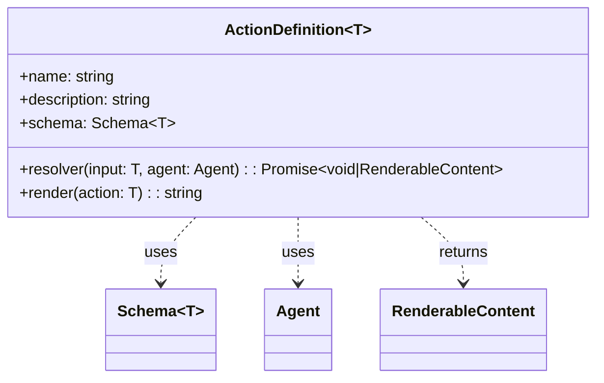
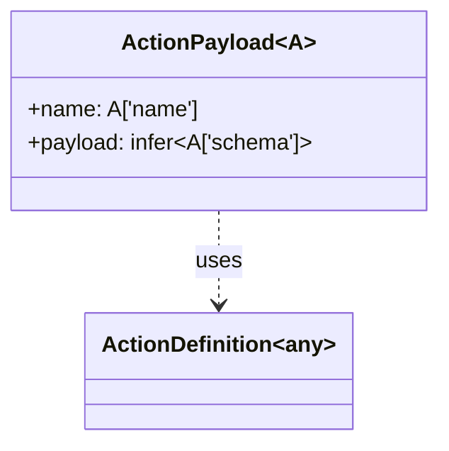
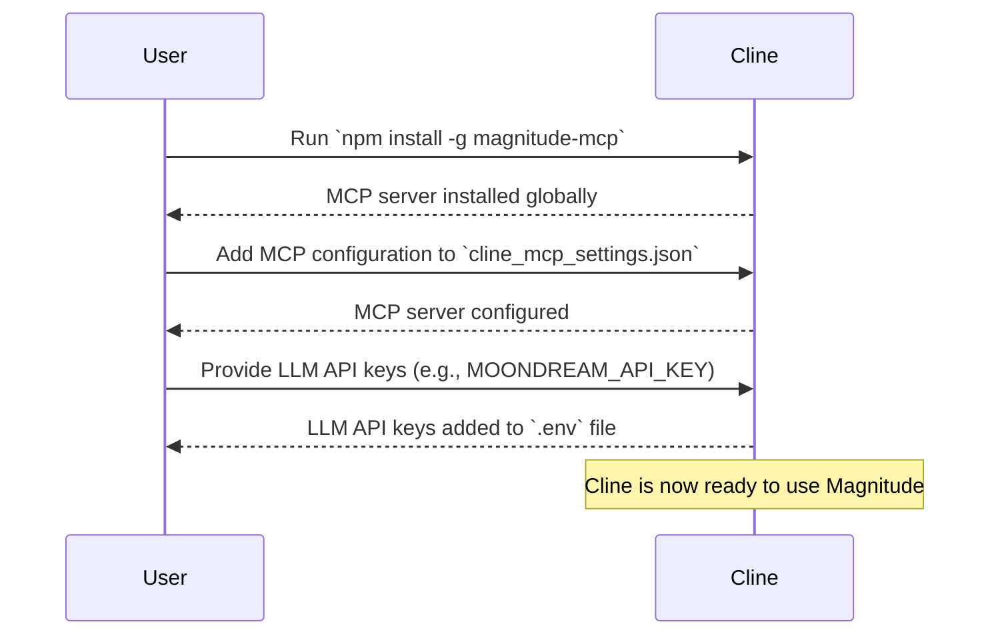
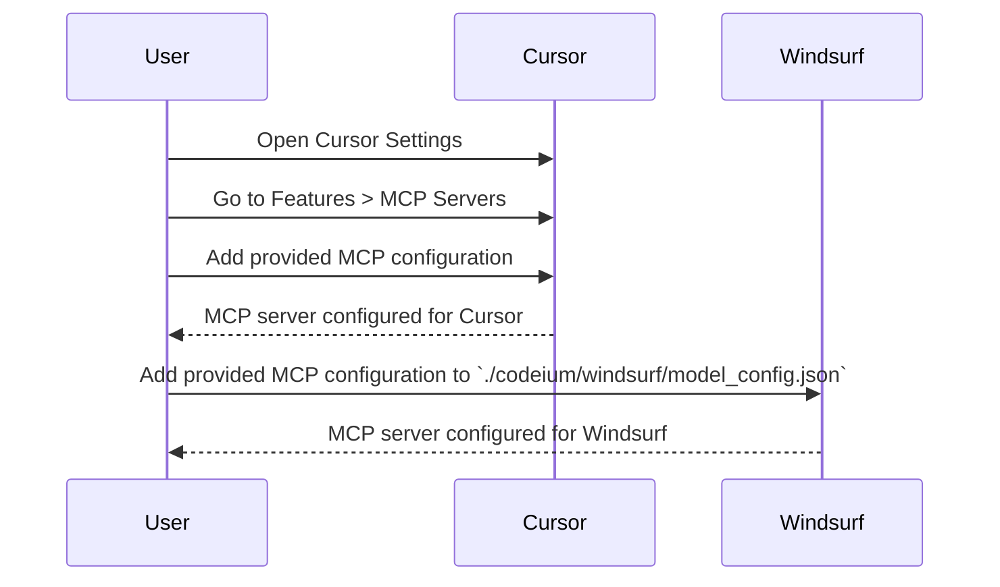

<details>
<summary>Relevant source files</summary>

The following files were used as context for generating this wiki page:

- [packages/magnitude-core/src/actions/index.ts](https://github.com/agattani123/magnitude/blob/main/packages/magnitude-core/src/actions/index.ts)
- [packages/magnitude-mcp/README.md](https://github.com/agattani123/magnitude/blob/main/packages/magnitude-mcp/README.md)

</details>

# Customization and Extension

## Introduction

The Magnitude project provides a framework for defining and executing custom actions within an agent-based system. These actions can be used to extend the functionality of the agents, allowing them to perform various tasks and interact with external systems or services. The "Customization and Extension" feature enables developers to create new actions, define their input schemas, and specify how they should be executed and rendered.

The [packages/magnitude-core/src/actions/index.ts](https://github.com/agattani123/magnitude/blob/main/packages/magnitude-core/src/actions/index.ts) file contains the core functionality for defining and managing actions, while the [packages/magnitude-mcp/README.md](https://github.com/agattani123/magnitude/blob/main/packages/magnitude-mcp/README.md) file provides instructions for installing and configuring the Magnitude MCP (Model Context Protocol) server, which allows agents to execute Magnitude test cases.

## Action Definition

The `ActionDefinition` interface defines the structure of an action, including its name, description, input schema, resolver function, and render function.



Sources: [packages/magnitude-core/src/actions/index.ts:3-10](https://github.com/agattani123/magnitude/blob/main/packages/magnitude-core/src/actions/index.ts#L3-L10)

The `createAction` function is a helper that simplifies the creation of `ActionDefinition` instances by inferring the schema type from the provided input.

```mermaid
classDiagram
    class createAction~S~ {
        +name: string
        +description: string
        +schema: S
        +resolver(input: infer~S~, agent: Agent): Promise~void|RenderableContent~
        +render(action: infer~S~): string
    }
    createAction~S~ ..> ActionDefinition~infer~S~~ : returns
    createAction~S~ ..> Agent : uses
    createAction~S~ ..> RenderableContent : returns
    createAction~S~ ..> ZodTypeAny : uses
```

Sources: [packages/magnitude-core/src/actions/index.ts:14-28](https://github.com/agattani123/magnitude/blob/main/packages/magnitude-core/src/actions/index.ts#L14-L28)

## Action Payload

The `ActionPayload` type is a helper that combines the action name (as a literal type) and the inferred schema from the `ActionDefinition`. This type can be useful when working with actions and their input data.



Sources: [packages/magnitude-core/src/actions/index.ts:33-35](https://github.com/agattani123/magnitude/blob/main/packages/magnitude-core/src/actions/index.ts#L33-L35)

## Magnitude MCP Server

The Magnitude MCP (Model Context Protocol) server is a component that allows agents to write and run Magnitude test cases. It can be installed globally via npm:

```bash
npm i -g magnitude-mcp
```

The MCP server needs to be configured in the project's settings, as shown in the following examples:

| Project | Configuration |
| --- | --- |
| Cline | Add the following configuration to `cline_mcp_settings.json`: <pre>{<br>  "mcpServers": {<br>    "magnitude": {<br>      "command": "npx",<br>      "args": [<br>        "magnitude-mcp"<br>      ]<br>    }<br>  }<br>}</pre> |
| Cursor | 1. Open Cursor Settings<br>2. Go to Features > MCP Servers<br>3. Click "+ Add new global MCP server"<br>4. Enter the provided configuration |
| Windsurf | Add the provided configuration to `./codeium/windsurf/model_config.json` |

Sources: [packages/magnitude-mcp/README.md](https://github.com/agattani123/magnitude/blob/main/packages/magnitude-mcp/README.md)

## Installation and Configuration

The installation and configuration process for the Magnitude MCP server varies depending on the project or platform being used. The [packages/magnitude-mcp/README.md](https://github.com/agattani123/magnitude/blob/main/packages/magnitude-mcp/README.md) file provides detailed instructions for different projects, including Cline, Cursor, and Windsurf.

For Cline users, the instructions involve installing the `magnitude-mcp` package globally, adding the MCP configuration to `cline_mcp_settings.json`, and providing API keys for the LLM providers they want to use.



Sources: [packages/magnitude-mcp/README.md](https://github.com/agattani123/magnitude/blob/main/packages/magnitude-mcp/README.md)

For Cursor and Windsurf users, the instructions involve adding the provided MCP configuration to the respective project settings files.



Sources: [packages/magnitude-mcp/README.md](https://github.com/agattani123/magnitude/blob/main/packages/magnitude-mcp/README.md)

## Conclusion

The Magnitude project provides a flexible and extensible framework for defining and executing custom actions within an agent-based system. The "Customization and Extension" feature allows developers to create new actions, define their input schemas, and specify how they should be executed and rendered. The Magnitude MCP server enables agents to write and run Magnitude test cases, and the installation and configuration process is well-documented for different projects and platforms.