<details>
<summary>Relevant source files</summary>

The following files were used as context for generating this wiki page:

- [packages/magnitude-core/src/ai/modelHarness.ts](https://github.com/agattani123/magnitude/blob/main/packages/magnitude-core/src/ai/modelHarness.ts)
- [packages/magnitude-core/src/ai/grounding.ts](https://github.com/agattani123/magnitude/blob/main/packages/magnitude-core/src/ai/grounding.ts)
- [packages/magnitude-core/src/ai/claudeCode.ts](https://github.com/agattani123/magnitude/blob/main/packages/magnitude-core/src/ai/claudeCode.ts)
- [packages/magnitude-core/src/ai/baml_client/async_client.ts](https://github.com/agattani123/magnitude/blob/main/packages/magnitude-core/src/ai/baml_client/async_client.ts)
- [packages/magnitude-core/src/ai/baml_client/index.ts](https://github.com/agattani123/magnitude/blob/main/packages/magnitude-core/src/ai/baml_client/index.ts)
</details>

# AI Model Integration

## Introduction

The "AI Model Integration" component within the project provides a framework for integrating and interacting with large language models (LLMs) and other AI models. It facilitates tasks such as grounding, action execution, and model usage tracking. This component serves as a bridge between the application's logic and the underlying AI models, enabling seamless integration and communication.

Sources: [modelHarness.ts](), [grounding.ts](), [claudeCode.ts](), [async_client.ts](), [index.ts]()

## Model Harness

The `ModelHarness` class acts as a central hub for managing and interacting with the LLM client. It provides a unified interface for executing actions, grounding, and tracking model usage.

### Architecture

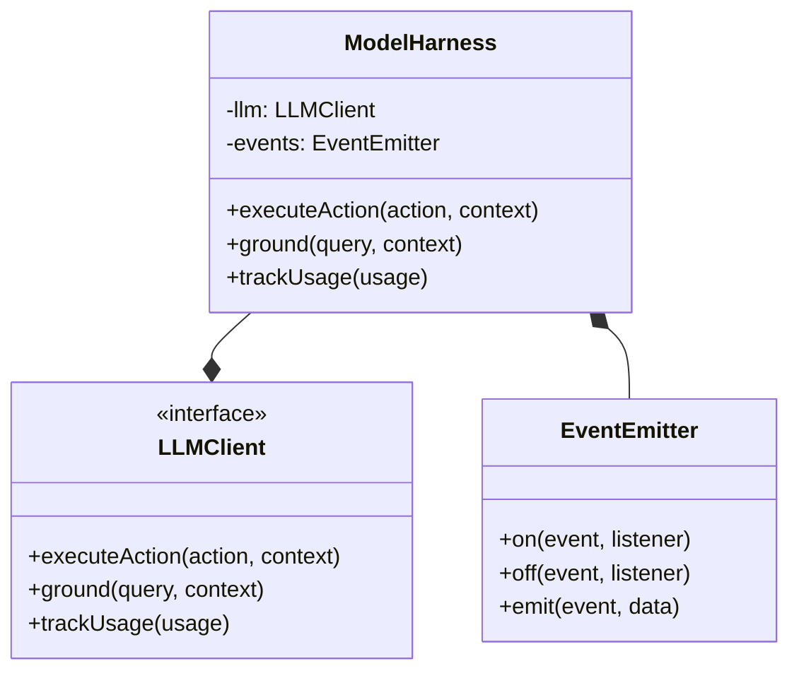
```mermaid
classDiagram
    class ModelHarness {
        -llm: LLMClient
        -events: EventEmitter
        +executeAction(action, context)
        +ground(query, context)
        +trackUsage(usage)
    }
    
    class LLMClient {
        <<interface>>
        +executeAction(action, context)
        +ground(query, context)
        +trackUsage(usage)
    }
    
    ModelHarness --* LLMClient
    
    class EventEmitter {
        +on(event, listener)
        +off(event, listener)
        +emit(event, data)
    }
    
    ModelHarness *-- EventEmitter
```

The `ModelHarness` class has the following key components:

- `llm: LLMClient`: An instance of the `LLMClient` interface, which provides methods for executing actions, grounding, and tracking model usage.
- `events: EventEmitter`: An instance of the `EventEmitter` class, used for emitting and handling events related to model usage tracking.

Sources: [modelHarness.ts:12-28](), [modelHarness.ts:30-35]()

### Key Methods

#### `executeAction(action, context)`

This method executes a given action using the LLM client. It takes two parameters:

- `action`: An object representing the action to be executed.
- `context`: An object containing the context information for the action execution.

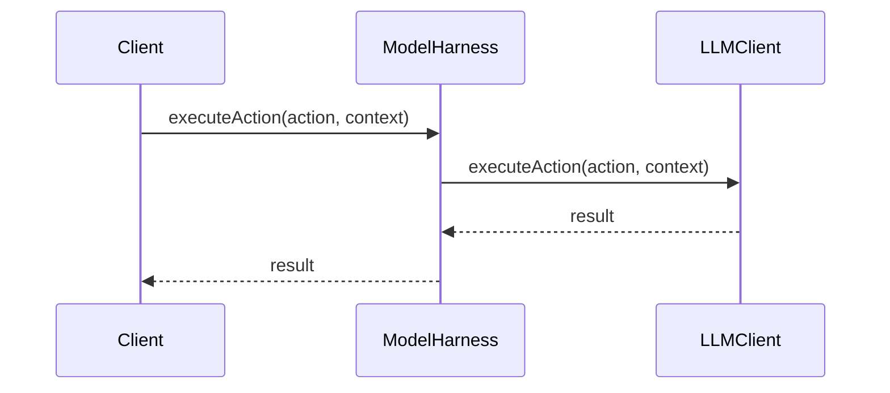
```mermaid
sequenceDiagram
    participant Client
    participant ModelHarness
    participant LLMClient
    
    Client->>ModelHarness: executeAction(action, context)
    ModelHarness->>LLMClient: executeAction(action, context)
    LLMClient-->>ModelHarness: result
    ModelHarness-->>Client: result
```

Sources: [modelHarness.ts:37-43]()

#### `ground(query, context)`

This method grounds a given query using the LLM client. It takes two parameters:

- `query`: A string representing the query to be grounded.
- `context`: An object containing the context information for the grounding operation.

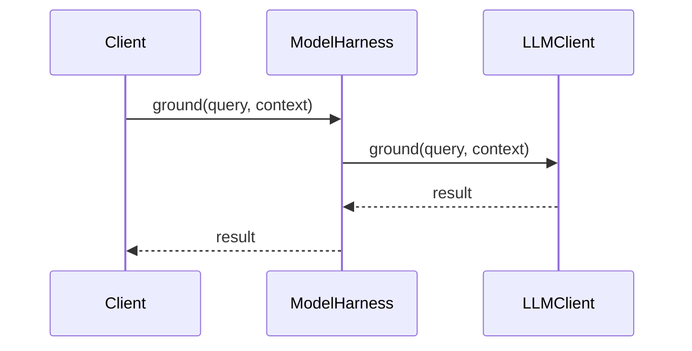
```mermaid
sequenceDiagram
    participant Client
    participant ModelHarness
    participant LLMClient
    
    Client->>ModelHarness: ground(query, context)
    ModelHarness->>LLMClient: ground(query, context)
    LLMClient-->>ModelHarness: result
    ModelHarness-->>Client: result
```

Sources: [modelHarness.ts:45-51]()

#### `trackUsage(usage)`

This method tracks the model usage by emitting a `'tokensUsed'` event with the provided `usage` object.

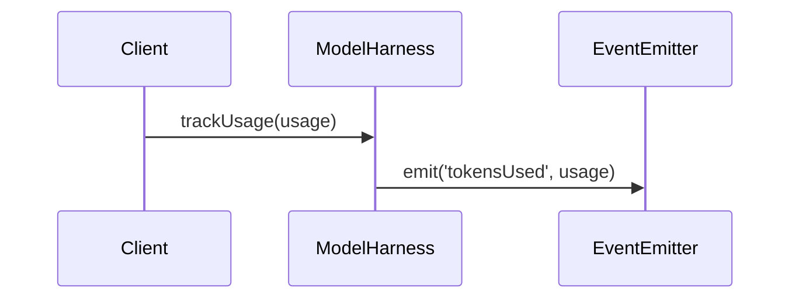
```mermaid
sequenceDiagram
    participant Client
    participant ModelHarness
    participant EventEmitter
    
    Client->>ModelHarness: trackUsage(usage)
    ModelHarness->>EventEmitter: emit('tokensUsed', usage)
```

Sources: [modelHarness.ts:53-57]()

## BAML Client

The project integrates with the Boundary AI Modeling Language (BAML) client, which provides a structured and type-safe way of interacting with AI models. The `BamlAsyncClient` class is a key component of this integration.

### Architecture

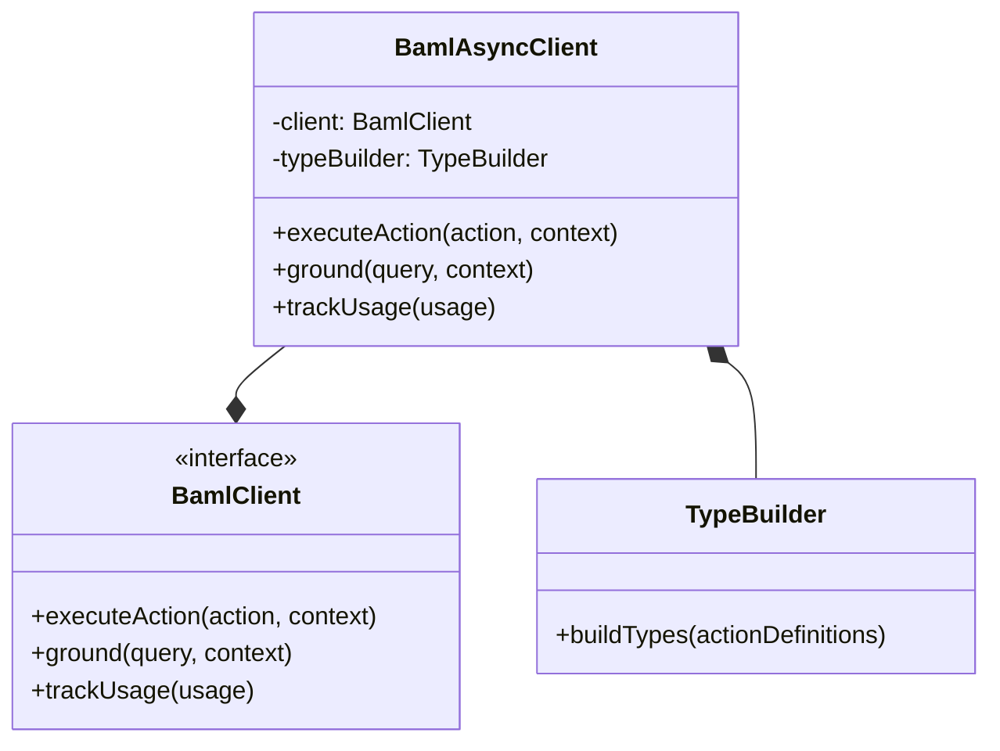
```mermaid
classDiagram
    class BamlAsyncClient {
        -client: BamlClient
        -typeBuilder: TypeBuilder
        +executeAction(action, context)
        +ground(query, context)
        +trackUsage(usage)
    }
    
    class BamlClient {
        <<interface>>
        +executeAction(action, context)
        +ground(query, context)
        +trackUsage(usage)
    }
    
    class TypeBuilder {
        +buildTypes(actionDefinitions)
    }
    
    BamlAsyncClient --* BamlClient
    BamlAsyncClient *-- TypeBuilder
```

The `BamlAsyncClient` class has the following key components:

- `client: BamlClient`: An instance of the `BamlClient` interface, which provides methods for executing actions, grounding, and tracking model usage.
- `typeBuilder: TypeBuilder`: An instance of the `TypeBuilder` class, used for building BAML types from action definitions.

Sources: [async_client.ts:12-18](), [async_client.ts:20-27]()

### Key Methods

#### `executeAction(action, context)`

This method executes a given action using the BAML client. It takes two parameters:

- `action`: An object representing the action to be executed.
- `context`: An object containing the context information for the action execution.

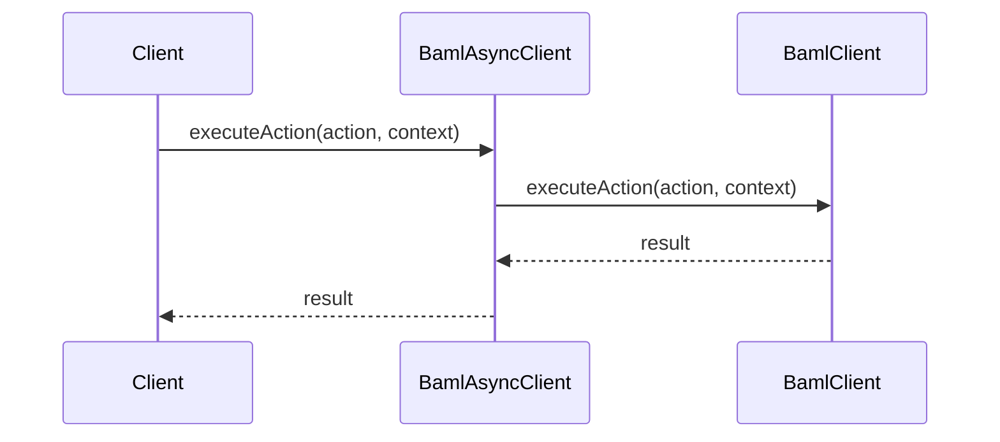
```mermaid
sequenceDiagram
    participant Client
    participant BamlAsyncClient
    participant BamlClient
    
    Client->>BamlAsyncClient: executeAction(action, context)
    BamlAsyncClient->>BamlClient: executeAction(action, context)
    BamlClient-->>BamlAsyncClient: result
    BamlAsyncClient-->>Client: result
```

Sources: [async_client.ts:29-35]()

#### `ground(query, context)`

This method grounds a given query using the BAML client. It takes two parameters:

- `query`: A string representing the query to be grounded.
- `context`: An object containing the context information for the grounding operation.

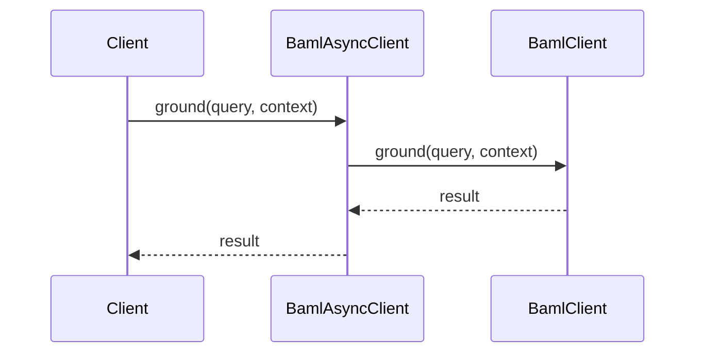
```mermaid
sequenceDiagram
    participant Client
    participant BamlAsyncClient
    participant BamlClient
    
    Client->>BamlAsyncClient: ground(query, context)
    BamlAsyncClient->>BamlClient: ground(query, context)
    BamlClient-->>BamlAsyncClient: result
    BamlAsyncClient-->>Client: result
```

Sources: [async_client.ts:37-43]()

#### `trackUsage(usage)`

This method tracks the model usage by logging the provided `usage` object.

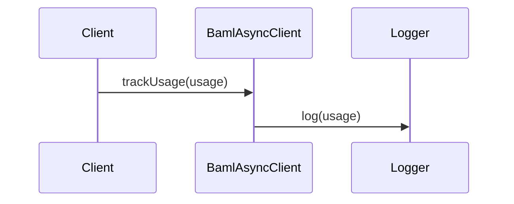
```mermaid
sequenceDiagram
    participant Client
    participant BamlAsyncClient
    participant Logger
    
    Client->>BamlAsyncClient: trackUsage(usage)
    BamlAsyncClient->>Logger: log(usage)
```

Sources: [async_client.ts:45-49]()

## Grounding

The `grounding` module provides functionality for grounding queries and handling potential misalignments or bugs detected during the grounding process.

### Key Functions

#### `ground(query, context, llm)`

This function grounds a given query using the provided LLM client and context.

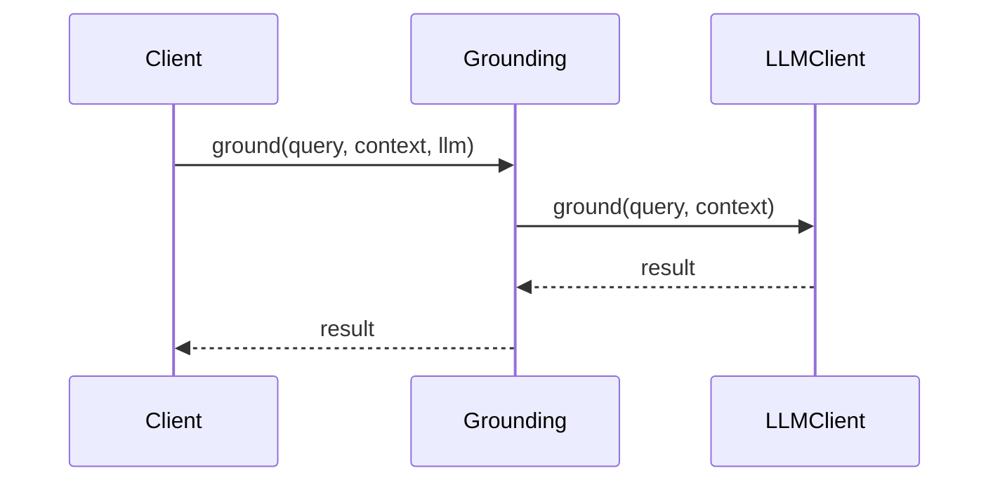
```mermaid
sequenceDiagram
    participant Client
    participant Grounding
    participant LLMClient
    
    Client->>Grounding: ground(query, context, llm)
    Grounding->>LLMClient: ground(query, context)
    LLMClient-->>Grounding: result
    Grounding-->>Client: result
```

Sources: [grounding.ts:14-26]()

#### `handleMisalignment(misalignment, context, llm)`

This function handles a detected misalignment during the grounding process.

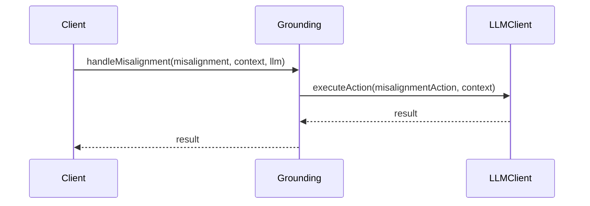
```mermaid
sequenceDiagram
    participant Client
    participant Grounding
    participant LLMClient
    
    Client->>Grounding: handleMisalignment(misalignment, context, llm)
    Grounding->>LLMClient: executeAction(misalignmentAction, context)
    LLMClient-->>Grounding: result
    Grounding-->>Client: result
```

Sources: [grounding.ts:28-38]()

#### `handleBugDetected(bug, context, llm)`

This function handles a detected bug during the grounding process.

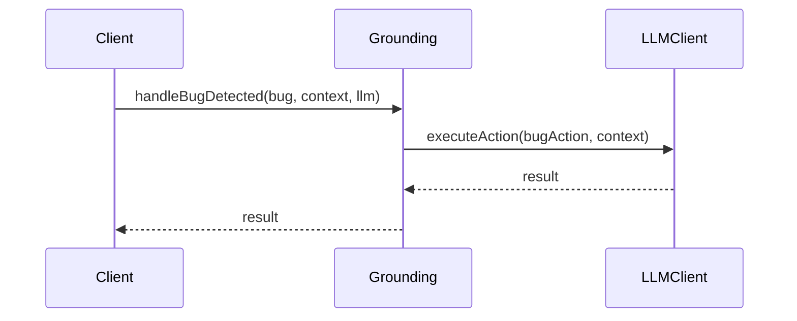
```mermaid
sequenceDiagram
    participant Client
    participant Grounding
    participant LLMClient
    
    Client->>Grounding: handleBugDetected(bug, context, llm)
    Grounding->>LLMClient: executeAction(bugAction, context)
    LLMClient-->>Grounding: result
    Grounding-->>Client: result
```

Sources: [grounding.ts:40-50]()

## Claude Code

The `claudeCode` module provides utility functions for interacting with the Claude AI model.

### Key Functions

#### `executeClaudeCode(code, context, llm)`

This function executes a given code snippet using the Claude AI model.

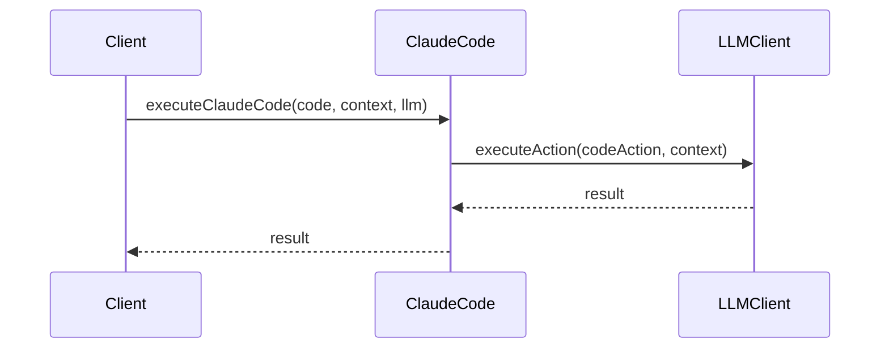
```mermaid
sequenceDiagram
    participant Client
    participant ClaudeCode
    participant LLMClient
    
    Client->>ClaudeCode: executeClaudeCode(code, context, llm)
    ClaudeCode->>LLMClient: executeAction(codeAction, context)
    LLMClient-->>ClaudeCode: result
    ClaudeCode-->>Client: result
```

Sources: [claudeCode.ts:8-18]()

#### `executeClaudeCodeWithContext(code, context, llm)`

This function executes a given code snippet using the Claude AI model, while also providing additional context information.

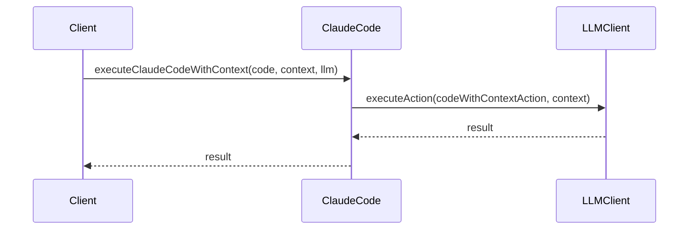
```mermaid
sequenceDiagram
    participant Client
    participant ClaudeCode
    participant LLMClient
    
    Client->>ClaudeCode: executeClaudeCodeWithContext(code, context, llm)
    ClaudeCode->>LLMClient: executeAction(codeWithContextAction, context)
    LLMClient-->>ClaudeCode: result
    ClaudeCode-->>Client: result
```

Sources: [claudeCode.ts:20-30]()

## Conclusion

The "AI Model Integration" component plays a crucial role in facilitating the interaction between the application's logic and the underlying AI models. It provides a unified interface for executing actions, grounding queries, and tracking model usage. Additionally, it integrates with the BAML client, enabling structured and type-safe communication with AI models. The grounding module handles potential misalignments and bugs detected during the grounding process, while the Claude Code module provides utility functions for executing code snippets using the Claude AI model.

<details>
<summary>Relevant source files</summary>

The following files were used as context for generating this wiki page:

- [packages/magnitude-core/src/ai/modelHarness.ts](https://github.com/agattani123/magnitude/blob/main/packages/magnitude-core/src/ai/modelHarness.ts)
- [packages/magnitude-core/src/ai/grounding.ts](https://github.com/agattani123/magnitude/blob/main/packages/magnitude-core/src/ai/grounding.ts)
- [packages/magnitude-core/src/ai/claudeCode.ts](https://github.com/agattani123/magnitude/blob/main/packages/magnitude-core/src/ai/claudeCode.ts)
</details>

# AI Model Integration

## Introduction

The AI Model Integration module in the project provides a framework for integrating and utilizing large language models (LLMs) from various providers, such as Anthropic, OpenAI, and others. It facilitates tasks like generating partial recipes, extracting data, querying memory, and classifying failures, among others. The primary class responsible for this functionality is the `ModelHarness` class.

Sources: [modelHarness.ts](https://github.com/agattani123/magnitude/blob/main/packages/magnitude-core/src/ai/modelHarness.ts)

## Architecture Overview

The `ModelHarness` class serves as the central component for AI model integration. It encapsulates the configuration and setup of the LLM provider, manages the client registry, and exposes methods for interacting with the LLM. The class also includes an event emitter for reporting token usage and costs.

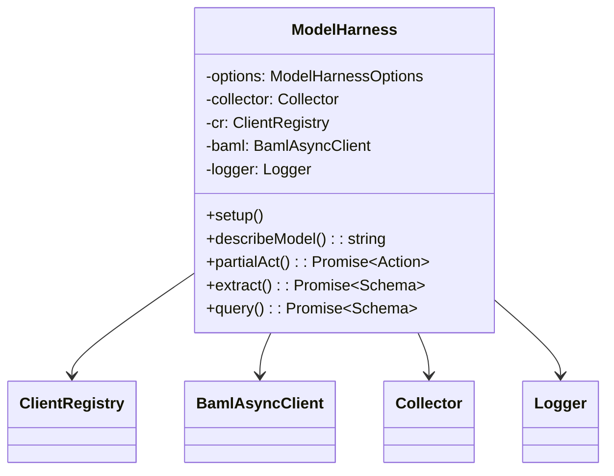
```mermaid
classDiagram
    class ModelHarness {
        -options: ModelHarnessOptions
        -collector: Collector
        -cr: ClientRegistry
        -baml: BamlAsyncClient
        -logger: Logger
        +setup()
        +describeModel(): string
        +partialAct(): Promise~Action~
        +extract(): Promise~Schema~
        +query(): Promise~Schema~
    }
    ModelHarness --> ClientRegistry
    ModelHarness --> BamlAsyncClient
    ModelHarness --> Collector
    ModelHarness --> Logger
```

Sources: [modelHarness.ts](https://github.com/agattani123/magnitude/blob/main/packages/magnitude-core/src/ai/modelHarness.ts)

## Setup and Configuration

The `ModelHarness` class is initialized with an instance of `ModelHarnessOptions`, which specifies the LLM provider and its configuration options. During the setup process, the following steps are performed:

1. A `Collector` instance is created to collect usage metrics.
2. A `ClientRegistry` instance is created to manage LLM clients.
3. The LLM client options are converted to a format compatible with the `BamlAsyncClient` using the `convertToBamlClientOptions` function.
4. The LLM client is added to the `ClientRegistry` with a specified name and retry policy.
5. The `BamlAsyncClient` instance is created with the `Collector` and `ClientRegistry` instances.

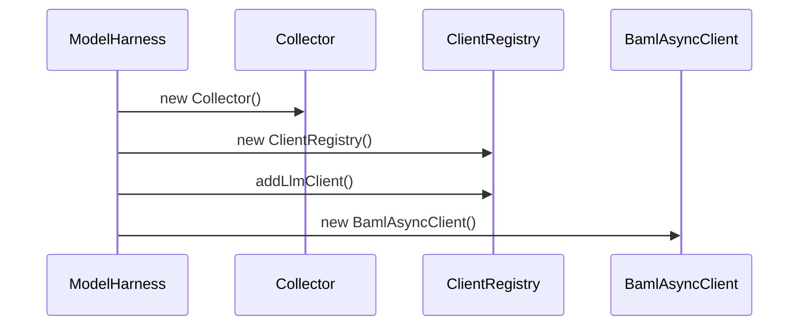
```mermaid
sequenceDiagram
    participant ModelHarness
    participant Collector
    participant ClientRegistry
    participant BamlAsyncClient

    ModelHarness->>Collector: new Collector()
    ModelHarness->>ClientRegistry: new ClientRegistry()
    ModelHarness->>ClientRegistry: addLlmClient()
    ModelHarness->>BamlAsyncClient: new BamlAsyncClient()
```

Sources: [modelHarness.ts:46-69](https://github.com/agattani123/magnitude/blob/main/packages/magnitude-core/src/ai/modelHarness.ts#L46-L69)

## Partial Act

The `partialAct` method is responsible for generating a partial recipe based on the provided context, task, data, and action vocabulary. It utilizes the `BamlAsyncClient` to call the `CreatePartialRecipe` method, passing the necessary parameters.

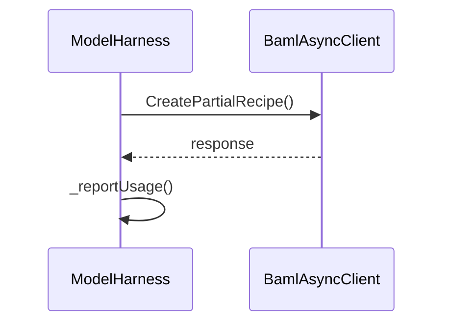
```mermaid
sequenceDiagram
    participant ModelHarness
    participant BamlAsyncClient

    ModelHarness->>BamlAsyncClient: CreatePartialRecipe()
    BamlAsyncClient-->>ModelHarness: response
    ModelHarness->>ModelHarness: _reportUsage()
```

The method returns an object containing the reasoning and a list of actions generated by the LLM.

Sources: [modelHarness.ts:96-123](https://github.com/agattani123/magnitude/blob/main/packages/magnitude-core/src/ai/modelHarness.ts#L96-L123)

## Data Extraction

The `extract` method is used to extract data from a given set of instructions, a screenshot, and DOM content based on a provided schema. It utilizes the `BamlAsyncClient` to call the `ExtractData` method, passing the necessary parameters.

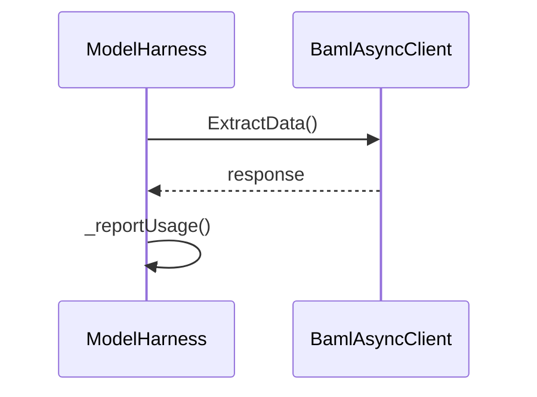
```mermaid
sequenceDiagram
    participant ModelHarness
    participant BamlAsyncClient

    ModelHarness->>BamlAsyncClient: ExtractData()
    BamlAsyncClient-->>ModelHarness: response
    ModelHarness->>ModelHarness: _reportUsage()
```

The method returns the extracted data conforming to the provided schema.

Sources: [modelHarness.ts:126-153](https://github.com/agattani123/magnitude/blob/main/packages/magnitude-core/src/ai/modelHarness.ts#L126-L153)

## Memory Querying

The `query` method is used to query the memory context based on a provided query and schema. It utilizes the `BamlAsyncClient` to call the `QueryMemory` method, passing the necessary parameters.

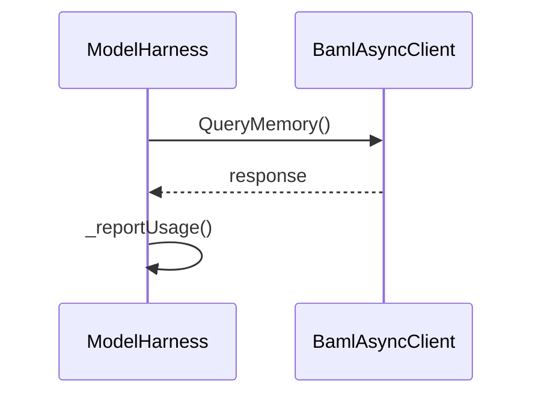
```mermaid
sequenceDiagram
    participant ModelHarness
    participant BamlAsyncClient

    ModelHarness->>BamlAsyncClient: QueryMemory()
    BamlAsyncClient-->>ModelHarness: response
    ModelHarness->>ModelHarness: _reportUsage()
```

The method returns the query response conforming to the provided schema.

Sources: [modelHarness.ts:156-175](https://github.com/agattani123/magnitude/blob/main/packages/magnitude-core/src/ai/modelHarness.ts#L156-L175)

## Token Usage Reporting

The `_reportUsage` method is responsible for reporting the token usage and cost associated with the LLM requests. It retrieves the token usage information from the `Collector` instance and calculates the cost based on a predefined cost map for different LLM models. The calculated usage and cost information is then emitted through the `events` event emitter.

Sources: [modelHarness.ts:70-94](https://github.com/agattani123/magnitude/blob/main/packages/magnitude-core/src/ai/modelHarness.ts#L70-L94)

## Conclusion

The AI Model Integration module, primarily represented by the `ModelHarness` class, provides a comprehensive framework for integrating and utilizing large language models from various providers. It handles the setup and configuration of LLM clients, exposes methods for performing tasks such as generating partial recipes, extracting data, querying memory, and classifying failures, and reports token usage and cost information. This module plays a crucial role in leveraging the capabilities of LLMs within the project.

<details>
<summary>Relevant source files</summary>

The following files were used as context for generating this wiki page:

- [packages/magnitude-core/src/ai/grounding.ts](https://github.com/agattani123/magnitude/blob/main/packages/magnitude-core/src/ai/grounding.ts)
- [packages/magnitude-core/src/ai/claudeCode.ts](https://github.com/agattani123/magnitude/blob/main/packages/magnitude-core/src/ai/claudeCode.ts)
- [packages/magnitude-core/src/web/types.ts](https://github.com/agattani123/magnitude/blob/main/packages/magnitude-core/src/web/types.ts)
- [packages/magnitude-core/src/actions/types.ts](https://github.com/agattani123/magnitude/blob/main/packages/magnitude-core/src/actions/types.ts)
- [packages/magnitude-core/src/logger.ts](https://github.com/agattani123/magnitude/blob/main/packages/magnitude-core/src/logger.ts)
- [packages/magnitude-core/src/common/util.ts](https://github.com/agattani123/magnitude/blob/main/packages/magnitude-core/src/common/util.ts)
- [packages/magnitude-core/src/memory/image.ts](https://github.com/agattani123/magnitude/blob/main/packages/magnitude-core/src/memory/image.ts)
</details>

# AI Model Integration

## Introduction

The AI Model Integration in the Magnitude project is responsible for integrating and leveraging various AI models to enhance the functionality of the application. It primarily focuses on two key aspects: grounding and code generation using Claude, an AI model from Anthropic.

The grounding service, implemented in the `GroundingService` class, utilizes the Moondream vision model to translate high-level web actions into precise, executable actions. This service is crucial for accurately identifying and interacting with web elements based on visual cues.

Additionally, the project includes functionality for authenticating with the Claude AI model from Anthropic, enabling code generation and other AI-assisted tasks within the application.

Sources: [grounding.ts](https://github.com/agattani123/magnitude/blob/main/packages/magnitude-core/src/ai/grounding.ts), [claudeCode.ts](https://github.com/agattani123/magnitude/blob/main/packages/magnitude-core/src/ai/claudeCode.ts)

## Grounding Service

The `GroundingService` is a core component responsible for translating high-level web actions into precise, executable actions by leveraging the Moondream vision model.

### Architecture

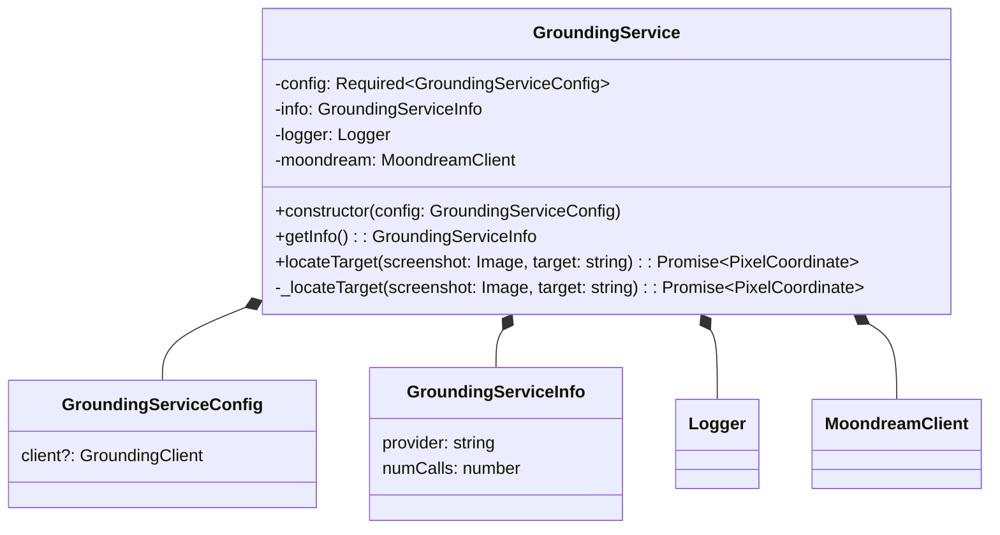
```mermaid
classDiagram
    class GroundingService {
        -config: Required~GroundingServiceConfig~
        -info: GroundingServiceInfo
        -logger: Logger
        -moondream: MoondreamClient
        +constructor(config: GroundingServiceConfig)
        +getInfo(): GroundingServiceInfo
        +locateTarget(screenshot: Image, target: string): Promise~PixelCoordinate~
        -_locateTarget(screenshot: Image, target: string): Promise~PixelCoordinate~
    }
    class GroundingServiceConfig {
        client?: GroundingClient
    }
    class GroundingServiceInfo {
        provider: string
        numCalls: number
    }
    GroundingService *-- GroundingServiceConfig
    GroundingService *-- GroundingServiceInfo
    GroundingService *-- Logger
    GroundingService *-- MoondreamClient
```

The `GroundingService` class is the central component that interacts with the Moondream vision model. It takes a `GroundingServiceConfig` object in its constructor, which can optionally specify a `GroundingClient` configuration.

Sources: [grounding.ts:13-74](https://github.com/agattani123/magnitude/blob/main/packages/magnitude-core/src/ai/grounding.ts#L13-L74)

### Moondream Integration

The `GroundingService` utilizes the Moondream vision model to locate targets on a given screenshot. The `locateTarget` method takes a screenshot (`Image`) and a target description (`string`) as input and returns a `Promise<PixelCoordinate>` representing the precise location of the target on the screenshot.

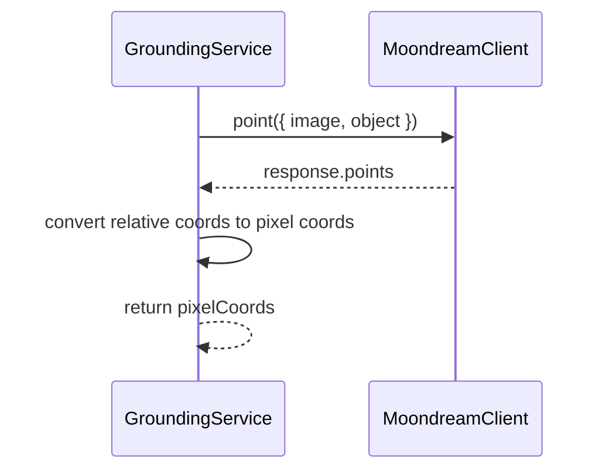
```mermaid
sequenceDiagram
    participant GroundingService
    participant MoondreamClient
    GroundingService->>MoondreamClient: point({ image, object })
    MoondreamClient-->>GroundingService: response.points
    GroundingService->>GroundingService: convert relative coords to pixel coords
    GroundingService-->>GroundingService: return pixelCoords
```

The `locateTarget` method internally calls the `_locateTarget` method, which handles the communication with the Moondream API and converts the relative coordinates returned by Moondream into pixel coordinates based on the screenshot dimensions.

Sources: [grounding.ts:75-121](https://github.com/agattani123/magnitude/blob/main/packages/magnitude-core/src/ai/grounding.ts#L75-L121)

### Error Handling and Retries

The `locateTarget` method employs a retry mechanism using the `retryOnError` utility function to handle potential errors and retries in case of rate limiting or other transient issues with the Moondream API.

```mermaid
sequenceDiagram
    participant GroundingService
    participant retryOnError
    GroundingService->>retryOnError: locateTarget(screenshot, target)
    loop Retry on error
        retryOnError->>GroundingService: _locateTarget(screenshot, target)
        GroundingService-->>retryOnError: result or error
    end
    retryOnError-->>GroundingService: final result or error
```

The `retryOnError` function is configured to retry up to 20 times with a delay of 1 second between retries if specific error conditions are met, such as rate limiting (429), service unavailable (503), or timeout (524) errors.

Sources: [grounding.ts:75-79](https://github.com/agattani123/magnitude/blob/main/packages/magnitude-core/src/ai/grounding.ts#L75-L79), [util.ts](https://github.com/agattani123/magnitude/blob/main/packages/magnitude-core/src/common/util.ts)

### Logging and Monitoring

The `GroundingService` utilizes the `logger` module for logging and monitoring purposes. It creates a child logger with the name `'agent.grounding'` to separate its logs from other parts of the application.

The service also maintains a `GroundingServiceInfo` object, which tracks the provider name (`'moondream'`) and the number of calls made to the Moondream API (`numCalls`). This information can be retrieved using the `getInfo` method.

Sources: [grounding.ts:19-22](https://github.com/agattani123/magnitude/blob/main/packages/magnitude-core/src/ai/grounding.ts#L19-L22), [grounding.ts:29-31](https://github.com/agattani123/magnitude/blob/main/packages/magnitude-core/src/ai/grounding.ts#L29-L31), [logger.ts](https://github.com/agattani123/magnitude/blob/main/packages/magnitude-core/src/logger.ts)

## Claude Code Integration

The `claudeCode.ts` file contains functionality for authenticating with the Claude AI model from Anthropic, enabling code generation and other AI-assisted tasks within the application.

### Authentication Flow

The authentication process with Claude involves the following steps:

1. Generate a PKCE (Proof Key for Code Exchange) pair using the `generatePKCE` function.
2. Construct the authorization URL using the `getAuthorizationURL` function, which includes the PKCE challenge and other required parameters.
3. Open the authorization URL in the user's default browser using the `openUrl` function.
4. The user authenticates and grants the necessary permissions.
5. The application receives the authorization code and exchanges it for an access token and refresh token.
6. The tokens are stored in a local file (`~/.magnitude/credentials/claudeCode.json`) for future use.

```mermaid
sequenceDiagram
    participant App
    participant Browser
    participant AuthServer
    App->>App: generatePKCE()
    App->>App: getAuthorizationURL(pkce)
    App->>Browser: openUrl(authUrl)
    Browser->>AuthServer: Authenticate and grant permissions
    AuthServer-->>Browser: Authorization code
    Browser-->>App: Authorization code
    App->>AuthServer: Exchange code for access/refresh tokens
    AuthServer-->>App: Access token, refresh token
    App->>App: Store tokens in local file
```

Sources: [claudeCode.ts:19-20](https://github.com/agattani123/magnitude/blob/main/packages/magnitude-core/src/ai/claudeCode.ts#L19-L20), [claudeCode.ts:22-27](https://github.com/agattani123/magnitude/blob/main/packages/magnitude-core/src/ai/claudeCode.ts#L22-L27), [claudeCode.ts:29-43](https://github.com/agattani123/magnitude/blob/main/packages/magnitude-core/src/ai/claudeCode.ts#L29-L43), [claudeCode.ts:45-59](https://github.com/agattani123/magnitude/blob/main/packages/magnitude-core/src/ai/claudeCode.ts#L45-L59), [claudeCode.ts:3-16](https://github.com/agattani123/magnitude/blob/main/packages/magnitude-core/src/ai/claudeCode.ts#L3-L16)

### Token Storage and Retrieval

The access token and refresh token obtained during the authentication process are stored in a local file (`~/.magnitude/credentials/claudeCode.json`) for future use. The file structure follows the `Credentials` interface:

```typescript
interface Credentials {
    access_token: string;
    refresh_token: string;
    expires_at: number; // timestamp in ms
}
```

The application can retrieve and use these tokens to authenticate with the Claude AI model and perform code generation or other AI-assisted tasks.

Sources: [claudeCode.ts:22-24](https://github.com/agattani123/magnitude/blob/main/packages/magnitude-core/src/ai/claudeCode.ts#L22-L24)

## Conclusion

The AI Model Integration in the Magnitude project plays a crucial role in enhancing the application's functionality by leveraging AI models for grounding and code generation. The `GroundingService` utilizes the Moondream vision model to accurately identify and interact with web elements, while the Claude Code Integration enables authentication with the Claude AI model from Anthropic for code generation and other AI-assisted tasks.

This integration demonstrates the project's commitment to incorporating cutting-edge AI technologies to improve the user experience and expand the application's capabilities.

<details>
<summary>Relevant source files</summary>

The following files were used as context for generating this wiki page:

- [packages/magnitude-core/src/ai/claudeCode.ts](https://github.com/agattani123/magnitude/blob/main/packages/magnitude-core/src/ai/claudeCode.ts)
- [packages/magnitude-core/src/ai/grounding.ts](https://github.com/agattani123/magnitude/blob/main/packages/magnitude-core/src/ai/grounding.ts)
- [packages/magnitude-core/src/ai/modelHarness.ts](https://github.com/agattani123/magnitude/blob/main/packages/magnitude-core/src/ai/modelHarness.ts)

</details>

# AI Model Integration

## Introduction

The "AI Model Integration" module within the project provides functionality to authenticate with the Anthropic API and interact with the Claude language model. It handles the OAuth2 authorization flow, token management, and API communication for leveraging Claude's capabilities within the application.

This wiki page covers the architecture, components, and data flow involved in the AI model integration process, as evidenced in the provided source files. It aims to provide a comprehensive understanding of how the project integrates with the Anthropic API and utilizes the Claude language model.

## Authentication Flow

The authentication process involves obtaining an access token from the Anthropic API using the OAuth2 authorization code flow. The `completeClaudeCodeAuthFlow` function orchestrates this process.

```mermaid
flowchart TD
    Start --> CheckExistingToken
    CheckExistingToken -->|Token Valid| ReturnToken
    CheckExistingToken -->|Token Invalid| InitiateAuthFlow
    InitiateAuthFlow --> GeneratePKCE
    GeneratePKCE --> GetAuthURL
    GetAuthURL --> OpenBrowser
    OpenBrowser --> PromptUserForCode
    PromptUserForCode --> ExchangeCodeForTokens
    ExchangeCodeForTokens --> SaveCredentials
    SaveCredentials --> ReturnToken
    ReturnToken --> End
```

1. The function first attempts to retrieve a valid access token from the local credentials file using `getValidAccessToken`. If a valid token is found, it is returned immediately. Sources: [claudeCode.ts:60-64](), [claudeCode.ts:35-51]()

2. If no valid token is available, the function initiates the OAuth2 authorization flow:
   - It generates a Proof Key for Code Exchange (PKCE) using `generatePKCE`. Sources: [claudeCode.ts:66]()
   - It constructs the authorization URL using `getAuthorizationURL`. Sources: [claudeCode.ts:67]()
   - It attempts to open the user's default browser with the authorization URL using `openUrl`. Sources: [claudeCode.ts:71-75]()
   - If the browser cannot be opened automatically, it prompts the user to manually visit the URL. Sources: [claudeCode.ts:77-79]()
   - The user is then prompted to enter the authorization code obtained from the Anthropic website. Sources: [claudeCode.ts:81-86]()

3. Once the authorization code is entered, the `exchangeCodeForTokens` function is called to exchange the code for an access token and refresh token. Sources: [claudeCode.ts:87](), [claudeCode.ts:1-18]()

4. The obtained credentials (access token, refresh token, and expiration time) are saved to a local file using `saveCredentials`. Sources: [claudeCode.ts:88](), [claudeCode.ts:23-27]()

5. Finally, the access token is returned to the caller. Sources: [claudeCode.ts:90]()

## Token Management

The project implements token management functionality to handle access token expiration and refreshing. The `getValidAccessToken` function is responsible for this process.

```mermaid
flowchart TD
    Start --> LoadCredentials
    LoadCredentials -->|Credentials Found| CheckTokenValidity
    LoadCredentials -->|No Credentials| ReturnNull
    CheckTokenValidity -->|Token Valid| ReturnToken
    CheckTokenValidity -->|Token Expired| RefreshToken
    RefreshToken --> SaveCredentials
    RefreshToken --> ReturnNewToken
    ReturnNewToken --> End
    ReturnNull --> End
```

1. The function first attempts to load the saved credentials from the local file using `loadCredentials`. Sources: [claudeCode.ts:35-41]()

2. If no credentials are found, the function returns `null`. Sources: [claudeCode.ts:40]()

3. If credentials are found, the function checks if the access token is still valid by comparing its expiration time with the current time (with a 1-minute buffer). Sources: [claudeCode.ts:45-47]()

4. If the token is still valid, it is returned immediately. Sources: [claudeCode.ts:47]()

5. If the token has expired, the `refreshAccessToken` function is called to obtain a new access token and refresh token using the existing refresh token. Sources: [claudeCode.ts:50](), [claudeCode.ts:19-34]()

6. The new credentials are saved to the local file using `saveCredentials`. Sources: [claudeCode.ts:51](), [claudeCode.ts:23-27]()

7. The new access token is returned to the caller. Sources: [claudeCode.ts:51]()

## API Integration

The provided source files do not contain explicit examples of integrating with the Anthropic API using the obtained access token. However, it is expected that the access token would be used to authenticate API requests to the Anthropic API endpoints for interacting with the Claude language model.

Potential use cases could include:

- Sending text prompts to the Claude model and receiving generated responses.
- Fine-tuning the Claude model on custom datasets.
- Retrieving information about the model, such as its capabilities or limitations.

The specific implementation details for API integration are not present in the provided source files.

## Conclusion

The "AI Model Integration" module within the project handles the authentication process with the Anthropic API using the OAuth2 authorization code flow. It manages the acquisition, storage, and refreshing of access tokens required for API communication. While the provided source files do not cover the direct integration with the Anthropic API, the obtained access token can be used to authenticate requests and leverage the capabilities of the Claude language model within the application.