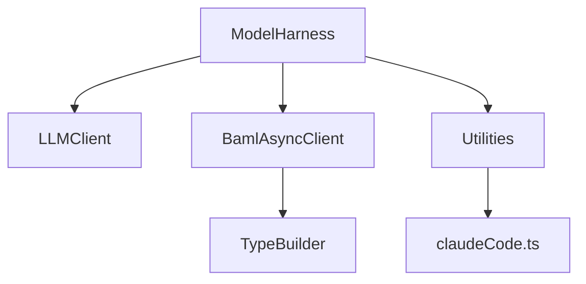
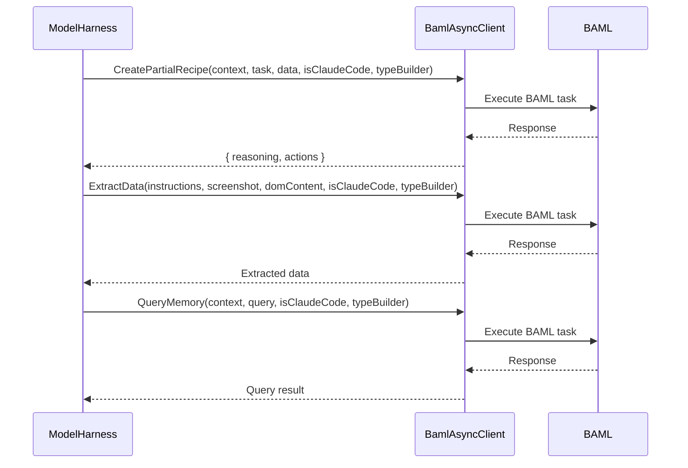
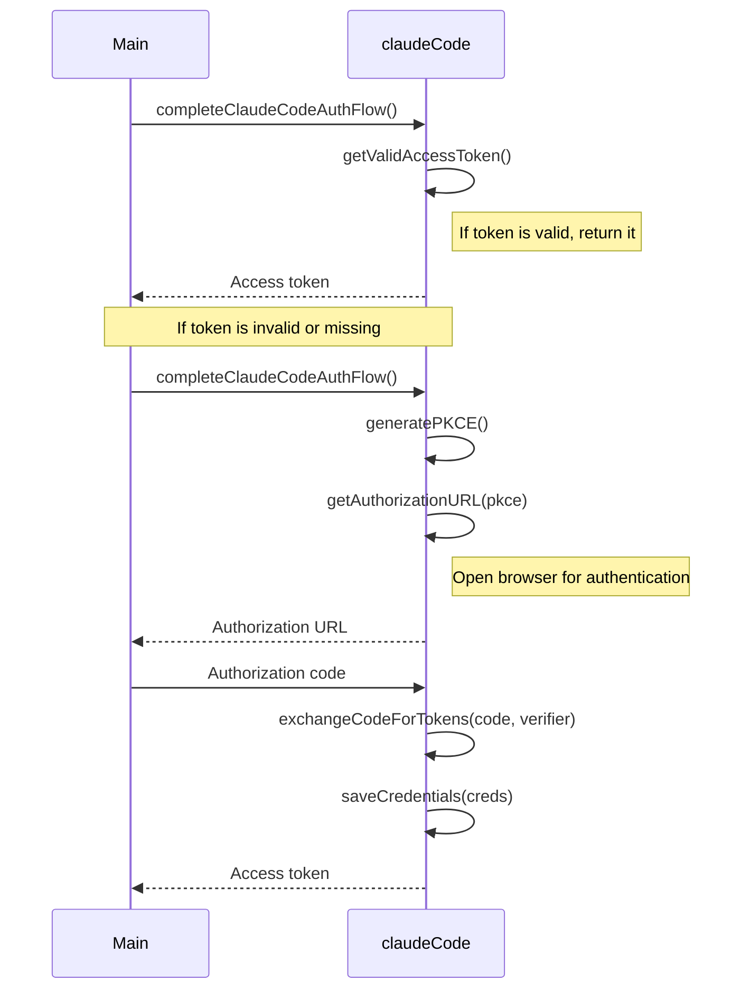

<details>
<summary>Relevant source files</summary>

The following files were used as context for generating this wiki page:

- [packages/magnitude-core/src/ai/modelHarness.ts](https://github.com/agattani123/magnitude/blob/main/packages/magnitude-core/src/ai/modelHarness.ts)
- [packages/magnitude-core/src/ai/claudeCode.ts](https://github.com/agattani123/magnitude/blob/main/packages/magnitude-core/src/ai/claudeCode.ts)
- [packages/magnitude-core/src/ai/baml_client/async_client.ts](https://github.com/agattani123/magnitude/blob/main/packages/magnitude-core/src/ai/baml_client/async_client.ts)
- [packages/magnitude-core/src/ai/baml_client/index.ts](https://github.com/agattani123/magnitude/blob/main/packages/magnitude-core/src/ai/baml_client/index.ts)
- [packages/magnitude-core/src/ai/types.ts](https://github.com/agattani123/magnitude/blob/main/packages/magnitude-core/src/ai/types.ts)
</details>

# LLM Integration

## Introduction

The LLM (Large Language Model) Integration in this project provides a unified interface for interacting with various language models from different providers. It serves as a core component, enabling the application to leverage the capabilities of these models for tasks such as natural language processing, code generation, and knowledge extraction.

The primary class responsible for LLM integration is `ModelHarness`. It acts as a high-level abstraction, encapsulating the communication with the language models and providing methods for executing various tasks, such as partial action planning, data extraction, and querying memory.

## Architecture Overview

The LLM Integration architecture consists of the following key components:

1. **ModelHarness**: This class serves as the central entry point for interacting with language models. It manages the setup, configuration, and communication with the underlying LLM clients.

2. **LLMClient**: An interface that defines the contract for different LLM providers. It abstracts away the provider-specific implementation details, allowing for easy integration of new providers.

3. **BamlAsyncClient**: A client that interacts with the Boundary AI Modeling Language (BAML) framework. It provides a typed interface for executing BAML tasks, such as creating partial recipes, extracting data, and querying memory.

4. **TypeBuilder**: A utility class that helps in constructing and defining the types and schemas required for BAML tasks.

5. **Utilities**: Various utility functions and modules that support the LLM Integration, such as type conversion, client options handling, and authentication flows (e.g., `claudeCode.ts` for handling the authentication flow with Anthropic's Claude model).



Sources: [packages/magnitude-core/src/ai/modelHarness.ts](https://github.com/agattani123/magnitude/blob/main/packages/magnitude-core/src/ai/modelHarness.ts), [packages/magnitude-core/src/ai/baml_client/async_client.ts](https://github.com/agattani123/magnitude/blob/main/packages/magnitude-core/src/ai/baml_client/async_client.ts), [packages/magnitude-core/src/ai/baml_client/index.ts](https://github.com/agattani123/magnitude/blob/main/packages/magnitude-core/src/ai/baml_client/index.ts), [packages/magnitude-core/src/ai/types.ts](https://github.com/agattani123/magnitude/blob/main/packages/magnitude-core/src/ai/types.ts), [packages/magnitude-core/src/ai/claudeCode.ts](https://github.com/agattani123/magnitude/blob/main/packages/magnitude-core/src/ai/claudeCode.ts)

## ModelHarness

The `ModelHarness` class is the central component responsible for managing the interaction with language models. It provides methods for executing various tasks, such as partial action planning, data extraction, and querying memory.

### Key Properties and Methods

- `events`: An `EventEmitter` instance that emits events related to token usage by the LLM.
- `setup()`: Initializes the necessary components, such as the `Collector`, `ClientRegistry`, and `BamlAsyncClient`.
- `describeModel()`: Returns a string describing the LLM provider and model being used.
- `partialAct()`: Generates a partial recipe (a set of actions) based on the provided context, task, data, and action vocabulary.
- `extract()`: Extracts data from a given set of instructions, a screenshot, and DOM content, based on a specified schema.
- `query()`: Queries the memory context with a given query and schema, returning the result.

```mermaid
classDiagram
    class ModelHarness {
        -options: ModelHarnessOptions
        -collector: Collector
        -cr: ClientRegistry
        -baml: BamlAsyncClient
        -logger: Logger
        +events: EventEmitter~ModelHarnessEvents~
        +setup()
        +describeModel(): string
        +partialAct(): Promise~{ reasoning: string, actions: Action[] }~
        +extract(): Promise~any~
        +query(): Promise~any~
    }
    ModelHarness --> LLMClient
    ModelHarness --> BamlAsyncClient
    ModelHarness --> TypeBuilder
    ModelHarness --> Utilities
```

Sources: [packages/magnitude-core/src/ai/modelHarness.ts](https://github.com/agattani123/magnitude/blob/main/packages/magnitude-core/src/ai/modelHarness.ts)

## LLMClient

The `LLMClient` interface defines the contract for different LLM providers. It abstracts away the provider-specific implementation details, allowing for easy integration of new providers.

```typescript
export interface LLMClient {
    provider: string;
    options: any;
}
```

Sources: [packages/magnitude-core/src/ai/types.ts:3-6](https://github.com/agattani123/magnitude/blob/main/packages/magnitude-core/src/ai/types.ts#L3-L6)

## BamlAsyncClient

The `BamlAsyncClient` is a client that interacts with the Boundary AI Modeling Language (BAML) framework. It provides a typed interface for executing BAML tasks, such as creating partial recipes, extracting data, and querying memory.



Sources: [packages/magnitude-core/src/ai/baml_client/async_client.ts](https://github.com/agattani123/magnitude/blob/main/packages/magnitude-core/src/ai/baml_client/async_client.ts)

## TypeBuilder

The `TypeBuilder` is a utility class that helps in constructing and defining the types and schemas required for BAML tasks. It provides a way to define the structure of the input and output data for various BAML operations.

```typescript
import { Schema, z } from 'zod';
import { convertZodToBaml } from "@/actions/util";

class TypeBuilder {
    PartialRecipe: any;
    ExtractedData: any;
    QueryResponse: any;

    constructor() {
        this.PartialRecipe = {};
        this.ExtractedData = {};
        this.QueryResponse = {};
    }

    addProperty(schema: Schema, name: string, description?: string) {
        const bamlType = convertZodToBaml(this, schema);
        if (description) {
            bamlType.description(description);
        }
        this[name].addProperty(name, bamlType);
    }
}
```

Sources: [packages/magnitude-core/src/ai/baml_client/type_builder.ts](https://github.com/agattani123/magnitude/blob/main/packages/magnitude-core/src/ai/baml_client/type_builder.ts)

## Utilities

The project includes various utility functions and modules that support the LLM Integration. These utilities handle tasks such as type conversion, client options handling, and authentication flows.

### claudeCode.ts

The `claudeCode.ts` module is responsible for handling the authentication flow with Anthropic's Claude model. It provides functions for completing the authentication process, exchanging authorization codes for tokens, refreshing access tokens, and managing credentials.



Sources: [packages/magnitude-core/src/ai/claudeCode.ts](https://github.com/agattani123/magnitude/blob/main/packages/magnitude-core/src/ai/claudeCode.ts)

## Conclusion

The LLM Integration in this project provides a flexible and extensible architecture for integrating and utilizing various language models from different providers. The `ModelHarness` class serves as the central entry point, abstracting away the complexities of interacting with the underlying LLM clients and BAML framework. This architecture enables the application to leverage the capabilities of these models for tasks such as natural language processing, code generation, and knowledge extraction, while maintaining a modular and scalable codebase.