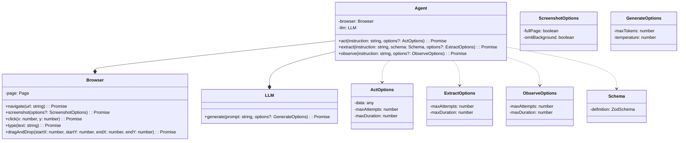
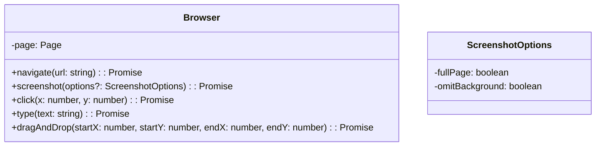
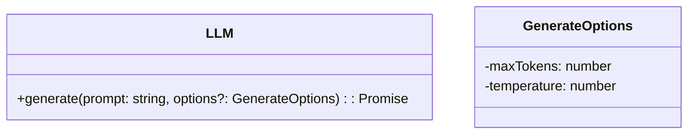
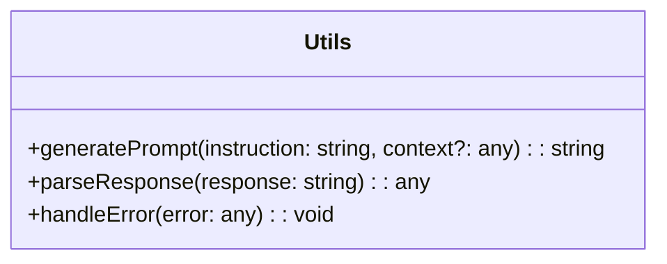

<details>
<summary>Relevant source files</summary>

The following files were used as context for generating this wiki page:

- [README.md](https://github.com/agattani123/magnitude/blob/main/README.md)
- [packages/create-magnitude-app/src/cli.ts](https://github.com/agattani123/magnitude/blob/main/packages/create-magnitude-app/src/cli.ts)
- [src/index.ts](https://github.com/magnitudedev/magnitude-scaffold/blob/main/src/index.ts)
- [src/agent.ts](https://github.com/magnitudedev/magnitude-scaffold/blob/main/src/agent.ts)
- [src/utils.ts](https://github.com/magnitudedev/magnitude-scaffold/blob/main/src/utils.ts)
- [tests/magnitude/example.mag.ts](https://github.com/magnitudedev/magnitude-scaffold/blob/main/tests/magnitude/example.mag.ts)
</details>

# Getting Started

## Introduction

Magnitude is a vision AI-powered browser automation tool that enables you to control your browser with natural language. It provides a powerful and flexible way to navigate, interact with, and extract data from web interfaces. The "Getting Started" process involves setting up a new Magnitude project, configuring the language model and other options, and running your first browser automation script.

Sources: [README.md](https://github.com/agattani123/magnitude/blob/main/README.md), [packages/create-magnitude-app/src/cli.ts](https://github.com/agattani123/magnitude/blob/main/packages/create-magnitude-app/src/cli.ts)

## Project Setup

### Creating a New Project

To create a new Magnitude project, you can use the `create-magnitude-app` command-line tool. This tool will guide you through a series of prompts to configure your project, including setting the project name, selecting the language model (Claude Sonnet 4 or Qwen 2.5 VL 72B), and specifying the API provider and key.

```bash
npx create-magnitude-app
```

The tool will clone a project template, configure the project based on your selections, and install the necessary dependencies.

Sources: [packages/create-magnitude-app/src/cli.ts](https://github.com/agattani123/magnitude/blob/main/packages/create-magnitude-app/src/cli.ts)

### Project Structure

The generated project will have the following structure:

```
my-awesome-browser-app/
├── src/
│   ├── index.ts
│   ├── agent.ts
│   └── utils.ts
├── tests/
│   └── magnitude/
│       ├── magnitude.config.ts
│       └── example.mag.ts
├── package.json
├── .env
└── (assistant configuration file)
```

- `src/index.ts`: The main entry point for running browser automations.
- `src/agent.ts`: Contains the `Agent` class for interacting with the browser.
- `src/utils.ts`: Utility functions for working with the agent.
- `tests/magnitude/magnitude.config.ts`: Configuration file for the Magnitude test runner.
- `tests/magnitude/example.mag.ts`: An example test file demonstrating how to write Magnitude tests.
- `package.json`: Project dependencies and scripts.
- `.env`: Environment variables, including the API key for the selected provider.
- `(assistant configuration file)`: A file containing instructions for the language model assistant (e.g., `.cursorrules`, `CLAUDE.md`, `.clinerules`, `.windsurfrules`).

Sources: [packages/create-magnitude-app/src/cli.ts](https://github.com/agattani123/magnitude/blob/main/packages/create-magnitude-app/src/cli.ts), [src/index.ts](https://github.com/magnitudedev/magnitude-scaffold/blob/main/src/index.ts), [src/agent.ts](https://github.com/magnitudedev/magnitude-scaffold/blob/main/src/agent.ts), [src/utils.ts](https://github.com/magnitudedev/magnitude-scaffold/blob/main/src/utils.ts), [tests/magnitude/example.mag.ts](https://github.com/magnitudedev/magnitude-scaffold/blob/main/tests/magnitude/example.mag.ts)

## Running Your First Automation

After creating the project, you can run the example automation script by navigating to the project directory and executing the provided start command (e.g., `npm start` or `yarn start`).

```bash
cd my-awesome-browser-app
npm start
```

This will launch a browser instance and execute the example script, demonstrating how to use the `Agent` class to perform various actions, such as navigating to a website, interacting with elements, and extracting data.

Sources: [README.md](https://github.com/agattani123/magnitude/blob/main/README.md), [packages/create-magnitude-app/src/cli.ts](https://github.com/agattani123/magnitude/blob/main/packages/create-magnitude-app/src/cli.ts)

## Using the Test Runner

Magnitude also provides a test runner for writing and running browser automation tests. To set up the test runner in an existing web app, you can run the following commands:

```bash
npm i --save-dev magnitude-test && npx magnitude init
```

This will create a `tests/magnitude` directory with a configuration file (`magnitude.config.ts`) and an example test file (`example.mag.ts`).

You can then write your own tests in the `tests/magnitude` directory and run them using the provided test runner commands (e.g., `npx magnitude test` or `npx magnitude watch`).

Sources: [README.md](https://github.com/agattani123/magnitude/blob/main/README.md)

## Key Components and Architecture

### Agent

The `Agent` class is the core component of Magnitude, responsible for interacting with the browser and executing actions based on natural language instructions.



The `Agent` class uses a `Browser` instance to interact with the web page and an `LLM` (Language Model) instance to generate instructions and interpret observations. It provides methods for performing actions (`act`), extracting data (`extract`), and making observations (`observe`).

Sources: [src/agent.ts](https://github.com/magnitudedev/magnitude-scaffold/blob/main/src/agent.ts)

### Browser

The `Browser` class encapsulates the browser instance and provides methods for navigating to URLs, taking screenshots, clicking on coordinates, typing text, and performing drag-and-drop operations.



The `Browser` class internally uses a `Page` instance from the Playwright library to interact with the web page.

Sources: [src/agent.ts](https://github.com/magnitudedev/magnitude-scaffold/blob/main/src/agent.ts)

### Language Model (LLM)

The `LLM` class represents the language model used by Magnitude for generating instructions and interpreting observations. It provides a `generate` method that takes a prompt and generates a response based on the configured language model.



Magnitude supports different language model providers, such as Anthropic, OpenAI, and Claude Code, which can be configured during project setup.

Sources: [src/agent.ts](https://github.com/magnitudedev/magnitude-scaffold/blob/main/src/agent.ts)

### Utilities

The `utils.ts` file contains utility functions for working with the `Agent` class, such as generating prompts, parsing responses, and handling errors.



Sources: [src/utils.ts](https://github.com/magnitudedev/magnitude-scaffold/blob/main/src/utils.ts)

## Example Automation

The `example.mag.ts` file in the `tests/magnitude` directory demonstrates how to write a Magnitude test case. It showcases various actions that can be performed using the `Agent` class, such as navigating to a website, creating a task, dragging and dropping elements, and extracting data based on a provided schema.

```typescript
import { test, expect } from '@magnitude/test';
import { z } from 'zod';

test('Example test', async ({ agent }) => {
    await agent.act('Navigate to https://example.com');

    await agent.act('Create a task', {
        data: {
            title: 'Use Magnitude',
            description: 'Run "npx create-magnitude-app" and follow the instructions',
        },
    });

    await agent.act('Drag "Use Magnitude" to the top of the in progress column');

    const tasks = await agent.extract(
        'List in progress tasks',
        z.array(z.object({
            title: z.string(),
            description: z.string(),
            difficulty: z.number().describe('Rate the difficulty between 1-5')
        })),
    );

    expect(tasks.length).toBeGreaterThan(0);
});
```

This example demonstrates the following actions:

1. Navigating to `https://example.com` using `agent.act('Navigate to https://example.com')`.
2. Creating a task with a title and description using `agent.act('Create a task', { data: { ... } })`.
3. Dragging and dropping an element using `agent.act('Drag "Use Magnitude" to the top of the in progress column')`.
4. Extracting a list of in-progress tasks with their titles, descriptions, and difficulties using `agent.extract('List in progress tasks', schema)`.

The extracted data is validated against the provided Zod schema, ensuring that the expected data structure is returned.

Sources: [tests/magnitude/example.mag.ts](https://github.com/magnitudedev/magnitude-scaffold/blob/main/tests/magnitude/example.mag.ts)

## Conclusion

Magnitude provides a powerful and flexible way to automate browser interactions using natural language instructions. The "Getting Started" process involves setting up a new project, configuring the language model and other options, and running your first automation script or test case. With its vision AI-powered architecture and customizable actions, Magnitude enables developers to build robust and maintainable browser automations for a wide range of use cases.