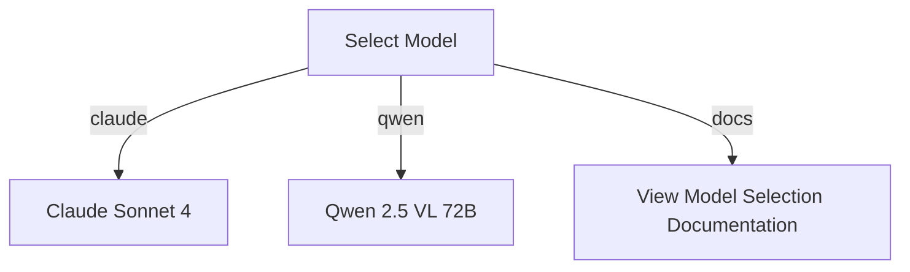
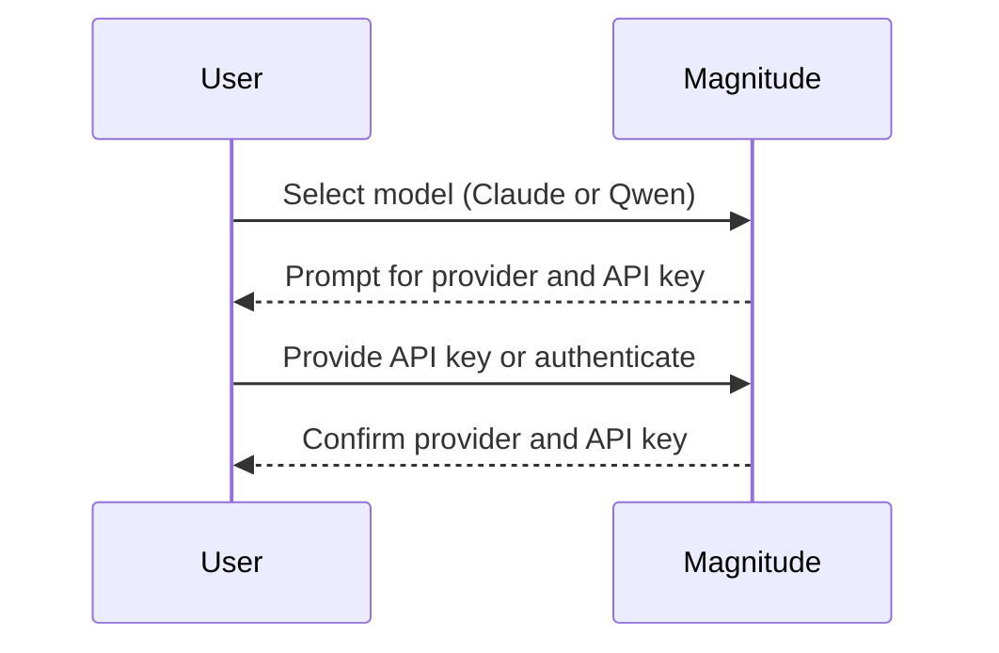
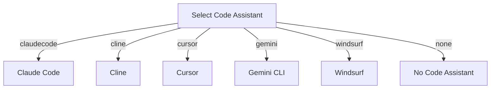
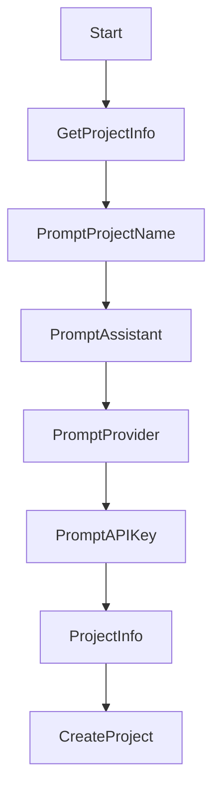
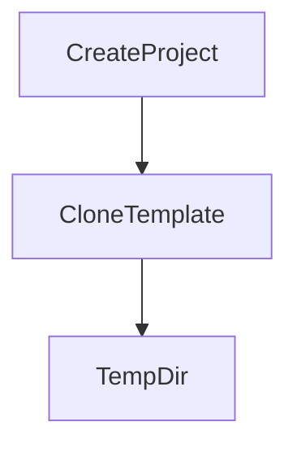
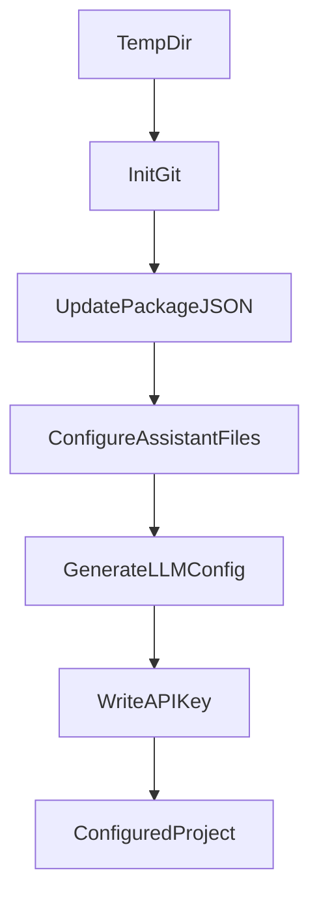
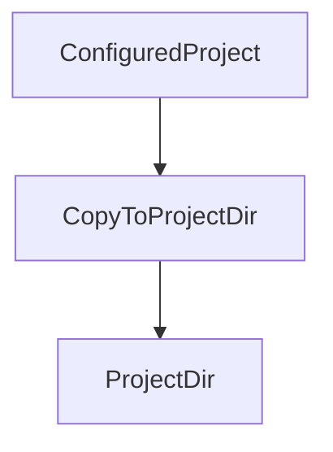
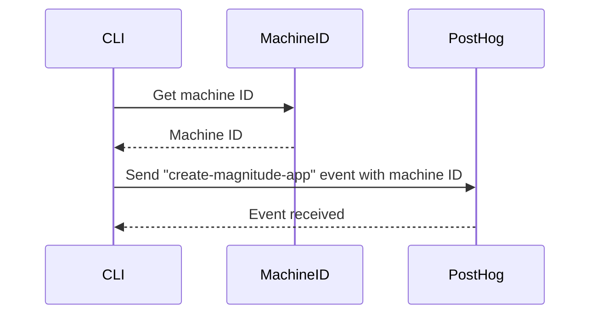
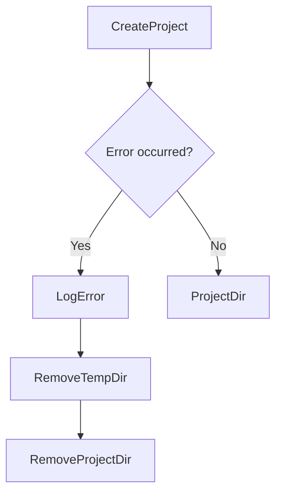

<details>
<summary>Relevant source files</summary>

The following files were used as context for generating this wiki page:

- [packages/create-magnitude-app/src/cli.ts](https://github.com/agattani123/magnitude/blob/main/packages/create-magnitude-app/src/cli.ts)
- [packages/magnitude-test/examples/README.md](https://github.com/agattani123/magnitude/blob/main/packages/magnitude-test/examples/README.md)
- [packages/magnitude-test/examples/src/App.tsx](https://github.com/agattani123/magnitude/blob/main/packages/magnitude-test/examples/src/App.tsx)
- [packages/magnitude-test/examples/src/components/CodeEditor.tsx](https://github.com/agattani123/magnitude/blob/main/packages/magnitude-test/examples/src/components/CodeEditor.tsx)
- [packages/magnitude-test/examples/src/components/Sidebar.tsx](https://github.com/agattani123/magnitude/blob/main/packages/magnitude-test/examples/src/components/Sidebar.tsx)
</details>

# Getting Started

## Introduction

Magnitude is a framework that enables the development of interactive web applications powered by large language models (LLMs). It provides a seamless integration between the user interface and the LLM, allowing developers to create applications that leverage the capabilities of these models for various tasks, such as code generation, natural language processing, and more.

The "Getting Started" process is a crucial step in setting up a new Magnitude project. It involves configuring the project's name, selecting the desired LLM model and provider, and specifying any code assistants to be used. This process ensures that the project is properly initialized and ready for development.

Sources: [packages/create-magnitude-app/src/cli.ts](https://github.com/agattani123/magnitude/blob/main/packages/create-magnitude-app/src/cli.ts)

## Project Setup

### Project Name

The first step in the "Getting Started" process is to provide a name for the new Magnitude project. The `establishProjectInfo` function prompts the user to enter a project name, which is then validated to ensure that it is not empty and that a directory with the same name does not already exist in the current working directory.

```typescript
const projectName = await text({
    message: 'What should your project be called?',
    placeholder: 'my-awesome-browser-app',
    validate(value) {
        if (value.trim().length === 0) return "Project name cannot be empty";

        const projectDir = path.resolve(process.cwd(), value);

        if (fs.existsSync(projectDir)) {
            return `Directory ${projectDir} already exists`;
        }
    }
});
```

Sources: [packages/create-magnitude-app/src/cli.ts:47-58](https://github.com/agattani123/magnitude/blob/main/packages/create-magnitude-app/src/cli.ts#L47-L58)

### Model Selection

After providing the project name, the user is prompted to select the LLM model they want to use for the project. Currently, Magnitude supports two models: Claude Sonnet 4 and Qwen 2.5 VL 72B. The user can choose between these two options or view additional information about the model selection process.



Sources: [packages/create-magnitude-app/src/cli.ts:64-83](https://github.com/agattani123/magnitude/blob/main/packages/create-magnitude-app/src/cli.ts#L64-L83)

### Provider and API Key

Depending on the selected model, the user may need to provide an API key or authenticate with a specific provider. For the Claude model, the following options are available:

1. **Claude Code**: If the user has a Claude Pro or Max subscription, they can authenticate using the Claude Code provider.
2. **Anthropic**: If the user does not have a Claude Pro or Max subscription, they can use the Anthropic provider by providing an ANTHROPIC_API_KEY or obtaining one during the setup process.
3. **OpenRouter**: If the user has an OPENROUTER_API_KEY, they can choose to use the Claude model via the OpenRouter provider.

For the Qwen model, the user must provide an OPENROUTER_API_KEY or obtain one during the setup process.



Sources: [packages/create-magnitude-app/src/cli.ts:87-164](https://github.com/agattani123/magnitude/blob/main/packages/create-magnitude-app/src/cli.ts#L87-L164)

### Code Assistant Selection

After configuring the model and provider, the user is prompted to select a code assistant to be used in the project. Magnitude supports several code assistants, including Claude Code, Cline, Cursor, Gemini CLI, and Windsurf. The user can choose one of these options or opt not to use a code assistant.



Sources: [packages/create-magnitude-app/src/cli.ts:166-181](https://github.com/agattani123/magnitude/blob/main/packages/create-magnitude-app/src/cli.ts#L166-L181)

## Project Structure

After completing the "Getting Started" process, a new Magnitude project is created with the following structure:

```
my-awesome-browser-app/
├── node_modules/
├── public/
├── src/
│   ├── App.tsx
│   ├── components/
│   │   ├── CodeEditor.tsx
│   │   └── Sidebar.tsx
│   ├── index.tsx
│   └── ...
├── package.json
├── tsconfig.json
└── ...
```

The main components of the project structure are:

- `src/App.tsx`: The root component of the application, responsible for rendering the main layout and components.
- `src/components/CodeEditor.tsx`: A component that provides a code editor interface for writing and executing code.
- `src/components/Sidebar.tsx`: A component that displays the available code assistants and allows the user to interact with them.

Sources: [packages/magnitude-test/examples](https://github.com/agattani123/magnitude/blob/main/packages/magnitude-test/examples)

## Conclusion

The "Getting Started" process in Magnitude is a crucial step that sets up the project's configuration and initializes the development environment. By following this process, developers can create new Magnitude projects tailored to their specific requirements, such as the desired LLM model, provider, and code assistant. With the project structure in place, developers can proceed to build interactive web applications that leverage the power of large language models.

<details>
<summary>Relevant source files</summary>

The following files were used as context for generating this wiki page:

- [packages/create-magnitude-app/src/cli.ts](https://github.com/agattani123/magnitude/blob/main/packages/create-magnitude-app/src/cli.ts)
- [packages/create-magnitude-app/src/createProject.ts](https://github.com/agattani123/magnitude/blob/main/packages/create-magnitude-app/src/createProject.ts)
- [packages/create-magnitude-app/src/detectRuntime.ts](https://github.com/agattani123/magnitude/blob/main/packages/create-magnitude-app/src/detectRuntime.ts)
- [packages/create-magnitude-app/src/getMachineId.ts](https://github.com/agattani123/magnitude/blob/main/packages/create-magnitude-app/src/getMachineId.ts)
- [packages/create-magnitude-app/src/sendEvent.ts](https://github.com/agattani123/magnitude/blob/main/packages/create-magnitude-app/src/sendEvent.ts)
</details>

# Getting Started

## Introduction

The `create-magnitude-app` is a command-line interface (CLI) tool that helps developers quickly set up a new Magnitude project from a template. It streamlines the process of creating a new project directory, configuring project settings, and initializing the necessary files and dependencies.

The CLI tool is designed to be user-friendly and efficient, guiding developers through the project creation process with interactive prompts and clear instructions. It supports various package managers and runtime environments, ensuring a smooth setup experience across different development environments.

Sources: [packages/create-magnitude-app/src/cli.ts](), [packages/create-magnitude-app/src/createProject.ts](), [packages/create-magnitude-app/src/detectRuntime.ts]()

## Project Creation Flow

The project creation process follows a well-defined sequence of steps:

1. **Project Information Gathering**: The CLI prompts the user to provide the desired project name and other relevant information, such as the AI assistant to be used (e.g., Claude, Gemini, Windsurf), the language model provider (e.g., Anthropic, OpenRouter), and the API key if required.



Sources: [packages/create-magnitude-app/src/cli.ts:37-47](), [packages/create-magnitude-app/src/createProject.ts:35-56]()

2. **Template Cloning**: The CLI clones a predefined project template from a Git repository into a temporary directory. This template serves as the foundation for the new project.



Sources: [packages/create-magnitude-app/src/createProject.ts:61-64]()

3. **Project Configuration**: After cloning the template, the CLI performs several configuration steps:
   - Initializes a new Git repository in the temporary directory.
   - Updates the `package.json` file with the provided project name.
   - Configures the AI assistant files based on the selected assistant.
   - Generates the language model client configuration based on the chosen provider and model.
   - Writes the provided API key to the `.env` file, if applicable.



Sources: [packages/create-magnitude-app/src/createProject.ts:67-122]()

4. **Project Copying**: Finally, the configured project files from the temporary directory are copied to the desired project directory specified by the user.



Sources: [packages/create-magnitude-app/src/createProject.ts:126]()

## Runtime Detection

The `create-magnitude-app` CLI automatically detects the user's runtime environment (e.g., npm, yarn, pnpm, bun, deno) and provides the appropriate commands for installing dependencies and running the project.

| Runtime | Install Command | Run Command |
| ------- | ---------------- | ----------- |
| bun     | `bun install`    | `bun start` |
| pnpm    | `pnpm install`   | `pnpm start` |
| yarn    | `yarn install`   | `yarn start` |
| deno    | `deno cache src/index.ts` | `deno task start` |
| npm (default) | `npm install` | `npm start` |

Sources: [packages/create-magnitude-app/src/detectRuntime.ts]()

## Event Tracking

The `create-magnitude-app` CLI sends an anonymous event to a tracking service (PostHog) whenever a new project is created. This event includes a unique machine ID, which is generated and stored locally in the `~/.magnitude/user.json` file. The event tracking helps the Magnitude team gather usage statistics and improve the tool based on user behavior.



Sources: [packages/create-magnitude-app/src/getMachineId.ts](), [packages/create-magnitude-app/src/sendEvent.ts]()

## Error Handling

The CLI handles errors that may occur during the project creation process. If an error is encountered, the CLI will:

1. Log the error message to the console.
2. Remove the temporary directory used for cloning the template.
3. Remove the project directory if it was created before the error occurred.



Sources: [packages/create-magnitude-app/src/cli.ts:79-87]()

## Conclusion

The `create-magnitude-app` CLI is a powerful tool that simplifies the process of setting up a new Magnitude project. It guides developers through a series of prompts, configures the project based on their preferences, and sets up the necessary files and dependencies. The CLI also supports various runtime environments and includes features like event tracking and error handling, ensuring a smooth and reliable project creation experience.

<details>
<summary>Relevant source files</summary>

The following files were used as context for generating this wiki page:

- [packages/create-magnitude-app/src/cli.ts](https://github.com/agattani123/magnitude/blob/main/packages/create-magnitude-app/src/cli.ts)
- [packages/magnitude-test/examples/basic/tests/basic.test.ts](https://github.com/agattani123/magnitude/blob/main/packages/magnitude-test/examples/basic/tests/basic.test.ts)
- [packages/magnitude-test/examples/basic/package.json](https://github.com/agattani123/magnitude/blob/main/packages/magnitude-test/examples/basic/package.json)
- [packages/magnitude-test/examples/basic/README.md](https://github.com/agattani123/magnitude/blob/main/packages/magnitude-test/examples/basic/README.md)
- [packages/magnitude-test/examples/basic/tests/utils.ts](https://github.com/agattani123/magnitude/blob/main/packages/magnitude-test/examples/basic/tests/utils.ts)
</details>

# Getting Started

## Introduction

The "Getting Started" process is a crucial step in setting up and initializing a new Magnitude project. It involves creating a new project directory, installing the required dependencies, and running an example automation to verify the successful setup. This wiki page aims to provide a comprehensive guide on the "Getting Started" process, covering the various steps, configurations, and relevant code snippets from the project's source files.

## Project Creation

The first step in the "Getting Started" process is to create a new project directory. This is typically done using the `create-magnitude-app` command-line interface (CLI) tool.

```bash
npx create-magnitude-app@latest my-project
```

This command initializes a new project directory named `my-project` and sets up the necessary project structure and configuration files.

Sources: [packages/create-magnitude-app/src/cli.ts]()

## Dependency Installation

After creating the project directory, the next step is to install the required dependencies. This is done automatically by the `create-magnitude-app` CLI tool.

```typescript
const installSpinner = spinner();
installSpinner.start(`Installing dependencies with '${installCommand}'`);

const [command, ...args] = installCommand.split(' ');
await execa(command, args, { cwd: projectDir });

installSpinner.stop(`Installed dependencies with '${installCommand}'`);
```

The `installCommand` is detected based on the user's runtime environment (e.g., `npm install` or `yarn install`). The installation process is displayed with a spinner to provide visual feedback to the user.

Sources: [packages/create-magnitude-app/src/cli.ts:37-43]()

## Example Automation

Once the dependencies are installed, the user is prompted to run an example automation to verify the successful setup.

```
console.log(bold(blueBright`Next steps:`));
console.log(`◆ Run the example automation: ` + cyanBright`cd ${projectInfo.projectName} && ${runCommand}`);
```

The `runCommand` is also detected based on the user's runtime environment (e.g., `npm run test` or `yarn test`). The user is instructed to navigate to the project directory and run the example automation using the provided command.

Sources: [packages/create-magnitude-app/src/cli.ts:47-48]()

## Example Automation Structure

The example automation is typically located in the `tests` directory of the project. It demonstrates how to write and run tests using the Magnitude testing framework.

```typescript
import { test, expect } from '@magnitude/test';

test('Basic test', async ({ page }) => {
  await page.goto('https://example.com');
  const title = await page.title();
  expect(title).toBe('Example Domain');
});
```

This example test navigates to the `https://example.com` website, retrieves the page title, and asserts that the title matches the expected value.

Sources: [packages/magnitude-test/examples/basic/tests/basic.test.ts:3-8]()

## Utility Functions

The example project may also include utility functions to support the test automation process.

```typescript
import { chromium, FullConfig } from '@magnitude/test';

export const launchBrowser = async (config: FullConfig) => {
  const browser = await chromium.launch(config);
  return browser;
};
```

This utility function launches a new instance of the Chromium browser with the provided configuration.

Sources: [packages/magnitude-test/examples/basic/tests/utils.ts:3-7]()

## Configuration

The example project typically includes a `package.json` file that defines the project's dependencies and scripts.

```json
{
  "scripts": {
    "test": "magnitude"
  },
  "dependencies": {
    "@magnitude/test": "^1.0.0"
  }
}
```

In this example, the `test` script runs the `magnitude` command, which executes the test automation suite.

Sources: [packages/magnitude-test/examples/basic/package.json:5-9]()

## Summary

The "Getting Started" process in the Magnitude project involves creating a new project directory, installing dependencies, and running an example automation to verify the setup. The process is streamlined through the `create-magnitude-app` CLI tool, which automates several steps and provides user-friendly feedback. The example automation demonstrates how to write and run tests using the Magnitude testing framework, and the project structure includes utility functions and configuration files to support the test automation process.