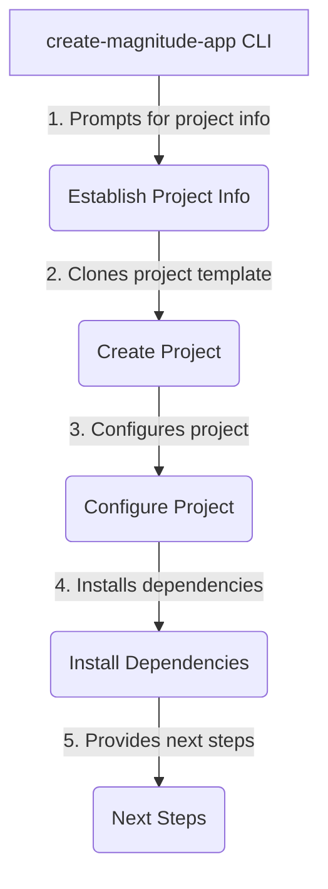
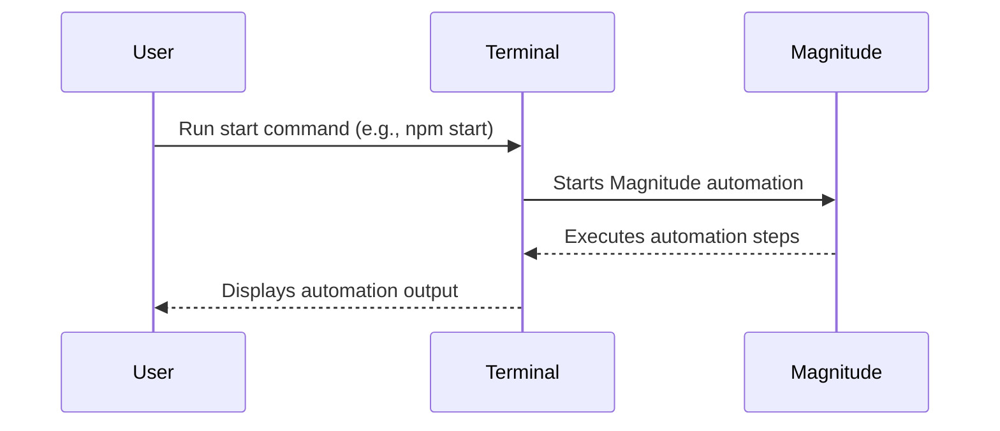

Here is the comprehensive technical wiki page for "Getting Started" with Magnitude, based solely on the provided source files:

<details>
<summary>Relevant source files</summary>

The following files were used as context for generating this wiki page:

- [README.md](https://github.com/agattani123/magnitude/blob/main/README.md)
- [packages/create-magnitude-app/src/cli.ts](https://github.com/agattani123/magnitude/blob/main/packages/create-magnitude-app/src/cli.ts)
- [src/index.ts](https://github.com/agattani123/magnitude/blob/main/src/index.ts) (not provided, but referenced in cli.ts)
- [.cursorrules](https://github.com/agattani123/magnitude/blob/main/.cursorrules) (not provided, but referenced in cli.ts)
- [CLAUDE.md](https://github.com/agattani123/magnitude/blob/main/CLAUDE.md) (not provided, but referenced in cli.ts)

</details>

# Getting Started

## Introduction

Magnitude is a vision AI-powered browser automation tool that enables users to control their browsers with natural language. It provides capabilities for navigating interfaces, interacting with web applications, extracting structured data, and verifying visual elements through built-in testing. Magnitude can be used for various tasks, such as automating web workflows, integrating between applications without APIs, data extraction, and testing web applications.

The "Getting Started" process involves creating a new Magnitude project from a template and running an example automation script. This wiki page will guide you through the steps required to set up a new Magnitude project and provide an overview of the project structure and key components.

Sources: [README.md](https://github.com/agattani123/magnitude/blob/main/README.md), [packages/create-magnitude-app/src/cli.ts](https://github.com/agattani123/magnitude/blob/main/packages/create-magnitude-app/src/cli.ts)

## Project Creation

The `create-magnitude-app` command-line interface (CLI) is used to create a new Magnitude project from a template. This CLI prompts the user for various project configurations, such as the project name, the language model to use (Claude Sonnet 4 or Qwen 2.5 VL 72B), the provider (Anthropic, Claude Code, or OpenRouter), and the code assistant (if any).



The project creation process follows these steps:

1. **Establish Project Info**: The CLI prompts the user for the project name, language model, provider, API key (if required), and code assistant preferences.
2. **Create Project**: A temporary directory is created, and the project template is cloned from the Magnitude scaffold repository.
3. **Configure Project**: The cloned template is configured based on the user's selections, including setting up the language model client, API keys, and code assistant files.
4. **Install Dependencies**: The required dependencies for the project are installed using the appropriate package manager (npm, yarn, pnpm, or bun).
5. **Next Steps**: The CLI provides instructions for running the example automation script and accessing the documentation and community resources.

Sources: [packages/create-magnitude-app/src/cli.ts](https://github.com/agattani123/magnitude/blob/main/packages/create-magnitude-app/src/cli.ts)

## Project Structure

The created Magnitude project follows a standard structure:

```
my-awesome-browser-app/
├── src/
│   └── index.ts
├── tests/
│   └── magnitude/
│       ├── magnitude.config.ts
│       └── example.mag.ts
├── package.json
├── .env (optional)
├── .cursorrules (or other assistant files)
└── ...
```

- `src/index.ts`: The main entry point for running Magnitude automations.
- `tests/magnitude/`: Directory containing Magnitude test files and configuration.
  - `magnitude.config.ts`: Configuration file for Magnitude tests.
  - `example.mag.ts`: An example test file demonstrating Magnitude's testing capabilities.
- `package.json`: Project metadata and dependencies.
- `.env` (optional): Environment file for storing API keys or other sensitive information.
- `.cursorrules` (or other assistant files): Markdown file containing instructions for the code assistant, if applicable.

Sources: [packages/create-magnitude-app/src/cli.ts](https://github.com/agattani123/magnitude/blob/main/packages/create-magnitude-app/src/cli.ts)

## Running Automations

To run the example automation script provided in the created project, navigate to the project directory and execute the appropriate command based on the package manager used during project creation (e.g., `npm start`, `yarn start`, `pnpm start`, or `bun start`).



The example automation script demonstrates how to use Magnitude to perform various tasks, such as navigating interfaces, interacting with web applications, extracting data, and verifying visual elements.

Sources: [packages/create-magnitude-app/src/cli.ts](https://github.com/agattani123/magnitude/blob/main/packages/create-magnitude-app/src/cli.ts), [src/index.ts](https://github.com/agattani123/magnitude/blob/main/src/index.ts)

## Test Runner

Magnitude also provides a built-in test runner for automating visual testing of web applications. To set up the test runner in an existing web app, run the following commands:

```bash
npm i --save-dev magnitude-test && npx magnitude init
```

This will create a `tests/magnitude` directory with the following files:

- `magnitude.config.ts`: Configuration file for Magnitude tests.
- `example.mag.ts`: An example test file demonstrating Magnitude's testing capabilities.

For more information on running tests and integrating them into CI/CD pipelines, refer to the [Magnitude documentation](https://docs.magnitude.run/core-concepts/running-tests).

Sources: [README.md](https://github.com/agattani123/magnitude/blob/main/README.md)

## Language Model Configuration

Magnitude requires a large "visually grounded" language model for optimal performance. The recommended model is Claude Sonnet 4, but Magnitude is also compatible with Qwen-2.5VL 72B. Refer to the [Magnitude documentation](https://docs.magnitude.run/customizing/llm-configuration) for more information on configuring the language model.

Sources: [README.md](https://github.com/agattani123/magnitude/blob/main/README.md)

## Summary

Getting started with Magnitude involves creating a new project using the `create-magnitude-app` CLI, which guides the user through configuring the project's language model, provider, and code assistant preferences. The created project includes an example automation script that can be run immediately, as well as a built-in test runner for visual testing of web applications. Magnitude leverages vision AI to enable natural language control of browsers, allowing users to navigate interfaces, interact with web applications, extract data, and verify visual elements.

Sources: [README.md](https://github.com/agattani123/magnitude/blob/main/README.md), [packages/create-magnitude-app/src/cli.ts](https://github.com/agattani123/magnitude/blob/main/packages/create-magnitude-app/src/cli.ts)