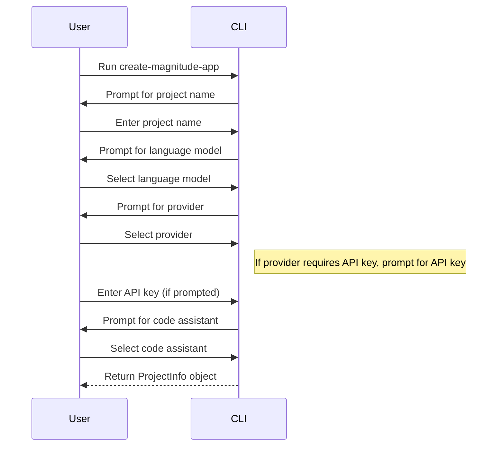
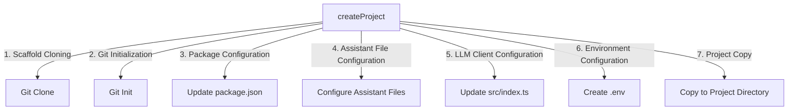

<details>
<summary>Relevant source files</summary>

The following files were used as context for generating this wiki page:

- [packages/create-magnitude-app/src/cli.ts](https://github.com/agattani123/magnitude/blob/main/packages/create-magnitude-app/src/cli.ts)
- [packages/create-magnitude-app/src/claudeCode.ts](https://github.com/agattani123/magnitude/blob/main/packages/create-magnitude-app/src/claudeCode.ts)
- [packages/create-magnitude-app/src/version.ts](https://github.com/agattani123/magnitude/blob/main/packages/create-magnitude-app/src/version.ts)
- [packages/create-magnitude-app/package.json](https://github.com/agattani123/magnitude/blob/main/packages/create-magnitude-app/package.json)
- [packages/create-magnitude-app/README.md](https://github.com/agattani123/magnitude/blob/main/packages/create-magnitude-app/README.md)
</details>

# Getting Started

## Introduction

The `create-magnitude-app` command-line interface (CLI) is a tool provided by the Magnitude project to help developers quickly set up a new Magnitude project from a pre-configured template. It guides users through a series of prompts to gather information about the project, such as the project name, the language model (LLM) to use, and any code assistant preferences. Based on the user's input, the CLI clones a scaffold project from a GitHub repository, configures it according to the specified options, and sets up the project directory with the necessary files and dependencies.

This wiki page covers the architecture, components, and data flow of the `create-magnitude-app` CLI, providing insights into how it functions and how developers can use it to kickstart their Magnitude projects.

Sources: [cli.ts](https://github.com/agattani123/magnitude/blob/main/packages/create-magnitude-app/src/cli.ts), [package.json:1-19](https://github.com/agattani123/magnitude/blob/main/packages/create-magnitude-app/package.json#L1-L19), [README.md](https://github.com/agattani123/magnitude/blob/main/packages/create-magnitude-app/README.md)

## Command-Line Interface

The `create-magnitude-app` CLI is built using the [Commander.js](https://github.com/tj/commander.js/) library, which provides a simple and intuitive way to define and parse command-line arguments. The main entry point for the CLI is the `cli.ts` file, which sets up the command-line interface and handles the user's input.

```mermaid
graph TD
    A[cli.ts] -->|imports| B(Commander.js)
    A -->|imports| C(fs-extra)
    A -->|imports| D(path)
    A -->|imports| E(os)
    A -->|imports| F(ansis)
    A -->|imports| G(@clack/prompts)
    A -->|imports| H(version.ts)
    A -->|imports| I(@paralleldrive/cuid2)
    A -->|imports| J(claudeCode.ts)
    A -->|defines| K[Command-Line Interface]
    K -->|uses| L[Project Setup Flow]
    L -->|uses| M[Project Configuration]
    M -->|uses| N[Scaffold Cloning]
    N -->|uses| O[Git Initialization]
    O -->|uses| P[Package Configuration]
    P -->|uses| Q[Assistant File Configuration]
    Q -->|uses| R[LLM Client Configuration]
    R -->|uses| S[Environment Configuration]
    S -->|uses| T[Project Copy]
    T -->|uses| U[Dependency Installation]
    U -->|uses| V[Next Steps]
```

The CLI defines a single command, `create-magnitude-app`, which accepts an optional `project-name` argument. It then guides the user through a series of prompts to gather information about the project, such as the project name (if not provided as an argument), the language model to use, the provider for the language model, and the code assistant preference.

Sources: [cli.ts](https://github.com/agattani123/magnitude/blob/main/packages/create-magnitude-app/src/cli.ts)

## Project Setup Flow

The `establishProjectInfo` function is responsible for gathering the necessary information from the user to set up the project. It prompts the user for the project name, language model, provider, API key (if required), and code assistant preference.



The `ProjectInfo` interface defines the structure of the project information gathered during this process.

Sources: [cli.ts:38-207](https://github.com/agattani123/magnitude/blob/main/packages/create-magnitude-app/src/cli.ts#L38-L207)

## Project Configuration

Once the project information is gathered, the `createProject` function is called to configure and create the project. This function performs the following steps:

1. **Scaffold Cloning**: It clones the Magnitude scaffold project from a GitHub repository into a temporary directory.
2. **Git Initialization**: It removes the existing Git repository from the cloned scaffold and initializes a new Git repository in the temporary directory.
3. **Package Configuration**: It updates the `package.json` file with the provided project name.
4. **Assistant File Configuration**: It creates or removes the appropriate assistant files (e.g., `.cursorrules`, `.clinerules`, `CLAUDE.md`, `GEMINI.md`, `.windsurfrules`) based on the selected code assistant.
5. **LLM Client Configuration**: It modifies the `src/index.ts` file to include the appropriate configuration for the selected language model provider and API key.
6. **Environment Configuration**: If an API key is provided, it creates an `.env` file with the API key.
7. **Project Copy**: It copies the configured project from the temporary directory to the target project directory.



Sources: [cli.ts:209-339](https://github.com/agattani123/magnitude/blob/main/packages/create-magnitude-app/src/cli.ts#L209-L339)

## Utility Functions

The `create-magnitude-app` CLI also includes several utility functions:

- **`getMachineId`**: This function generates a unique machine ID for the user, which is used for analytics purposes. It attempts to read an existing ID from a local file (`~/.magnitude/user.json`), and if not found, it generates a new ID and stores it in the file.

  Sources: [cli.ts:341-361](https://github.com/agattani123/magnitude/blob/main/packages/create-magnitude-app/src/cli.ts#L341-L361)

- **`sendEvent`**: This function sends an event to a third-party analytics service (PostHog) when a new project is created, using the machine ID generated by `getMachineId`.

  Sources: [cli.ts:363-388](https://github.com/agattani123/magnitude/blob/main/packages/create-magnitude-app/src/cli.ts#L363-L388)

- **`detectRuntime`**: This function attempts to detect the user's package manager (e.g., npm, yarn, pnpm, bun, deno) based on the `npm_config_user_agent` environment variable. It returns the appropriate install and run commands for the detected package manager.

  Sources: [cli.ts:390-412](https://github.com/agattani123/magnitude/blob/main/packages/create-magnitude-app/src/cli.ts#L390-L412)

## Claude Code Integration

The `create-magnitude-app` CLI integrates with the Claude Code service provided by Anthropic. The `claudeCode.ts` file contains functions to authenticate with the Claude Code service and obtain a valid access token.

The `completeClaudeCodeAuthFlow` function guides the user through the authentication process by opening a browser window and prompting the user to log in to their Claude Code account. Once authenticated, it retrieves and stores the access token for future use.

The `getValidClaudeCodeAccessToken` function checks if a valid access token is already stored and returns it if available. If not, it prompts the user to complete the authentication flow.

These functions are used during the project setup flow to configure the project to use the Claude Code service as the language model provider if the user has a Claude Pro or Max subscription.

Sources: [claudeCode.ts](https://github.com/agattani123/magnitude/blob/main/packages/create-magnitude-app/src/claudeCode.ts)

## Conclusion

The `create-magnitude-app` CLI is a crucial component of the Magnitude project, providing a streamlined and user-friendly way for developers to set up new Magnitude projects. It guides users through a series of prompts, configures the project based on their preferences, and sets up the necessary files and dependencies. By leveraging the CLI, developers can quickly start building browser automations with Magnitude, focusing on their application logic rather than the project setup process.

Sources: [cli.ts](https://github.com/agattani123/magnitude/blob/main/packages/create-magnitude-app/src/cli.ts), [package.json](https://github.com/agattani123/magnitude/blob/main/packages/create-magnitude-app/package.json), [README.md](https://github.com/agattani123/magnitude/blob/main/packages/create-magnitude-app/README.md)