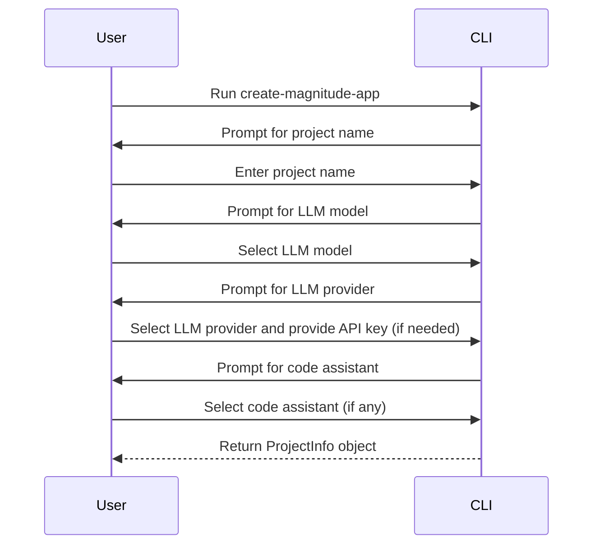
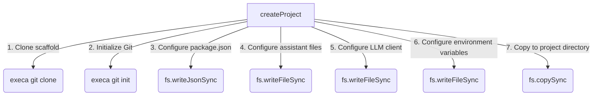

<details>
<summary>Relevant source files</summary>

The following files were used as context for generating this wiki page:

- [packages/create-magnitude-app/src/cli.ts](https://github.com/agattani123/magnitude/blob/main/packages/create-magnitude-app/src/cli.ts)
- [packages/create-magnitude-app/src/claudeCode.ts](https://github.com/agattani123/magnitude/blob/main/packages/create-magnitude-app/src/claudeCode.ts)
- [packages/create-magnitude-app/src/version.ts](https://github.com/agattani123/magnitude/blob/main/packages/create-magnitude-app/src/version.ts)
- [packages/create-magnitude-app/package.json](https://github.com/agattani123/magnitude/blob/main/packages/create-magnitude-app/package.json)
- [packages/create-magnitude-app/README.md](https://github.com/agattani123/magnitude/blob/main/packages/create-magnitude-app/README.md)
</details>

# Getting Started

## Introduction

The `create-magnitude-app` package is a command-line interface (CLI) tool that helps developers create a new Magnitude project from a template. Magnitude is a platform for building browser automations using large language models (LLMs) and visual grounding. This CLI tool guides users through a series of prompts to configure the project's name, LLM provider, model, and code assistant (if any). It then clones a scaffold project from a GitHub repository, customizes it based on the user's selections, and sets up the project with the necessary dependencies.

The "Getting Started" process involves running the `create-magnitude-app` command, providing the required information, and following the instructions to run the newly created project. This wiki page covers the architecture, components, and data flow involved in this process.

Sources: [packages/create-magnitude-app/src/cli.ts](), [packages/create-magnitude-app/README.md]()

## Command-Line Interface

The `create-magnitude-app` CLI is built using the [Commander.js](https://www.npmjs.com/package/commander) library for Node.js. The entry point is the `cli.ts` file, which defines the CLI commands and options.

```mermaid
graph TD
    A[cli.ts] -->|imports| B(commander)
    A -->|imports| C(execa)
    A -->|imports| D(fs-extra)
    A -->|imports| E(path)
    A -->|imports| F(os)
    A -->|imports| G(ansis)
    A -->|imports| H(@clack/prompts)
    A -->|imports| I(cuid2)
    A -->|imports| J(claudeCode)
    A -->|imports| K(version)
```

The main `program` object from Commander.js is configured with the command name, description, and an optional argument for the project name. The `action` function is executed when the command is run, which initiates the project creation process.

Sources: [packages/create-magnitude-app/src/cli.ts:1-22](), [packages/create-magnitude-app/src/cli.ts:272-316]()

## Project Information Gathering

The `establishProjectInfo` function is responsible for gathering information from the user through a series of prompts. It uses the `@clack/prompts` library to display prompts and collect user input.



The function collects the following information:

- **Project Name**: The name of the new project, validated to ensure it's a valid directory name.
- **LLM Model**: The large language model to be used, either "claude" or "qwen".
- **LLM Provider**: The provider for the selected LLM model, which can be "anthropic", "claude-code", or "openrouter". If needed, the user is prompted to provide an API key.
- **Code Assistant**: The code assistant to be used, if any, such as "claudecode", "cline", "cursor", "gemini", or "windsurf".

The gathered information is returned as a `ProjectInfo` object, which is used in the subsequent project creation step.

Sources: [packages/create-magnitude-app/src/cli.ts:38-239]()

## Project Creation

The `createProject` function is responsible for creating the new project based on the provided `ProjectInfo` object. It performs the following steps:

1. **Clone Scaffold Repository**: The function clones the Magnitude scaffold repository from GitHub into a temporary directory using the `execa` library to execute Git commands.
2. **Initialize Git**: The existing Git repository in the cloned scaffold is removed, and a new Git repository is initialized in the temporary directory.
3. **Configure Package.json**: The `package.json` file in the cloned scaffold is updated with the provided project name.
4. **Configure Assistant Files**: Based on the selected code assistant, the corresponding assistant file (e.g., `.cursorrules`, `CLAUDE.md`, `.clinerules`, `GEMINI.md`, or `.windsurfrules`) is created or updated in the temporary directory.
5. **Configure LLM Client**: The `src/index.ts` file in the cloned scaffold is modified to include the LLM configuration based on the selected provider and model.
6. **Configure Environment Variables**: If an API key is provided, an `.env` file is created in the temporary directory with the appropriate environment variable (`ANTHROPIC_API_KEY` or `OPENROUTER_API_KEY`).
7. **Copy to Project Directory**: The contents of the temporary directory are copied to the final project directory.



The `createProject` function handles error cases and ensures that the temporary and project directories are cleaned up in case of any errors.

Sources: [packages/create-magnitude-app/src/cli.ts:241-333]()

## Utility Functions

The `cli.ts` file also includes several utility functions:

- `getMachineId`: Generates a unique machine ID for analytics purposes, either by reading an existing ID from a file or generating a new one using the `cuid2` library.
- `sendEvent`: Sends an analytics event to a third-party service (PostHog) to track the usage of the `create-magnitude-app` command.
- `detectRuntime`: Detects the current Node.js runtime environment (e.g., Bun, pnpm, yarn, deno, or npm) and returns the appropriate install and run commands for the project.

Sources: [packages/create-magnitude-app/src/cli.ts:335-399]()

## Dependency Management

The `create-magnitude-app` CLI uses several external dependencies, which are listed in the `package.json` file:

| Dependency | Description |
| --- | --- |
| `@clack/prompts` | Library for creating interactive command-line prompts |
| `@paralleldrive/cuid2` | Library for generating collision-resistant unique IDs |
| `ansis` | Library for styling terminal output with ANSI escape codes |
| `commander` | Library for building command-line interfaces |
| `execa` | Library for executing external commands |
| `fs-extra` | Extension of the built-in `fs` module with additional features |

These dependencies are installed when running the `npm install` command in the project directory.

Sources: [packages/create-magnitude-app/package.json]()

## Conclusion

The `create-magnitude-app` CLI is a crucial component of the Magnitude platform, providing a streamlined way for developers to set up new projects and configure the necessary components, such as the LLM provider, model, and code assistant. By guiding users through a series of prompts and automating the project setup process, the CLI simplifies the initial steps of building browser automations with Magnitude.

Sources: [packages/create-magnitude-app/README.md]()