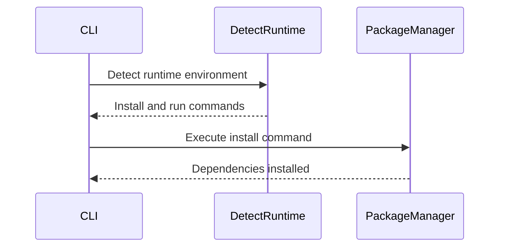
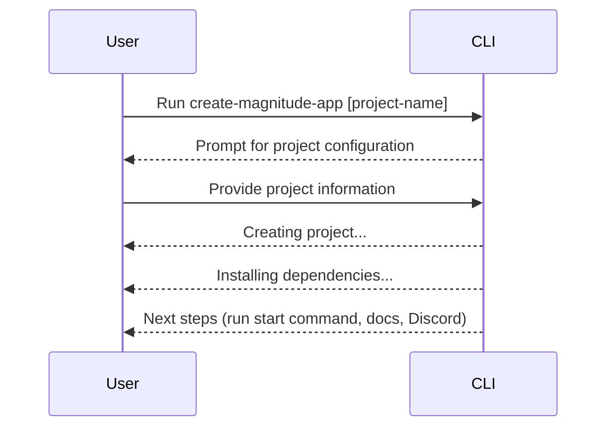

<details>
<summary>Relevant source files</summary>

The following files were used as context for generating this wiki page:

- [packages/create-magnitude-app/src/cli.ts](https://github.com/agattani123/magnitude/blob/main/packages/create-magnitude-app/src/cli.ts)
- [packages/create-magnitude-app/src/claudeCode.ts](https://github.com/agattani123/magnitude/blob/main/packages/create-magnitude-app/src/claudeCode.ts)
- [packages/create-magnitude-app/src/version.ts](https://github.com/agattani123/magnitude/blob/main/packages/create-magnitude-app/src/version.ts)
- [packages/create-magnitude-app/package.json](https://github.com/agattani123/magnitude/blob/main/packages/create-magnitude-app/package.json)
- [packages/create-magnitude-app/README.md](https://github.com/agattani123/magnitude/blob/main/packages/create-magnitude-app/README.md)
</details>

# Getting Started

## Introduction

The `create-magnitude-app` package is a command-line interface (CLI) tool that helps developers create a new Magnitude project from a template. Magnitude is a framework for building browser automations using large language models (LLMs) and visual grounding. The CLI guides users through a series of prompts to configure the project's name, LLM model, provider, API key, and code assistant (if applicable). It then clones a scaffold project from a GitHub repository, customizes it based on the user's selections, and sets up the project with the necessary dependencies.

The "Getting Started" process involves several key steps, including project configuration, template cloning, customization, dependency installation, and providing guidance for running the newly created project. This wiki page aims to provide a comprehensive overview of the "Getting Started" workflow and the underlying architecture and components involved.

## Project Configuration

The `establishProjectInfo` function is responsible for gathering the necessary information to configure the new Magnitude project. It prompts the user for the project name, LLM model (Claude or Qwen), provider (Anthropic, Claude Code, or OpenRouter), API key (if required), and code assistant (Claude Code, Cline, Cursor, Gemini, Windsurf, or none).

```mermaid
flowchart TD
    subgraph establishProjectInfo
        start([Start]) --> projectName[Prompt for project name]
        projectName --> modelSelection[Prompt for LLM model]
        modelSelection --> providerSelection[Determine provider and API key]
        providerSelection --> assistantSelection[Prompt for code assistant]
        assistantSelection --> end([Return ProjectInfo])
    end
```

Sources: [cli.ts:96-258](https://github.com/agattani123/magnitude/blob/main/packages/create-magnitude-app/src/cli.ts#L96-L258)

### API Key Handling

The `establishProjectInfo` function handles API key configuration based on the selected provider and user input. If the user has a Claude Pro or Max subscription, it initiates the Claude Code authentication flow using the `completeClaudeCodeAuthFlow` function from the `claudeCode` module. Otherwise, it checks for the `ANTHROPIC_API_KEY` or `OPENROUTER_API_KEY` environment variables or prompts the user to provide a valid API key.

```mermaid
flowchart TD
    subgraph providerSelection
        start([Start]) --> claudeModel{Claude model?}
        claudeModel --Yes--> claudeCodeSub{Claude Pro/Max subscription?}
        claudeCodeSub --Yes--> completeClaudeCodeAuth[Complete Claude Code auth flow]
        claudeCodeSub --No--> checkEnvVars[Check environment variables]
        checkEnvVars --> promptKey[Prompt for API key]
        promptKey --> end([Return provider and API key])
        claudeModel --No--> checkOpenRouterEnv[Check OPENROUTER_API_KEY]
        checkOpenRouterEnv --> promptOpenRouterKey[Prompt for OpenRouter API key]
        promptOpenRouterKey --> end
    end
```

Sources: [cli.ts:155-205](https://github.com/agattani123/magnitude/blob/main/packages/create-magnitude-app/src/cli.ts#L155-L205), [claudeCode.ts](https://github.com/agattani123/magnitude/blob/main/packages/create-magnitude-app/src/claudeCode.ts)

## Project Creation

The `createProject` function is responsible for cloning the Magnitude scaffold project from a GitHub repository, configuring it based on the user's selections, and copying it to the desired project directory.

```mermaid
flowchart TD
    subgraph createProject
        start([Start]) --> cloneRepo[Clone scaffold repository]
        cloneRepo --> initGit[Initialize Git repository]
        initGit --> configPackageName[Configure package.json name]
        configPackageName --> configAssistant[Configure assistant files]
        configAssistant --> configLLMClient[Configure LLM client]
        configLLMClient --> configEnv[Configure .env file]
        configEnv --> copyProject[Copy project to destination]
        copyProject --> end([Return project directory])
    end
```

Sources: [cli.ts:260-385](https://github.com/agattani123/magnitude/blob/main/packages/create-magnitude-app/src/cli.ts#L260-L385)

### Assistant Configuration

The `createProject` function configures the code assistant files based on the user's selection. It reads the contents of the `.cursorrules` file from the scaffold project and writes it to the appropriate file (e.g., `.clinerules`, `CLAUDE.md`, `GEMINI.md`, or `.windsurfrules`) in the new project directory. If the user chooses not to use a code assistant, the `.cursorrules` file is removed.

```mermaid
flowchart TD
    subgraph configAssistant
        start([Start]) --> readCursorRules[Read .cursorrules file]
        readCursorRules --> clineAssistant{Cline assistant?}
        clineAssistant --Yes--> writeClineRules[Write .clinerules file]
        clineAssistant --No--> claudeCodeAssistant{Claude Code assistant?}
        claudeCodeAssistant --Yes--> writeClaudeRules[Write CLAUDE.md file]
        claudeCodeAssistant --No--> geminiAssistant{Gemini assistant?}
        geminiAssistant --Yes--> writeGeminiRules[Write GEMINI.md file]
        geminiAssistant --No--> windsurfAssistant{Windsurf assistant?}
        windsurfAssistant --Yes--> writeWindsurfRules[Write .windsurfrules file]
        windsurfAssistant --No--> removeRules[Remove .cursorrules file]
        writeClineRules --> end([End])
        writeClaudeRules --> end
        writeGeminiRules --> end
        writeWindsurfRules --> end
        removeRules --> end
    end
```

Sources: [cli.ts:322-341](https://github.com/agattani123/magnitude/blob/main/packages/create-magnitude-app/src/cli.ts#L322-L341)

### LLM Client Configuration

The `createProject` function configures the LLM client in the `src/index.ts` file of the new project based on the selected provider and model. It generates a code snippet with the appropriate configuration and replaces a placeholder in the `src/index.ts` file with the generated snippet.

```mermaid
flowchart TD
    subgraph configLLMClient
        start([Start]) --> provider{Provider?}
        provider --Anthropic--> generateAnthropicSnippet[Generate Anthropic snippet]
        provider --OpenRouter--> generateOpenRouterSnippet[Generate OpenRouter snippet]
        provider --Claude Code--> generateClaudeCodeSnippet[Generate Claude Code snippet]
        generateAnthropicSnippet --> replaceCode[Replace code in src/index.ts]
        generateOpenRouterSnippet --> replaceCode
        generateClaudeCodeSnippet --> replaceCode
        replaceCode --> end([End])
    end
```

Sources: [cli.ts:344-372](https://github.com/agattani123/magnitude/blob/main/packages/create-magnitude-app/src/cli.ts#L344-L372)

## Dependency Installation

After creating the project, the CLI tool installs the necessary dependencies using the appropriate package manager command (`npm install`, `yarn install`, `pnpm install`, or `bun install`). It detects the runtime environment based on the `npm_config_user_agent` environment variable and executes the corresponding install command in the new project directory.



Sources: [cli.ts:400-426](https://github.com/agattani123/magnitude/blob/main/packages/create-magnitude-app/src/cli.ts#L400-L426)

## Usage

The `create-magnitude-app` CLI is implemented as a Commander.js program. It accepts an optional `[project-name]` argument and provides guidance for running the newly created project, including the appropriate `start` command based on the detected runtime environment.



Sources: [cli.ts:428-475](https://github.com/agattani123/magnitude/blob/main/packages/create-magnitude-app/src/cli.ts#L428-L475)

## Conclusion

The "Getting Started" process in the `create-magnitude-app` package involves several key steps, including project configuration, template cloning, customization, dependency installation, and providing guidance for running the newly created project. The CLI tool guides users through a series of prompts to configure the project's name, LLM model, provider, API key, and code assistant. It then clones a scaffold project from a GitHub repository, customizes it based on the user's selections, and sets up the project with the necessary dependencies. The CLI also provides instructions for running the example automation and accessing documentation and community resources.