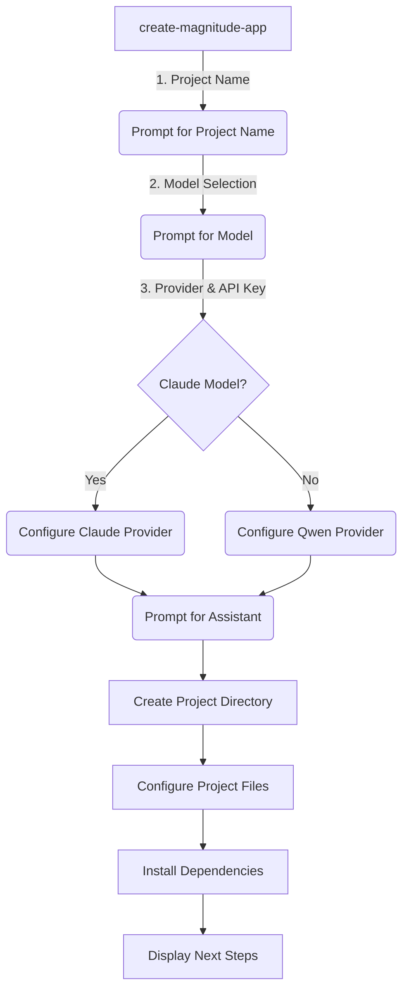
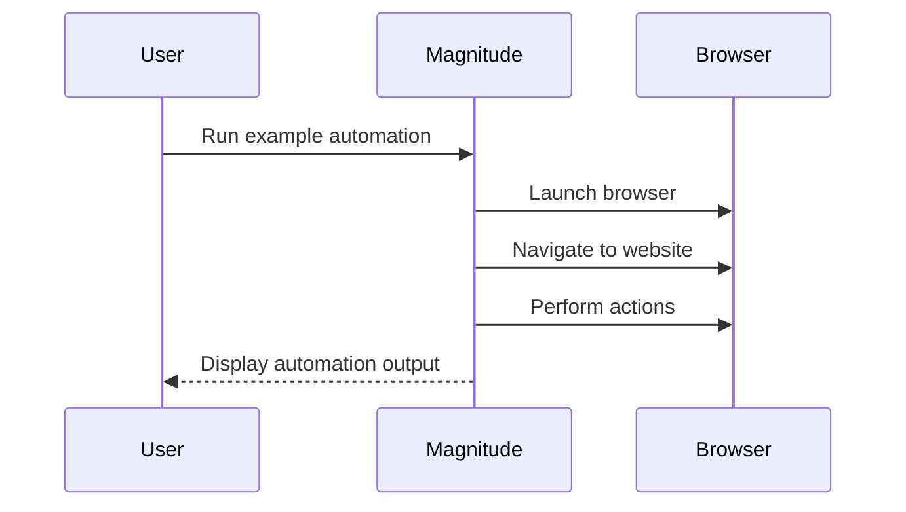
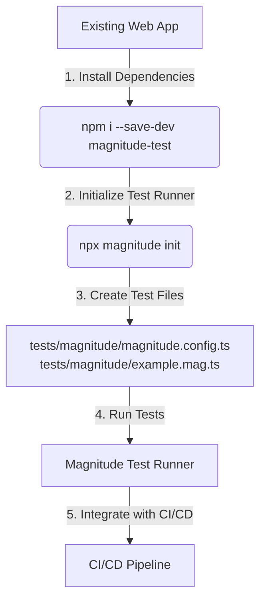

Here is a comprehensive technical wiki page on "Getting Started" with the Magnitude project, based solely on the provided source files.

<details>
<summary>Relevant source files</summary>

The following files were used as context for generating this wiki page:

- [README.md](https://github.com/agattani123/magnitude/blob/main/README.md)
- [packages/create-magnitude-app/src/cli.ts](https://github.com/agattani123/magnitude/blob/main/packages/create-magnitude-app/src/cli.ts)
- [src/index.ts](https://github.com/agattani123/magnitude/blob/main/src/index.ts) (not provided, but referenced in cli.ts)
- [.cursorrules](https://github.com/agattani123/magnitude/blob/main/.cursorrules) (not provided, but referenced in cli.ts)
- [CLAUDE.md](https://github.com/agattani123/magnitude/blob/main/CLAUDE.md) (not provided, but referenced in cli.ts)

</details>

# Getting Started

## Introduction

Magnitude is a project that enables users to control their browser with natural language using vision AI. It provides capabilities for navigating interfaces, interacting with web applications, extracting structured data, and verifying visual elements through a built-in test runner. Magnitude can be used for automating tasks on the web, integrating between applications without APIs, extracting data, testing web apps, or as a building block for creating custom browser agents.

The "Getting Started" process involves setting up a new Magnitude project and running your first browser automation or integrating the test runner into an existing web application. This wiki page will guide you through the steps to create a new Magnitude project, configure the language model and assistant, and run the initial example automation or set up the test runner.

Sources: [README.md](https://github.com/agattani123/magnitude/blob/main/README.md), [packages/create-magnitude-app/src/cli.ts](https://github.com/agattani123/magnitude/blob/main/packages/create-magnitude-app/src/cli.ts)

## Creating a New Magnitude Project

To create a new Magnitude project, you can use the `create-magnitude-app` command-line tool. This tool will guide you through a series of prompts to configure your project's name, language model, provider, API key (if required), and code assistant.

### Project Setup Flow

The project setup flow follows these steps:

1. **Project Name**: Provide a name for your new project. The tool will validate the name and ensure that a directory with the same name does not already exist.

2. **Language Model Selection**: Choose the language model you want to use for your project. The recommended option is the Claude Sonnet 4 model, but you can also select the Qwen 2.5 VL 72B model.

3. **Provider and API Key Configuration**: Based on the selected language model, you will be prompted to configure the provider (Anthropic, Claude Code, or OpenRouter) and provide an API key if required.

4. **Code Assistant Selection**: Choose whether you want to use a code assistant like Claude Code, Cline, Cursor, Gemini CLI, or Windsurf, or proceed without an assistant.

After providing the required information, the tool will create a new project directory with the specified name and set up the project template, including the necessary configuration files and example scripts.



Sources: [packages/create-magnitude-app/src/cli.ts](https://github.com/agattani123/magnitude/blob/main/packages/create-magnitude-app/src/cli.ts)

## Running Your First Browser Automation

After creating the new project, you can run the provided example automation script to see Magnitude in action. The `create-magnitude-app` tool will display the appropriate command to start the example script based on your project's configuration and the detected Node.js runtime (e.g., npm, yarn, pnpm, bun, or deno).



The example script demonstrates how Magnitude can handle high-level tasks, execute low-level actions, and intelligently extract data based on provided schemas.

Sources: [README.md](https://github.com/agattani123/magnitude/blob/main/README.md), [packages/create-magnitude-app/src/cli.ts](https://github.com/agattani123/magnitude/blob/main/packages/create-magnitude-app/src/cli.ts)

## Integrating the Test Runner

If you have an existing web application, you can integrate Magnitude's test runner by running the following command:

```bash
npm i --save-dev magnitude-test && npx magnitude init
```

This command will install the required dependencies and create a `tests/magnitude` directory in your project, containing the following files:

- `magnitude.config.ts`: Magnitude test configuration file
- `example.mag.ts`: An example test file

For information on how to run tests and integrate them into your CI/CD pipeline, refer to the [Magnitude documentation](https://docs.magnitude.run/core-concepts/running-tests).



Sources: [README.md](https://github.com/agattani123/magnitude/blob/main/README.md)

## Language Model Configuration

Magnitude requires a large visually grounded language model for optimal performance. The recommended model is Claude Sonnet 4, but Magnitude is also compatible with the Qwen-2.5VL 72B model. Refer to the [Magnitude documentation](https://docs.magnitude.run/customizing/llm-configuration) for more information on configuring the language model.

Sources: [README.md](https://github.com/agattani123/magnitude/blob/main/README.md)

## Summary

Getting started with Magnitude involves creating a new project using the `create-magnitude-app` command-line tool, configuring the language model and provider, and running the provided example automation script or integrating the test runner into an existing web application. The setup process guides you through selecting the project name, language model, provider, API key (if required), and code assistant. Once the project is created, you can run the example automation or set up the test runner to start using Magnitude for browser automation, data extraction, and web application testing.

Sources: [README.md](https://github.com/agattani123/magnitude/blob/main/README.md), [packages/create-magnitude-app/src/cli.ts](https://github.com/agattani123/magnitude/blob/main/packages/create-magnitude-app/src/cli.ts)