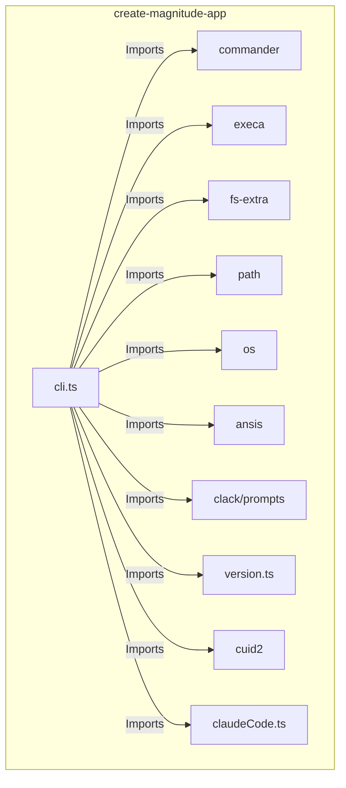
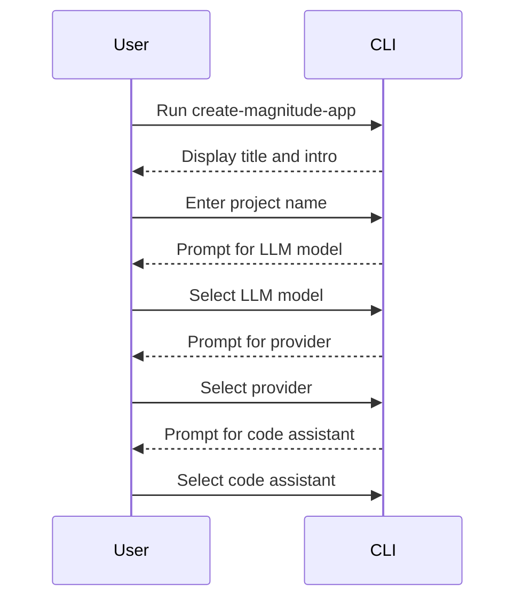
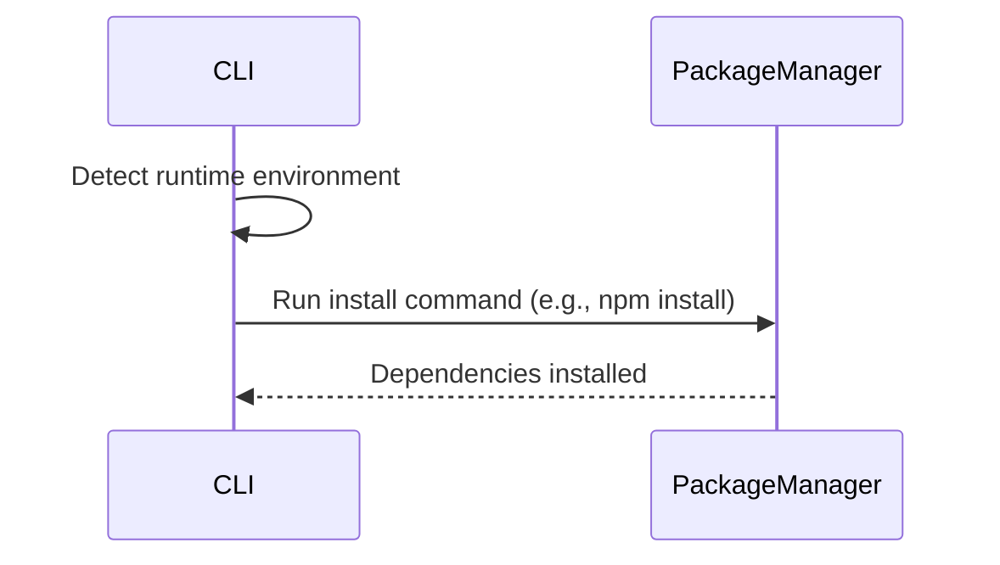
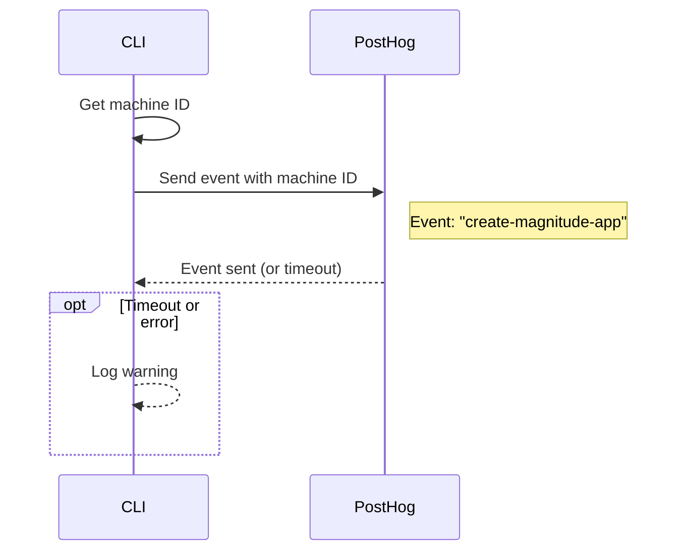

<details>
<summary>Relevant source files</summary>

The following files were used as context for generating this wiki page:

- [packages/create-magnitude-app/src/cli.ts](https://github.com/agattani123/magnitude/blob/main/packages/create-magnitude-app/src/cli.ts)
- [packages/create-magnitude-app/src/claudeCode.ts](https://github.com/agattani123/magnitude/blob/main/packages/create-magnitude-app/src/claudeCode.ts)
- [packages/create-magnitude-app/src/version.ts](https://github.com/agattani123/magnitude/blob/main/packages/create-magnitude-app/src/version.ts)
- [packages/create-magnitude-app/package.json](https://github.com/agattani123/magnitude/blob/main/packages/create-magnitude-app/package.json)
- [packages/create-magnitude-app/README.md](https://github.com/agattani123/magnitude/blob/main/packages/create-magnitude-app/README.md)
</details>

# Getting Started

## Introduction

The `create-magnitude-app` package is a command-line interface (CLI) tool that helps developers create a new Magnitude project from a template. Magnitude is a platform for building browser automations using large language models (LLMs) and visual grounding. This CLI guides users through a series of prompts to configure the project's name, LLM model, provider, and code assistant preferences.

After gathering the necessary information, the CLI clones a scaffold project from a GitHub repository, configures it based on the user's selections, and sets up the project directory with the required files and dependencies. The tool also provides instructions for running the example automation and accessing the project documentation and community resources.

Sources: [packages/create-magnitude-app/src/cli.ts](), [packages/create-magnitude-app/README.md]()

## Project Setup

The `create-magnitude-app` CLI is the entry point for creating a new Magnitude project. It uses the `commander` library for parsing command-line arguments and the `@clack/prompts` library for interactive prompts.



Sources: [packages/create-magnitude-app/src/cli.ts]()

### User Interaction

The CLI starts by displaying a title banner and an intro message. It then prompts the user to provide the project name, select the LLM model (Claude or Qwen), choose the provider (Anthropic, Claude Code, or OpenRouter), and specify the code assistant (if any).



The `establishProjectInfo` function handles the interactive prompts and returns a `ProjectInfo` object containing the user's selections.

Sources: [packages/create-magnitude-app/src/cli.ts:58-254]()

### Project Creation

After gathering the project information, the CLI creates a temporary directory, clones the scaffold project from a GitHub repository, and configures the project based on the user's selections.

```mermaid
flowchart TD
    subgraph create-magnitude-app
        createProject[createProject] -->|1. Create temp dir| fs.ensureDirSync
        createProject -->|2. Clone scaffold| execa[execa('git clone')]
        createProject -->|3. Remove existing git| fs.rmSync
        createProject -->|4. Init new git| execa[execa('git init')]
        createProject -->|5. Configure package.json| fs.readJsonSync
        createProject -->|6. Configure assistant files| fs.writeFileSync
        createProject -->|7. Configure LLM client| fs.readFileSync
        createProject -->|8. Configure .env| fs.writeFileSync
        createProject -->|9. Copy to project dir| fs.copySync
    end
```

The `createProject` function performs the following steps:

1. Create a temporary directory using `fs.ensureDirSync`.
2. Clone the scaffold project from the GitHub repository using `execa('git clone')`.
3. Remove the existing Git repository from the cloned scaffold using `fs.rmSync`.
4. Initialize a new Git repository in the temporary directory using `execa('git init')`.
5. Configure the `package.json` file with the project name using `fs.readJsonSync` and `fs.writeJsonSync`.
6. Configure the code assistant files (e.g., `.cursorrules`, `CLAUDE.md`) based on the user's selection using `fs.writeFileSync`.
7. Configure the LLM client in the project's source code (`src/index.ts`) using `fs.readFileSync` and `fs.writeFileSync`.
8. Create a `.env` file with the API key (if provided) using `fs.writeFileSync`.
9. Copy the configured project from the temporary directory to the target project directory using `fs.copySync`.

Sources: [packages/create-magnitude-app/src/cli.ts:258-388]()

### Dependency Installation and Running the Project

After creating the project, the CLI installs the required dependencies using the appropriate package manager command (`npm install`, `yarn install`, `pnpm install`, or `bun install`). It detects the runtime environment based on the `npm_config_user_agent` environment variable.



The `detectRuntime` function determines the appropriate install and run commands based on the runtime environment.

Sources: [packages/create-magnitude-app/src/cli.ts:390-414]()

Finally, the CLI provides instructions for running the example automation, accessing the project documentation, and joining the Magnitude community Discord server.

Sources: [packages/create-magnitude-app/src/cli.ts:440-447]()

## Utility Functions

### Machine ID Generation

The `getMachineId` function generates a unique machine ID for tracking purposes. It attempts to read an existing ID from the `~/.magnitude/user.json` file. If the file doesn't exist, it generates a new ID using the `@paralleldrive/cuid2` library and stores it in the file.

```mermaid
flowchart TD
    subgraph getMachineId
        getMachineId -->|1. Get file path| path.join
        getMachineId -->|2. Check if file exists| fs.existsSync
        existingId{Existing ID?} -->|Yes| readExistingId[Read existing ID]
        existingId -->|No| generateNewId[Generate new ID]
        readExistingId -->|3. Read file| fs.readFileSync
        generateNewId -->|4. Create dir| fs.mkdirSync
        generateNewId -->|5. Generate ID| cuid2.init
        generateNewId -->|6. Write file| fs.writeFileSync
    end
```

Sources: [packages/create-magnitude-app/src/cli.ts:308-328]()

### Event Tracking

The `sendEvent` function sends an event to a third-party analytics service (PostHog) using the generated machine ID. It attempts to send the event within a 5-second timeout and logs a warning if the request fails.



Sources: [packages/create-magnitude-app/src/cli.ts:330-356]()

## Other Files

### `claudeCode.ts`

This file contains utility functions for handling the Claude Code authentication flow and retrieving a valid Claude Code access token.

Sources: [packages/create-magnitude-app/src/claudeCode.ts]()

### `version.ts`

This file exports the current version of the `create-magnitude-app` package.

Sources: [packages/create-magnitude-app/src/version.ts]()

### `package.json`

The `package.json` file defines the project metadata, dependencies, and scripts for the `create-magnitude-app` package.

Sources: [packages/create-magnitude-app/package.json]()

### `README.md`

The `README.md` file provides an overview of the `create-magnitude-app` package, including its purpose and usage instructions.

Sources: [packages/create-magnitude-app/README.md]()

## Conclusion

The `create-magnitude-app` CLI is a crucial tool for setting up new Magnitude projects. It guides users through a series of prompts to configure the project's name, LLM model, provider, and code assistant preferences. The CLI then creates the project directory, clones the scaffold project, configures it based on the user's selections, and installs the required dependencies. By providing a streamlined project setup process, `create-magnitude-app` simplifies the initial steps for developers working with the Magnitude platform.