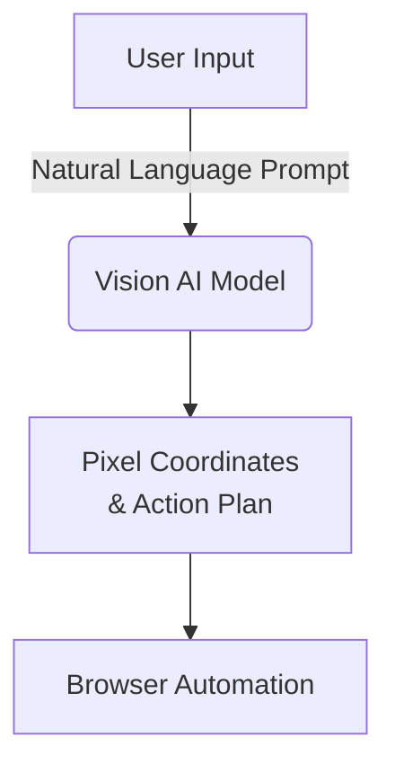
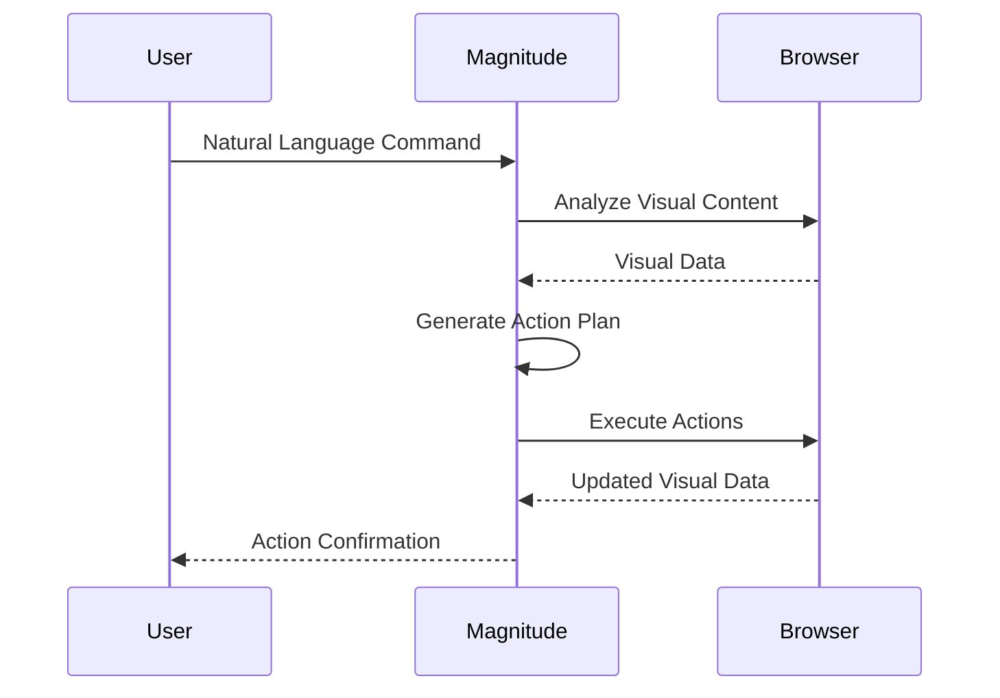
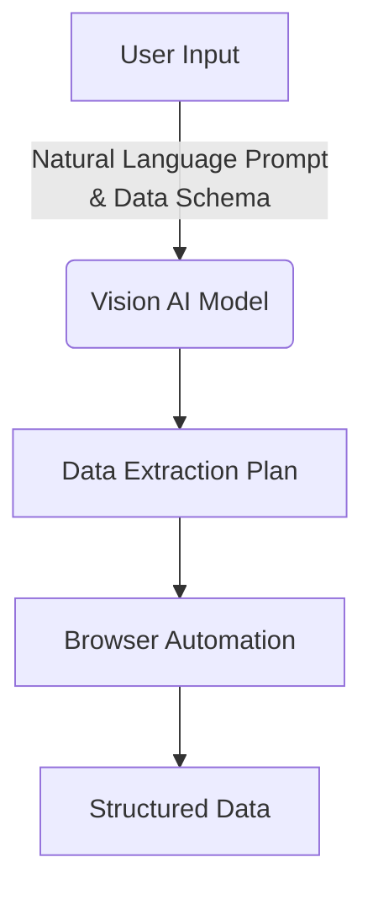
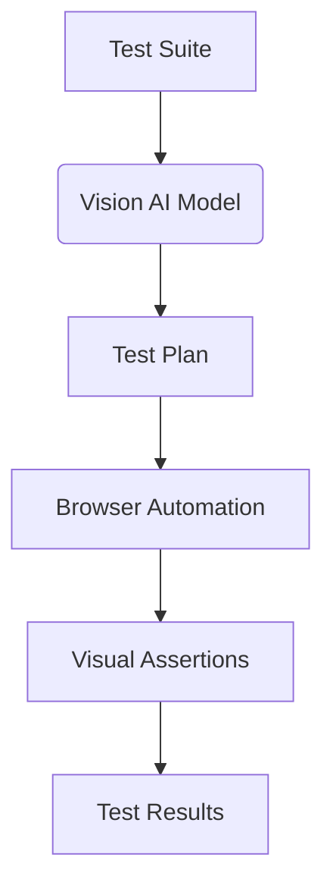

<details>
<summary>Relevant source files</summary>

The following file was used as context for generating this wiki page:

- [README.md](https://github.com/agattani123/magnitude/blob/main/README.md)
</details>

# Introduction to Magnitude

Magnitude is a vision AI-powered browser automation tool that enables users to control their browsers using natural language commands. It leverages visually grounded language models to understand and interact with web interfaces, execute precise actions, extract structured data, and perform visual assertions for testing purposes.

## Overview

Magnitude aims to revolutionize the way we interact with web applications by providing a natural language interface for browser automation. Its key features include:

1. **Navigation**: Magnitude can understand and navigate any web interface by visually analyzing the page content and planning appropriate actions.
2. **Interaction**: It can execute precise mouse and keyboard actions to interact with web elements, such as clicking, typing, or dragging and dropping.
3. **Data Extraction**: Magnitude can intelligently extract useful structured data from web pages based on provided schemas or patterns.
4. **Testing and Verification**: It includes a built-in test runner with powerful visual assertions, enabling automated testing of web applications.

Magnitude can be used for various purposes, including automating tasks on the web, integrating between applications without APIs, extracting data, testing web apps, or serving as a building block for creating custom browser agents.

## Architecture

Magnitude's architecture is vision-first, meaning it relies on visually grounded language models to understand and interact with web interfaces. This approach allows for true generalization independent of the underlying DOM structure, making it future-proof for desktop applications, virtual machines, and other environments.

### Key Components

#### Vision AI Model

Magnitude utilizes a large visually grounded language model, such as Claude Sonnet 4 or Qwen-2.5VL 72B, to analyze the visual content of web pages and plan appropriate actions based on natural language prompts.



Sources: [README.md](https://github.com/agattani123/magnitude/blob/main/README.md)

#### Browser Automation

Magnitude can execute precise mouse and keyboard actions in the browser based on the action plan generated by the vision AI model. This includes actions such as clicking, typing, scrolling, and dragging and dropping elements.



Sources: [README.md](https://github.com/agattani123/magnitude/blob/main/README.md)

#### Data Extraction

Magnitude can intelligently extract structured data from web pages based on provided schemas or patterns. This feature allows users to extract useful information from web interfaces without the need for APIs or scraping.



Sources: [README.md](https://github.com/agattani123/magnitude/blob/main/README.md)

#### Test Runner

Magnitude includes a built-in test runner with powerful visual assertions, enabling automated testing of web applications. This feature allows users to write and run tests that interact with web interfaces and verify their behavior based on visual cues.



Sources: [README.md](https://github.com/agattani123/magnitude/blob/main/README.md)

## Getting Started

Magnitude provides two main entry points for users:

1. **Running Browser Automation**: To create a new project and run your first browser automation script, you can use the `create-magnitude-app` command:

```bash
npx create-magnitude-app
```

This will create a new project and guide you through the setup process. It will also generate an example script that you can run immediately.

2. **Using the Test Runner**: To install the test runner for an existing web application, you can run the following commands:

```bash
npm i --save-dev magnitude-test && npx magnitude init
```

This will create a `tests/magnitude` directory with a configuration file (`magnitude.config.ts`) and an example test file (`example.mag.ts`). For more information on running tests and integrating with CI/CD, refer to the [official documentation](https://docs.magnitude.run/core-concepts/running-tests).

## Conclusion

Magnitude is a powerful vision AI-powered browser automation tool that enables users to control their browsers using natural language commands. Its vision-first architecture, flexible abstraction levels, and built-in testing capabilities make it a versatile solution for automating tasks on the web, extracting data, and testing web applications.

Sources: [README.md](https://github.com/agattani123/magnitude/blob/main/README.md)