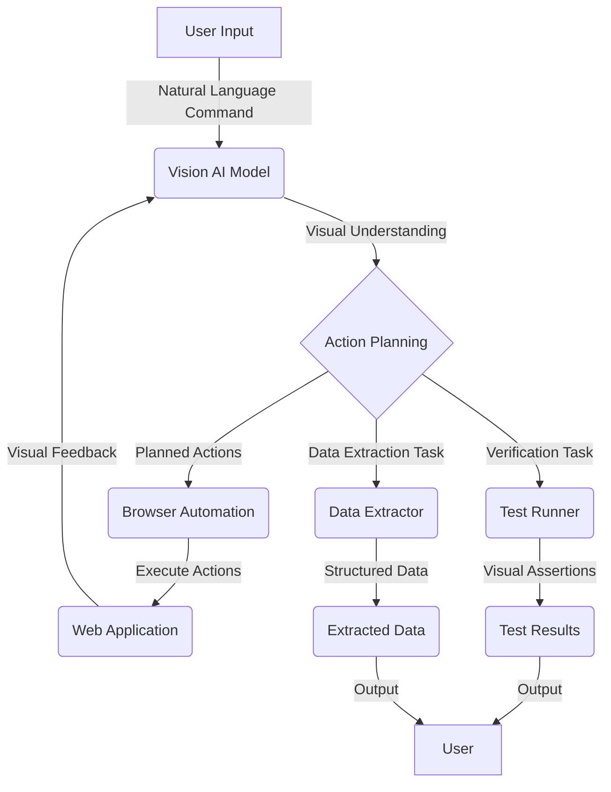

<details>
<summary>Relevant source files</summary>

The following file was used as context for generating this wiki page:

- [README.md](https://github.com/agattani123/magnitude/blob/main/README.md)

</details>

# Introduction

Magnitude is a vision AI-powered browser automation tool that enables users to control their browser with natural language commands. It leverages visually grounded language models to understand and interact with web interfaces, allowing for seamless navigation, interaction, data extraction, and verification tasks.

## Overview

Magnitude's core functionality revolves around four key capabilities:

1. **Navigation**: Magnitude can understand and navigate any web interface by visually analyzing the page layout and elements.
2. **Interaction**: It can execute precise actions, such as mouse clicks and keyboard inputs, to interact with web applications.
3. **Data Extraction**: Magnitude can intelligently extract structured data from web pages based on provided schemas or patterns.
4. **Verification**: It includes a built-in test runner with powerful visual assertions for testing web applications.

Magnitude can be used for various purposes, including automating tasks on the web, integrating between applications without APIs, extracting data, testing web apps, or as a building block for creating custom browser agents.

## Architecture

Magnitude's architecture is vision-first, meaning it relies on visually grounded language models to understand and interact with web interfaces. This approach allows for true generalization independent of the underlying DOM structure, making it future-proof for desktop applications, virtual machines, and other environments.

### Key Components

#### Vision AI Model

Magnitude leverages state-of-the-art visually grounded language models, such as Claude Sonnet 4 or Qwen-2.5VL 72B, to understand and reason about web interfaces. These models are trained on visual and textual data, enabling them to comprehend the visual layout and content of web pages.

#### Browser Automation

Magnitude integrates with a browser automation library (e.g., Puppeteer) to execute actions and interact with web pages. It translates the model's visual understanding into precise mouse and keyboard actions, enabling seamless interaction with web applications.

#### Data Extraction

Magnitude can extract structured data from web pages based on provided schemas or patterns. It leverages the vision AI model to identify relevant information on the page and extract it into a structured format, such as JSON or a custom data model.

#### Test Runner

Magnitude includes a built-in test runner that allows developers to write and execute visual tests for their web applications. The test runner supports powerful visual assertions, enabling developers to verify the correctness of their applications' visual appearance and behavior.

Sources: [README.md](https://github.com/agattani123/magnitude/blob/main/README.md)

## Workflow

Magnitude's workflow can be summarized as follows:

1. **Input**: The user provides a natural language command or task description to Magnitude.
2. **Visual Understanding**: The vision AI model analyzes the current web page's visual layout and content to understand the interface.
3. **Action Planning**: Based on the user's input and the visual understanding, the model plans a sequence of actions to accomplish the task.
4. **Execution**: Magnitude executes the planned actions using the browser automation library, interacting with the web page through mouse and keyboard inputs.
5. **Verification (Optional)**: If the task involves verifying or testing the web application, Magnitude's test runner performs visual assertions to ensure the expected behavior and appearance.
6. **Data Extraction (Optional)**: If the task requires extracting structured data, Magnitude identifies and extracts the relevant information from the web page based on the provided schema or pattern.
7. **Output**: Magnitude provides the user with the desired outcome, such as a confirmation of task completion, extracted data, or test results.



Sources: [README.md](https://github.com/agattani123/magnitude/blob/main/README.md)

## Usage

Magnitude provides two main ways to use its capabilities:

### Running Browser Automation

To run browser automation scripts with Magnitude, you can use the `create-magnitude-app` command to create a new project and follow the setup instructions:

```bash
npx create-magnitude-app
```

This will create a new project with an example script that you can run immediately. The script demonstrates how to use Magnitude's `agent.act` and `agent.extract` methods to automate tasks and extract data from web pages.

```ts
// Magnitude can handle high-level tasks
await agent.act('Create a task', {
    // Optionally pass data that the agent will use where appropriate
    data: {
        title: 'Use Magnitude',
        description: 'Run "npx create-magnitude-app" and follow the instructions',
    },
});

// It can also handle low-level actions
await agent.act('Drag "Use Magnitude" to the top of the in progress column');

// Intelligently extract data based on the DOM content matching a provided zod schema
const tasks = await agent.extract(
    'List in progress tasks',
    z.array(z.object({
        title: z.string(),
        description: z.string(),
        // Agent can extract existing data or new insights
        difficulty: z.number().describe('Rate the difficulty between 1-5')
    })),
);
```

Sources: [README.md](https://github.com/agattani123/magnitude/blob/main/README.md)

### Using the Test Runner

To use Magnitude's built-in test runner for an existing web application, you can install the `magnitude-test` package and run the `magnitude init` command:

```bash
npm i --save-dev magnitude-test && npx magnitude init
```

This will create a `tests/magnitude` directory with the following files:

- `magnitude.config.ts`: Magnitude test configuration file
- `example.mag.ts`: An example test file

You can then run the tests and integrate them into your CI/CD pipeline. For more information on running tests and integrating with CI/CD, refer to the [documentation](https://docs.magnitude.run/core-concepts/running-tests).

Sources: [README.md](https://github.com/agattani123/magnitude/blob/main/README.md)

## Configuration

Magnitude requires a large visually grounded language model for optimal performance. The recommended model is Claude Sonnet 4, but Magnitude is also compatible with Qwen-2.5VL 72B. You can configure the language model in the Magnitude configuration file, as described in the [documentation](https://docs.magnitude.run/customizing/llm-configuration).

Sources: [README.md](https://github.com/agattani123/magnitude/blob/main/README.md)

## Summary

Magnitude is a powerful vision AI-powered browser automation tool that enables users to control their browser with natural language commands. Its vision-first architecture and integration with visually grounded language models allow for true generalization across web interfaces, making it a future-proof solution for automating tasks, extracting data, and testing web applications.

With its flexible abstraction levels, custom actions and prompts, and deterministic run capabilities, Magnitude provides a controllable and repeatable automation experience suitable for production environments. Additionally, its built-in test runner with visual assertions ensures the correctness of web applications' visual appearance and behavior.

Sources: [README.md](https://github.com/agattani123/magnitude/blob/main/README.md)