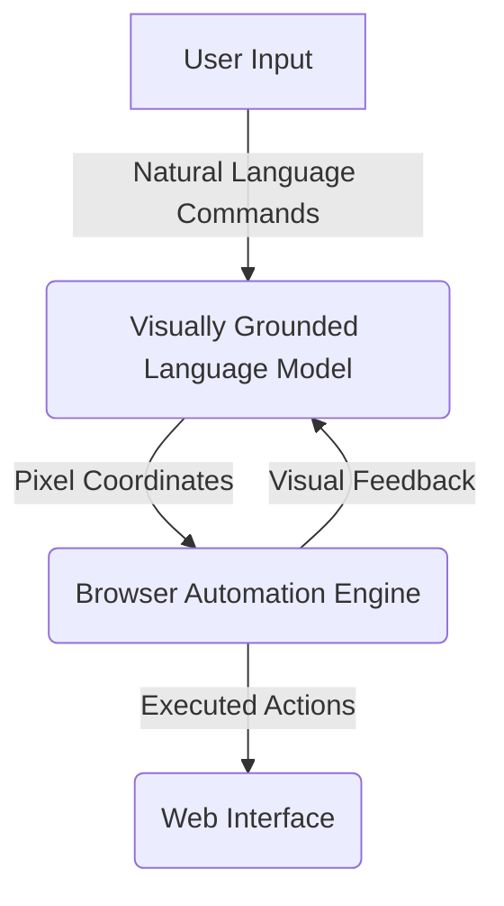
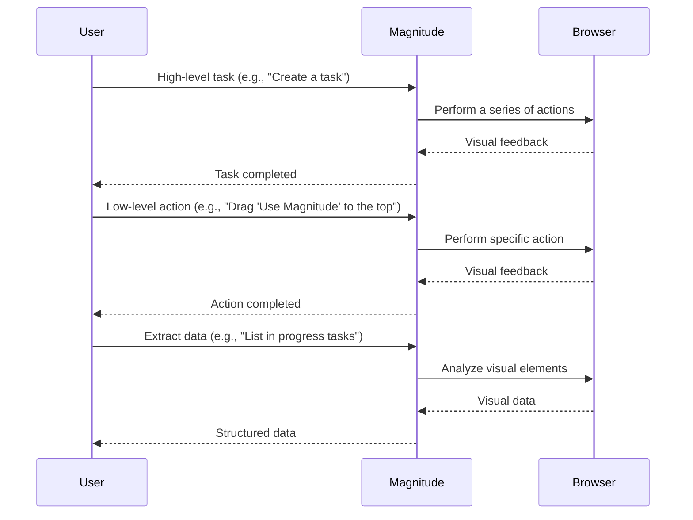

<details>
<summary>Relevant source files</summary>

The following file was used as context for generating this wiki page:

- [README.md](https://github.com/agattani123/magnitude/blob/main/README.md)

</details>

# Introduction

Magnitude is a vision AI-powered browser automation tool that enables users to control their browser with natural language commands. It provides a comprehensive set of capabilities for navigating, interacting with, extracting data from, and verifying web interfaces. Magnitude's unique vision-first architecture allows it to generalize across complex modern websites, making it a future-proof solution for automating tasks on the web, integrating between applications without APIs, extracting data, and testing web applications.

## Key Features

### Navigation

Magnitude can understand and navigate any interface by visually analyzing the screen. It can plan out actions based on the visual context, enabling seamless navigation through web applications.

### Interaction

With its ability to execute precise mouse and keyboard actions, Magnitude can interact with web interfaces, automating tasks such as filling out forms, clicking buttons, and performing drag-and-drop operations.

### Data Extraction

Magnitude can intelligently extract structured data from web pages based on the provided schema. This feature allows users to extract useful information from websites, even without access to APIs.

### Verification

Magnitude includes a built-in test runner with powerful visual assertions, enabling users to verify the correctness of their web applications by checking visual elements and their properties.

## Architecture

Magnitude's architecture is centered around a vision-first approach, leveraging visually grounded language models to understand and interact with web interfaces. This approach allows Magnitude to generalize across complex modern websites, independent of the underlying DOM structure.

### Vision-First Architecture

The core of Magnitude's architecture is a visually grounded language model that specifies pixel coordinates for interactions. This model analyzes the visual representation of the web page, enabling Magnitude to understand and interact with the interface without relying on the DOM structure. This vision-first approach ensures that Magnitude remains future-proof and can adapt to various environments, including desktop applications and virtual machines.



Sources: [README.md:25-32](https://github.com/agattani123/magnitude/blob/main/README.md#L25-L32)

### Controllable and Repeatable Automation

Magnitude provides a flexible abstraction layer that allows users to work at different levels of granularity, from executing granular actions to defining high-level flows. This flexibility enables users to create controllable and repeatable automations tailored to their specific needs.



Sources: [README.md:33-45](https://github.com/agattani123/magnitude/blob/main/README.md#L33-L45)

Magnitude also supports custom actions and prompts at the agent and action level, allowing users to tailor the automation to their specific use cases. Additionally, Magnitude's native caching system (in progress) enables deterministic runs, ensuring consistent and reliable automation.

## Getting Started

### Running Browser Automation

To run your first browser automation with Magnitude, you can use the `create-magnitude-app` command:

```bash
npx create-magnitude-app
```

This command will create a new project and guide you through the setup process for Magnitude. It will also generate an example script that you can run immediately to see Magnitude in action.

### Using the Test Runner

If you want to integrate Magnitude's test runner into an existing web application, you can install it using the following command:

```bash
npm i --save-dev magnitude-test && npx magnitude init
```

This command will create a `tests/magnitude` directory with the following files:

- `magnitude.config.ts`: Magnitude test configuration file
- `example.mag.ts`: An example test file

For more information on running tests and integrating Magnitude into your CI/CD pipeline, please refer to the [official documentation](https://docs.magnitude.run/core-concepts/running-tests).

### Model Requirements

Magnitude requires a large visually grounded language model for optimal performance. The recommended model is Claude Sonnet 4, but Magnitude is also compatible with Qwen-2.5VL 72B. For more information on configuring the language model, please refer to the [official documentation](https://docs.magnitude.run/customizing/llm-configuration).

Sources: [README.md:49-72](https://github.com/agattani123/magnitude/blob/main/README.md#L49-L72)

## Conclusion

Magnitude is a powerful vision AI-powered browser automation tool that enables users to control their browser with natural language commands. Its unique vision-first architecture and flexible abstraction layer make it a versatile solution for automating tasks on the web, integrating between applications, extracting data, and testing web applications. With its built-in test runner and support for custom actions and prompts, Magnitude provides a comprehensive and future-proof solution for browser automation.