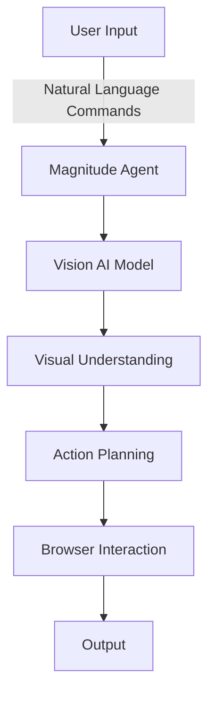
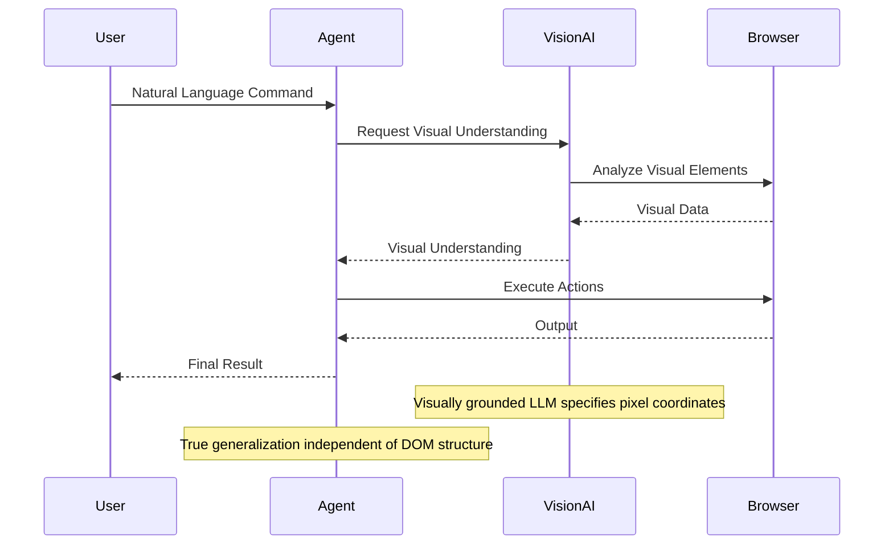
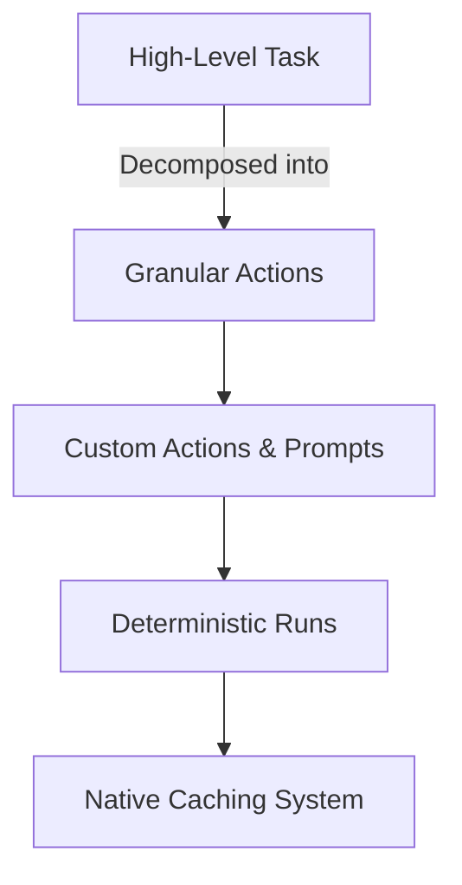

<details>
<summary>Relevant source files</summary>

The following file was used as context for generating this wiki page:

- [README.md](https://github.com/agattani123/magnitude/blob/main/README.md)

</details>

# Introduction

Magnitude is a vision AI-powered browser automation tool that enables users to control their browsers using natural language commands. It leverages visually grounded language models to understand and interact with web interfaces, allowing for seamless navigation, interaction, data extraction, and verification tasks.

## Overview

Magnitude's key features include:

1. **Navigation**: The ability to understand and navigate any web interface by interpreting its visual elements.
2. **Interaction**: Executing precise actions on web pages using mouse and keyboard inputs.
3. **Data Extraction**: Intelligently extracting structured data from web pages based on provided schemas.
4. **Verification**: A built-in test runner with powerful visual assertions for testing web applications.

Magnitude can be used for various purposes, such as automating tasks on the web, integrating between applications without APIs, extracting data, testing web apps, or as a building block for creating custom browser agents.

## Architecture

Magnitude's architecture is vision-first, meaning it relies on visually grounded language models to specify pixel coordinates and interact with web elements. This approach allows for true generalization independent of the underlying DOM structure, making it future-proof for desktop applications, virtual machines, and other environments.



Sources: [README.md](https://github.com/agattani123/magnitude/blob/main/README.md)

The core components of Magnitude's architecture are:

1. **Magnitude Agent**: The central component that receives user input in the form of natural language commands and coordinates the overall execution.
2. **Vision AI Model**: A visually grounded language model responsible for understanding the visual elements of web pages.
3. **Visual Understanding**: The process of interpreting the visual elements of a web page based on the output from the Vision AI Model.
4. **Action Planning**: Determining the sequence of actions required to accomplish the user's command based on the visual understanding.
5. **Browser Interaction**: Executing the planned actions by interacting with the browser using mouse and keyboard inputs.
6. **Output**: The final result of the user's command, which can be navigation, interaction, data extraction, or verification.

## Key Advantages

### 1. Vision-first Architecture



Sources: [README.md:26-29](https://github.com/agattani123/magnitude/blob/main/README.md#L26-L29)

Magnitude's vision-first architecture is a key advantage that sets it apart from traditional browser agents. Instead of relying on numbered boxes around page elements, which can be brittle and fail to generalize well on complex modern sites, Magnitude uses a visually grounded language model to specify pixel coordinates directly. This approach enables true generalization independent of the underlying DOM structure, making Magnitude future-proof for desktop applications, virtual machines, and other environments.

### 2. Controllable and Repeatable Automation



Sources: [README.md:32-35](https://github.com/agattani123/magnitude/blob/main/README.md#L32-L35)

Magnitude addresses the common issue of browser agents following a "high-level prompt + tools = work until done" approach, which works well for demos but may not be suitable for production environments. Instead, Magnitude offers a solution for controllable and repeatable automation through the following features:

1. **Flexible Abstraction Levels**: Users can specify high-level tasks or granular actions, allowing for a mix of abstraction levels based on their needs.
2. **Custom Actions and Prompts**: Magnitude supports custom actions and prompts at both the agent and action levels, enabling fine-grained control over the automation process.
3. **Deterministic Runs**: Magnitude aims to provide deterministic runs through a native caching system (currently in progress), ensuring consistent and repeatable execution of automation scripts.

## Getting Started

Magnitude provides two main entry points for getting started:

1. **Running Browser Automation**:

```bash
npx create-magnitude-app
```

This command creates a new project and guides users through the setup process for Magnitude. It also generates an example script that can be run immediately.

2. **Using the Test Runner**:

For existing web applications, users can install the Magnitude test runner with the following command:

```bash
npm i --save-dev magnitude-test && npx magnitude init
```

This will create a `tests/magnitude` directory with the following files:

- `magnitude.config.ts`: Magnitude test configuration file
- `example.mag.ts`: An example test file

For more information on running tests and integrating with CI/CD pipelines, refer to the [official documentation](https://docs.magnitude.run/core-concepts/running-tests).

## Requirements

Magnitude requires a large visually grounded language model for optimal performance. The recommended model is Claude Sonnet 4, but Magnitude is also compatible with Qwen-2.5VL 72B. For more details on configuring the language model, please refer to the [official documentation](https://docs.magnitude.run/customizing/llm-configuration).

## Additional Resources

- [Official Documentation](https://docs.magnitude.run)
- [Discord Community](https://discord.gg/VcdpMh9tTy)
- [Follow Tom Greenwald](https://x.com/tgrnwld)
- [Follow Anders Sørkål](https://x.com/ndrsrkl)

For enterprise inquiries or to discuss additional features and support, please reach out to the Magnitude team at founders@magnitude.run or schedule a call [here](https://cal.com/tom-greenwald/30min).

Sources: [README.md](https://github.com/agattani123/magnitude/blob/main/README.md)