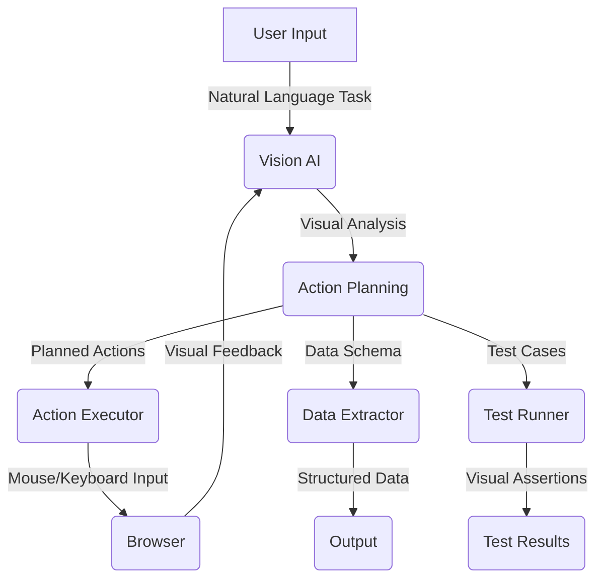

Relevant source files

The following file was used as context for generating this wiki page:

- [README.md](https://github.com/agattani123/magnitude/blob/main/README.md)

# Introduction

Magnitude is a vision AI-powered browser automation tool that enables users to control their browser with natural language commands. It provides a comprehensive set of capabilities, including navigation, interaction, data extraction, and visual testing. The key features of Magnitude are:

1. **Navigation**: Magnitude can understand and navigate any user interface by visually analyzing the screen.
2. **Interaction**: It can execute precise actions using mouse and keyboard inputs, allowing for seamless interaction with web applications.
3. **Data Extraction**: Magnitude can intelligently extract structured data from web pages based on provided schemas.
4. **Visual Testing**: It includes a built-in test runner with powerful visual assertions for testing web applications.

Magnitude can be used for various purposes, such as automating tasks on the web, integrating between applications without APIs, extracting data, testing web apps, or as a building block for creating custom browser agents.

## Architecture

Magnitude's architecture is vision-first, meaning it relies on visually grounded language models to specify pixel coordinates and actions. This approach provides true generalization independent of the DOM structure, making it future-proof for desktop applications, virtual machines, and other environments.

The core components of Magnitude's architecture are:

1. **Vision AI**: Magnitude utilizes state-of-the-art vision AI models, such as Claude Sonnet 4 or Qwen-2.5VL 72B, to understand and interpret visual elements on the screen.
2. **Action Executor**: This component translates the high-level actions specified by the vision AI into low-level mouse and keyboard inputs, enabling precise interaction with the browser.
3. **Data Extractor**: Magnitude can extract structured data from web pages based on provided schemas, allowing for intelligent data extraction and analysis.
4. **Test Runner**: The built-in test runner enables visual testing of web applications by executing test cases and performing visual assertions.

## Workflow

The typical workflow for using Magnitude involves the following steps:

1. **Task Definition**: The user provides a high-level task or action to be performed, such as "Create a task" or "Drag 'Use Magnitude' to the top of the in progress column."
2. **Visual Analysis**: Magnitude's vision AI analyzes the current screen and identifies the relevant visual elements and their locations.
3. **Action Planning**: Based on the visual analysis and the provided task, the vision AI plans a sequence of low-level actions to be executed.
4. **Action Execution**: The Action Executor component translates the planned actions into mouse and keyboard inputs and executes them in the browser.
5. **Data Extraction (Optional)**: If the task involves extracting data, Magnitude uses the Data Extractor component to intelligently extract structured data based on the provided schema.
6. **Visual Testing (Optional)**: For testing purposes, Magnitude's Test Runner can execute test cases and perform visual assertions to ensure the correctness of the application's behavior.

Sources: [README.md](https://github.com/agattani123/magnitude/blob/main/README.md)

## Getting Started

Magnitude provides two main ways to get started:

1. **Running Browser Automation**:
   - Use the `npx create-magnitude-app` command to create a new project and follow the setup instructions.
   - This will create an example script that can be run immediately to experience Magnitude's browser automation capabilities.

2. **Using the Test Runner**:
   - For existing web applications, install the test runner by running `npm i --save-dev magnitude-test && npx magnitude init`.
   - This will create a `tests/magnitude` directory with a configuration file (`magnitude.config.ts`) and an example test file (`example.mag.ts`).
   - See the [documentation](https://docs.magnitude.run/core-concepts/running-tests) for information on running tests and integrating them into CI/CD pipelines.

Sources: [README.md](https://github.com/agattani123/magnitude/blob/main/README.md#get-started)

## Key Features

### Vision-first Architecture

Magnitude's vision-first architecture addresses the limitations of traditional browser agents that rely on numbered boxes around page elements, which can fail to generalize well due to the complexity of modern websites.

Key aspects of the vision-first architecture:

- **Visually Grounded LLM**: Magnitude uses visually grounded large language models (LLMs) to specify pixel coordinates for actions, enabling true generalization independent of the DOM structure.
- **Future-Proof**: This architecture is future-proof and can be extended to desktop applications, virtual machines, and other environments beyond web browsers.

Sources: [README.md](https://github.com/agattani123/magnitude/blob/main/README.md#why-magnitude)

### Controllable and Repeatable Automation

Magnitude addresses the limitations of traditional "high-level prompt + tools = work until done" approach, which may work for demos but not for production environments.

Key aspects of Magnitude's controllable and repeatable automation:

- **Flexible Abstraction Levels**: Magnitude supports both granular actions and high-level flows, providing flexibility in automation.
- **Custom Actions and Prompts**: Users can define custom actions and prompts at the agent and action levels, enabling fine-grained control over the automation process.
- **Deterministic Runs**: Magnitude includes a native caching system (in progress) to ensure deterministic and repeatable runs.

Sources: [README.md](https://github.com/agattani123/magnitude/blob/main/README.md#why-magnitude)

## Summary

Magnitude is a powerful vision AI-powered browser automation tool that enables users to control their browser with natural language commands. Its vision-first architecture and controllable automation approach set it apart from traditional browser agents, providing true generalization and fine-grained control over the automation process. With its comprehensive set of features, including navigation, interaction, data extraction, and visual testing, Magnitude can be used for a wide range of tasks, from automating web-based workflows to testing web applications.