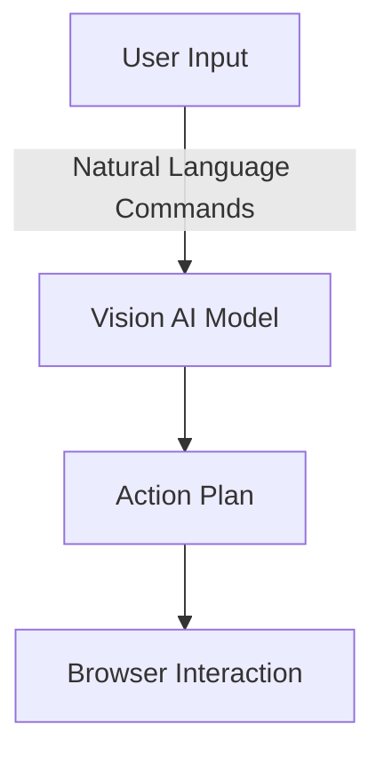
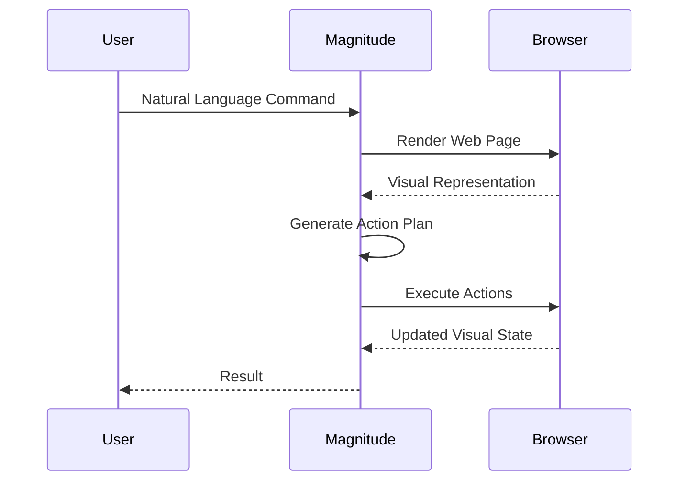
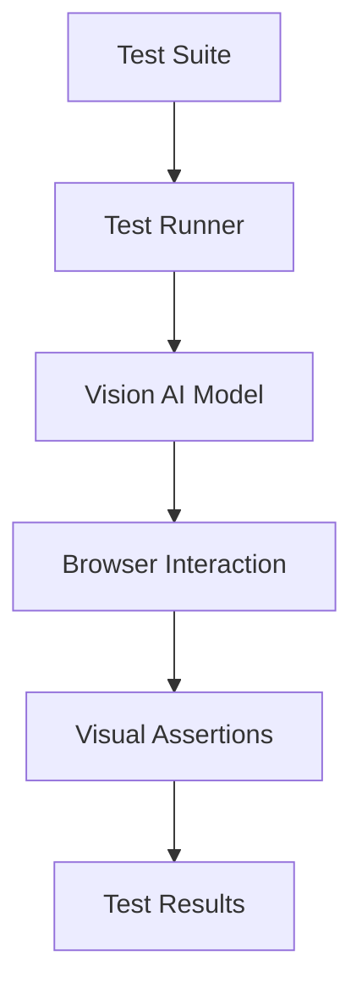

<details>
<summary>Relevant source files</summary>

The following file was used as context for generating this wiki page:

- [README.md](https://github.com/agattani123/magnitude/blob/main/README.md)

</details>

# Introduction

Magnitude is a vision AI-powered browser automation tool that enables users to control their browsers using natural language commands. It leverages visually grounded language models to understand and interact with web interfaces, allowing for navigation, interaction, data extraction, and verification tasks. Magnitude aims to provide a flexible and future-proof approach to browser automation, addressing limitations of traditional DOM-based techniques.

## Key Features

### Navigation

Magnitude can understand and navigate through any web interface by visually interpreting the user interface elements. It can plan and execute actions based on the visual representation of the page, enabling seamless navigation without relying on the underlying DOM structure.

### Interaction

With its ability to execute precise mouse and keyboard actions, Magnitude can interact with web applications by clicking, typing, dragging, and performing other interactions as specified by the user's natural language commands.

### Data Extraction

Magnitude can intelligently extract structured data from web pages based on the provided data schemas. It can identify and extract relevant information, including existing data and new insights derived from the visual content.

### Verification

Magnitude includes a built-in test runner with powerful visual assertions. This feature allows users to verify the correctness of their web applications by defining expected visual states and validating them against the rendered user interface.

## Architecture

Magnitude follows a vision-first architecture, where a visually grounded language model specifies pixel coordinates for interactions. This approach enables true generalization independent of the DOM structure, making Magnitude future-proof for various applications, including desktop apps and virtual machines.

### Core Components

#### Vision AI Model

The core of Magnitude's architecture is a visually grounded language model, such as Claude Sonnet 4 or Qwen-2.5VL 72B. This model is responsible for understanding the visual representation of the web interface and mapping natural language commands to specific actions and coordinates.



Sources: [README.md:32-35]()

#### Browser Interaction

Magnitude interacts with the browser by executing the action plan generated by the vision AI model. This involves performing precise mouse and keyboard actions, as well as extracting data and verifying visual assertions.



Sources: [README.md:32-35]()

#### Test Runner

Magnitude includes a built-in test runner that allows users to define and execute visual tests for their web applications. The test runner supports powerful visual assertions, enabling verification of the rendered user interface against expected visual states.



Sources: [README.md:18-21]()

## Getting Started

To get started with Magnitude, users can follow these steps:

1. **Create a new project:**
   ```bash
   npx create-magnitude-app
   ```
   This command will create a new project and guide users through the setup process. It will also generate an example script that can be run immediately.

2. **Install the test runner:**
   For existing web applications, users can install the test runner by running:
   ```bash
   npm i --save-dev magnitude-test && npx magnitude init
   ```
   This will create a `tests/magnitude` directory with a configuration file (`magnitude.config.ts`) and an example test file (`example.mag.ts`).

For more information on running tests and integrating with CI/CD pipelines, refer to the [official documentation](https://docs.magnitude.run/core-concepts/running-tests).

## Usage Examples

Here are some examples of how Magnitude can be used for various tasks:

### High-level Task Automation

```ts
// Magnitude can handle high-level tasks
await agent.act('Create a task', {
    // Optionally pass data that the agent will use where appropriate
    data: {
        title: 'Use Magnitude',
        description: 'Run "npx create-magnitude-app" and follow the instructions',
    },
});
```

Sources: [README.md:43-50]()

### Low-level Interaction

```ts
// It can also handle low-level actions
await agent.act('Drag "Use Magnitude" to the top of the in progress column');
```

Sources: [README.md:52-53]()

### Data Extraction

```ts
// Intelligently extract data based on the DOM content matching a provided zod schema
const tasks = await agent.extract(
    'List in progress tasks',
    z.array(z.object({
        title: z.string(),
        description: z.string(),
        // Agent can extract existing data or new insights
        difficulty: z.number().describe('Rate the difficulty between 1-5')
    })),
);
```

Sources: [README.md:55-63]()

## Conclusion

Magnitude is a powerful and flexible browser automation tool that leverages vision AI to enable natural language control of web interfaces. With its vision-first architecture, Magnitude can navigate, interact, extract data, and verify web applications in a generalized and future-proof manner. By combining the capabilities of visually grounded language models and precise browser interaction, Magnitude offers a robust solution for automating tasks on the web, integrating between applications without APIs, extracting data, and testing web applications.