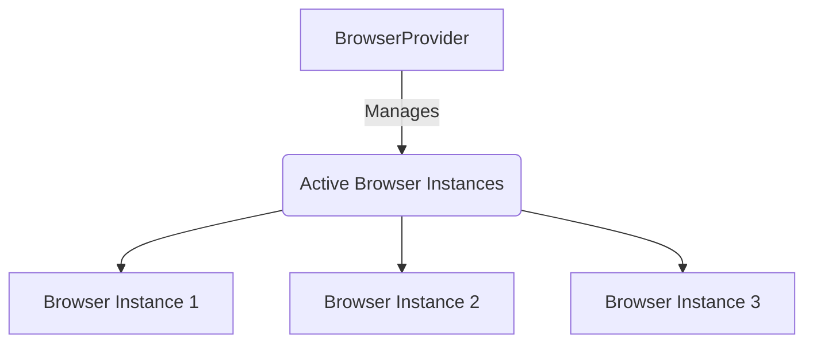
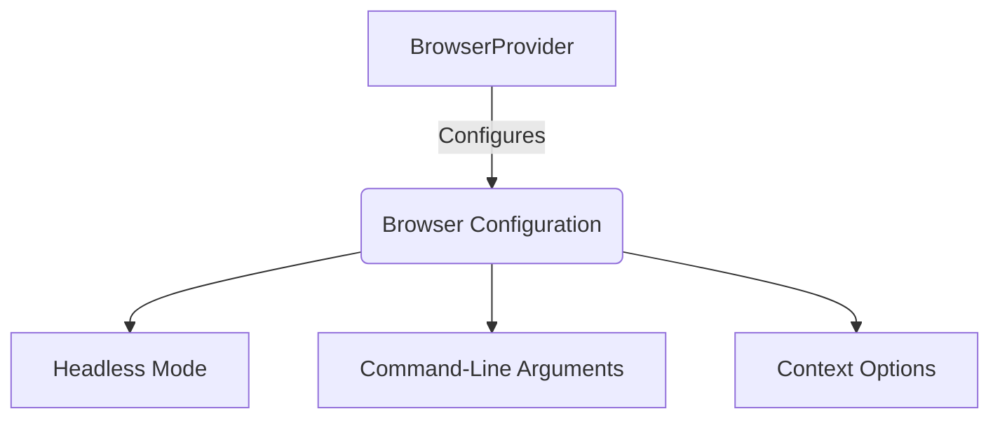
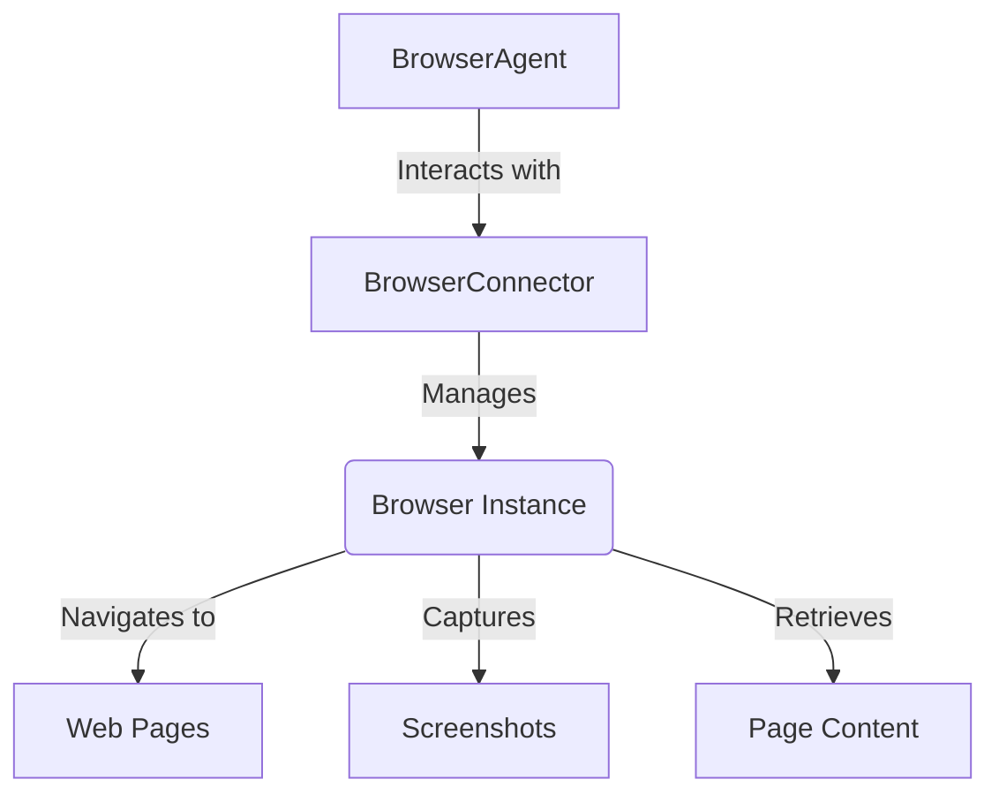
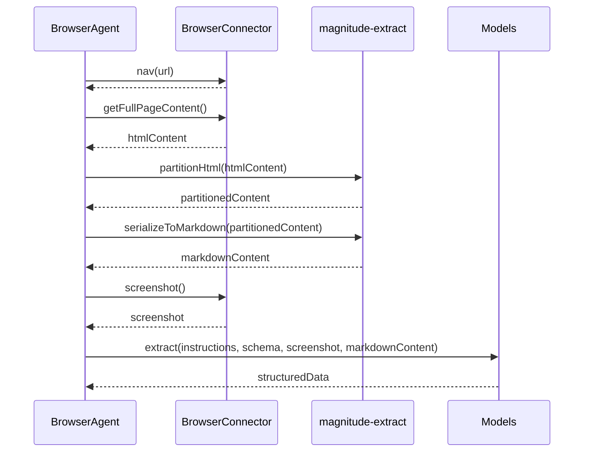
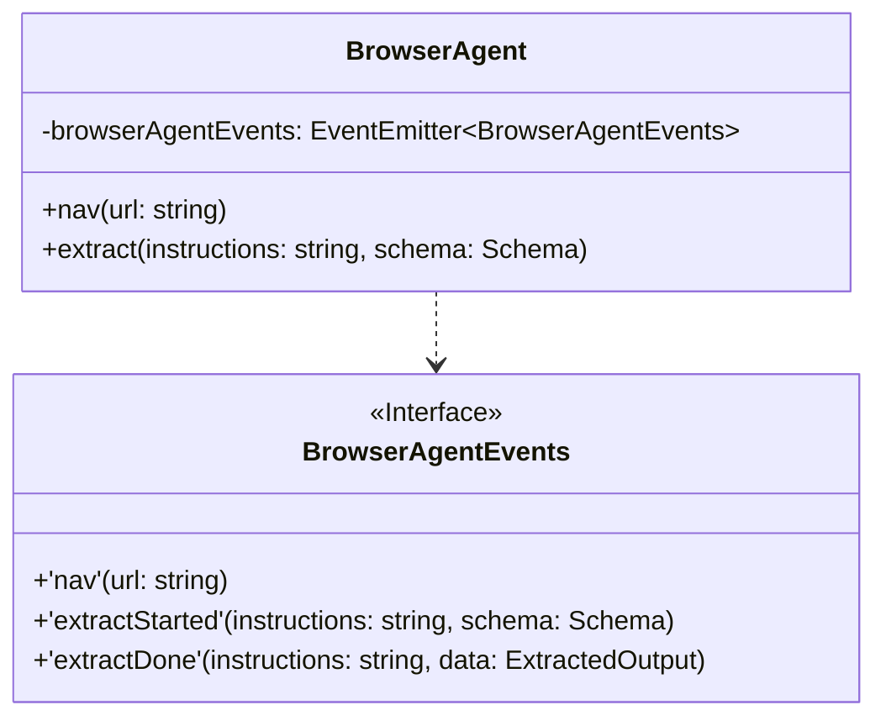

Relevant source files

The following files were used as context for generating this wiki page:

- [packages/magnitude-core/src/agent/browserAgent.ts](https://github.com/agattani123/magnitude/blob/main/packages/magnitude-core/src/agent/browserAgent.ts)
- [packages/magnitude-core/src/web/browserProvider.ts](https://github.com/agattani123/magnitude/blob/main/packages/magnitude-core/src/web/browserProvider.ts)
- [packages/magnitude-core/src/connectors/browserConnector.ts](https://github.com/agattani123/magnitude/blob/main/packages/magnitude-core/src/connectors/browserConnector.ts)
- [packages/magnitude-core/src/ai/util.ts](https://github.com/agattani123/magnitude/blob/main/packages/magnitude-core/src/ai/util.ts)
- [packages/magnitude-core/src/ai/types.ts](https://github.com/agattani123/magnitude/blob/main/packages/magnitude-core/src/ai/types.ts)

# Architecture Overview

## Introduction

The Magnitude project is a comprehensive framework that provides a unified interface for interacting with web browsers and extracting data from web pages. The core functionality revolves around the `BrowserAgent` class, which serves as a high-level abstraction for managing browser instances, navigating to web pages, and extracting structured data based on provided schemas.

The `BrowserAgent` class is built upon several key components, including the `BrowserConnector`, `BrowserProvider`, and various utility functions. Together, these components enable seamless integration with web browsers, efficient data extraction, and flexible configuration options.

Sources: [browserAgent.ts](https://github.com/agattani123/magnitude/blob/main/packages/magnitude-core/src/agent/browserAgent.ts), [browserProvider.ts](https://github.com/agattani123/magnitude/blob/main/packages/magnitude-core/src/web/browserProvider.ts), [browserConnector.ts](https://github.com/agattani123/magnitude/blob/main/packages/magnitude-core/src/connectors/browserConnector.ts)

## Browser Management

The `BrowserProvider` module is responsible for managing the lifecycle of browser instances. It provides a centralized mechanism for launching, reusing, and terminating browser instances based on various configuration options.

### Browser Instance Management

The `BrowserProvider` maintains a pool of active browser instances, which can be reused across multiple sessions or agents. This approach optimizes resource utilization and improves performance by reducing the overhead of launching new browser instances for each request.

Sources: [browserProvider.ts:15-31](https://github.com/agattani123/magnitude/blob/main/packages/magnitude-core/src/web/browserProvider.ts#L15-L31)

### Browser Configuration

The `BrowserProvider` supports various configuration options for launching and managing browser instances. These options include:

- `headless`: Determines whether the browser should run in headless mode (without a visible GUI) or not.
- `args`: Allows passing additional command-line arguments to the browser process.
- `contextOptions`: Configures the browser context, such as viewport size and other settings.

Sources: [browserProvider.ts:33-43](https://github.com/agattani123/magnitude/blob/main/packages/magnitude-core/src/web/browserProvider.ts#L33-L43), [browserProvider.ts:45-51](https://github.com/agattani123/magnitude/blob/main/packages/magnitude-core/src/web/browserProvider.ts#L45-L51)

## Browser Connector

The `BrowserConnector` acts as a bridge between the `BrowserAgent` and the underlying browser instance. It provides a unified interface for interacting with the browser, including navigating to web pages, capturing screenshots, and retrieving page content.

Sources: [browserConnector.ts](https://github.com/agattani123/magnitude/blob/main/packages/magnitude-core/src/connectors/browserConnector.ts), [browserAgent.ts:48-52](https://github.com/agattani123/magnitude/blob/main/packages/magnitude-core/src/agent/browserAgent.ts#L48-L52)

## Data Extraction

One of the core functionalities of the `BrowserAgent` is extracting structured data from web pages based on provided schemas. This process involves several steps:

1. **Navigation**: The `BrowserAgent` navigates to the desired web page using the `nav` method, which internally utilizes the `BrowserConnector` to interact with the browser instance.

2. **Page Content Retrieval**: The `getFullPageContent` function retrieves the complete HTML content of the web page, including the content of any embedded iframes.

3. **Content Partitioning**: The retrieved HTML content is partitioned using the `partitionHtml` function from the `magnitude-extract` library. This step extracts relevant information such as images, forms, and links from the HTML.

4. **Markdown Conversion**: The partitioned content is then converted to Markdown format using the `serializeToMarkdown` function, which preserves the structure and hierarchy of the content.

5. **Data Extraction**: The `extract` method of the `BrowserAgent` takes the instructions, a schema (defined using the Zod library), a screenshot of the web page, and the Markdown-formatted content. It then utilizes the `models` component to extract structured data based on the provided schema.

Sources: [browserAgent.ts:63-113](https://github.com/agattani123/magnitude/blob/main/packages/magnitude-core/src/agent/browserAgent.ts#L63-L113)

## Event Handling

The `BrowserAgent` class extends the `EventEmitter` class from the `eventemitter3` library, allowing it to emit and handle various events related to its operations. The `BrowserAgentEvents` interface defines the available events:

| Event            | Description                                                  |
|------------------|--------------------------------------------------------------|
| `'nav'`          | Emitted when navigating to a new URL                         |
| `'extractStarted'` | Emitted when the data extraction process starts             |
| `'extractDone'`   | Emitted when the data extraction process completes           |

Sources: [browserAgent.ts:28-31](https://github.com/agattani123/magnitude/blob/main/packages/magnitude-core/src/agent/browserAgent.ts#L28-L31), [browserAgent.ts:61-62](https://github.com/agattani123/magnitude/blob/main/packages/magnitude-core/src/agent/browserAgent.ts#L61-L62), [browserAgent.ts:93-94](https://github.com/agattani123/magnitude/blob/main/packages/magnitude-core/src/agent/browserAgent.ts#L93-L94)

## Conclusion

The Magnitude project provides a comprehensive architecture for interacting with web browsers and extracting structured data from web pages. The `BrowserAgent` class, along with its supporting components like `BrowserConnector` and `BrowserProvider`, offers a flexible and extensible framework for building web automation and data extraction solutions.

By leveraging the power of the Playwright library and the `magnitude-extract` library, the Magnitude project simplifies the process of navigating web pages, retrieving content, and extracting structured data based on defined schemas. The event-driven architecture and configuration options further enhance the project's flexibility and customization capabilities.

Sources: [browserAgent.ts](https://github.com/agattani123/magnitude/blob/main/packages/magnitude-core/src/agent/browserAgent.ts), [browserProvider.ts](https://github.com/agattani123/magnitude/blob/main/packages/magnitude-core/src/web/browserProvider.ts), [browserConnector.ts](https://github.com/agattani123/magnitude/blob/main/packages/magnitude-core/src/connectors/browserConnector.ts)

Relevant source files

The following files were used as context for generating this wiki page:

- [packages/magnitude-core/src/web/browserProvider.ts](https://github.com/agattani123/magnitude/blob/main/packages/magnitude-core/src/web/browserProvider.ts)

# Architecture Overview

The `BrowserProvider` class is a core component of the Magnitude project, responsible for managing the lifecycle of Chromium browser instances and their associated contexts. It serves as a centralized provider for creating, reusing, and configuring browser instances and contexts based on specified options.

## Singleton Instance

The `BrowserProvider` class follows the Singleton design pattern, ensuring that only one instance of the class exists throughout the application. This is achieved through the `getInstance` static method, which checks for an existing instance in the global scope and creates a new one if it doesn't exist. The instance is stored in the `__magnitude__` global object. Sources: [browserProvider.ts:5-19]()

## Browser Instance Management

The `BrowserProvider` maintains a record of active browser instances, keyed by a hash of the launch options used to create them. This hash is generated using the `objectHash` function from the `object-hash` library. Sources: [browserProvider.ts:21](), [browserProvider.ts:32-36]()

### Launching or Reusing Browsers

The `_launchOrReuseBrowser` method is responsible for launching a new browser instance or reusing an existing one based on the provided `LaunchOptions`. It first generates a hash of the options and checks if a browser instance with the same hash already exists in the `activeBrowsers` record. Sources: [browserProvider.ts:30-55]()

If a matching browser instance is found, it is reused. Otherwise, a new browser instance is launched using the `chromium.launch` method from the `puppeteer-core` library, with the provided `LaunchOptions` merged with the `DEFAULT_BROWSER_OPTIONS`. Sources: [browserProvider.ts:38-44]()

The launched browser instance is stored in the `activeBrowsers` record, along with a `Promise` representing the browser launch process and a counter for active contexts associated with the browser. Sources: [browserProvider.ts:45-50]()

### Browser Disconnection Handling

When a browser instance is disconnected, the `disconnected` event is handled by removing the corresponding entry from the `activeBrowsers` record. Sources: [browserProvider.ts:48-50]()

## Browser Context Management

The `BrowserProvider` provides methods for creating and managing browser contexts, which are isolated environments within a browser instance.

### Creating and Tracking Contexts

The `_createAndTrackContext` method is responsible for creating a new browser context and tracking its lifecycle. It first calls `_launchOrReuseBrowser` to obtain an active browser instance based on the provided `LaunchOptions`. Sources: [browserProvider.ts:57-67]()

A new browser context is then created using the `browser.newContext` method, with the specified `ContextOptions`. Sources: [browserProvider.ts:63]()

The method applies emulation settings to any new pages created within the context, such as viewport dimensions and device scale factor, by listening to the `page` event and applying the settings using the Chrome DevTools Protocol (CDP) session. Sources: [browserProvider.ts:65-71]()

The active context count for the associated browser instance is incremented, and a listener is set on the `close` event of the context to decrement the count and close the browser instance if no more active contexts remain. Sources: [browserProvider.ts:73-79]()

### Creating New Contexts

The `newContext` method is the public interface for creating new browser contexts. It handles various scenarios based on the provided `BrowserOptions`. Sources: [browserProvider.ts:81-124]()

If a `context` is directly provided in the options, it is returned as-is. Sources: [browserProvider.ts:83-85]()

If `cdp` or `instance` options are provided, the method connects to an existing browser instance using the specified Chrome DevTools Protocol (CDP) URL or the provided `Browser` instance, respectively. It then returns an existing context or creates a new one using the specified `ContextOptions`. Sources: [browserProvider.ts:108-115](), [browserProvider.ts:117-123]()

If `launchOptions` are provided, the method calls `_createAndTrackContext` with the specified options to create and track a new context. Sources: [browserProvider.ts:119-121]()

If no specific options are provided, the method creates a new context using the default browser options. Sources: [browserProvider.ts:123-125]()

The method also handles special cases, such as the `MAGNITUDE_PLAYGROUND` environment, where it applies specific launch options for debugging purposes. Sources: [browserProvider.ts:93-103]()

## Emulation Settings

The `_applyEmulationSettings` method is a helper function that applies emulation settings, such as viewport dimensions and device scale factor, to a new page created within a browser context. It uses the Chrome DevTools Protocol (CDP) session to send the `Emulation.setDeviceMetricsOverride` command with the specified settings. Sources: [browserProvider.ts:127-143]()

## Default Options

The `BrowserProvider` uses default options for browser instances (`DEFAULT_BROWSER_OPTIONS`) and browser contexts (`DEFAULT_BROWSER_CONTEXT_OPTIONS`), which are likely defined elsewhere in the codebase. Sources: [browserProvider.ts:38](), [browserProvider.ts:97]()

In summary, the `BrowserProvider` class is a crucial component of the Magnitude project, responsible for managing the lifecycle of Chromium browser instances and their associated contexts. It provides a centralized interface for creating, reusing, and configuring browser instances and contexts based on specified options, ensuring efficient resource utilization and consistent behavior across the application.