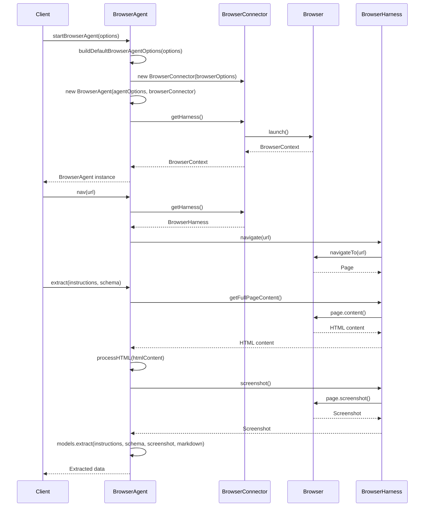

<details>
<summary>Relevant source files</summary>

The following files were used as context for generating this wiki page:

- [packages/magnitude-core/src/index.ts](https://github.com/agattani123/magnitude/blob/main/packages/magnitude-core/src/index.ts)
- [packages/magnitude-core/src/agent/browserAgent.ts](https://github.com/agattani123/magnitude/blob/main/packages/magnitude-core/src/agent/browserAgent.ts)
</details>

# Architecture Overview

## Introduction

The Magnitude project is a framework for building intelligent agents that can interact with web browsers and perform various tasks. The core architecture revolves around the `BrowserAgent` class, which serves as the main entry point for creating and managing agents capable of navigating web pages, extracting data, and potentially performing other actions.

The `BrowserAgent` class extends the base `Agent` class and incorporates a `BrowserConnector` to facilitate communication with a web browser. This architecture allows for the creation of agents that can leverage the capabilities of modern web browsers, such as rendering web pages, executing JavaScript, and interacting with web elements.

Sources: [packages/magnitude-core/src/agent/browserAgent.ts:1-11](), [packages/magnitude-core/src/agent/browserAgent.ts:49-52](), [packages/magnitude-core/src/agent/browserAgent.ts:87-92]()

## BrowserAgent Class

The `BrowserAgent` class is the central component of the Magnitude architecture for web-based agents. It inherits from the `Agent` class and provides additional functionality specific to web interactions.

### Constructor

The `BrowserAgent` constructor takes two optional parameters: `agentOptions` and `browserOptions`. These options allow for configuring the behavior of the agent and the underlying browser connector, respectively.

```typescript
constructor({ agentOptions, browserOptions }: { agentOptions?: Partial<AgentOptions>, browserOptions?: BrowserConnectorOptions }) {
    super({
        ...agentOptions,
        connectors: [new BrowserConnector(browserOptions || {}), ...(agentOptions?.connectors ?? [])]
    });
}
```

The constructor creates a new instance of the `BrowserConnector` and includes it in the list of connectors for the `Agent` class.

Sources: [packages/magnitude-core/src/agent/browserAgent.ts:87-92]()

### Navigation

The `nav` method allows the agent to navigate to a specified URL within the browser context.

```typescript
async nav(url: string): Promise<void> {
    this.browserAgentEvents.emit('nav', url);
    await this.require(BrowserConnector).getHarness().navigate(url);
}
```

It emits a `'nav'` event and then uses the `BrowserConnector` to navigate to the provided URL.

Sources: [packages/magnitude-core/src/agent/browserAgent.ts:95-99]()

### Data Extraction

The `extract` method is a crucial part of the `BrowserAgent` class. It allows the agent to extract data from the current web page based on provided instructions and a Zod schema.

```typescript
async extract<T extends Schema>(instructions: string, schema: T): Promise<z.infer<T>> {
    this.browserAgentEvents.emit('extractStarted', instructions, schema);
    const htmlContent = await getFullPageContent(this.page);
    // ... (code for processing HTML and extracting data)
    const data = await this.models.extract(instructions, schema, screenshot, markdown);
    this.browserAgentEvents.emit('extractDone', instructions, data);
    return data;
}
```

The method performs the following steps:

1. Emits an `'extractStarted'` event with the provided instructions and schema.
2. Retrieves the full HTML content of the current page, including the content of any iframes.
3. Processes the HTML content by partitioning it into various elements and converting it to Markdown format.
4. Captures a screenshot of the current page.
5. Utilizes the `extract` method of the `models` object to extract data based on the instructions, schema, screenshot, and Markdown content.
6. Emits an `'extractDone'` event with the instructions and extracted data.
7. Returns the extracted data.

Sources: [packages/magnitude-core/src/agent/browserAgent.ts:101-135]()

### Event Handling

The `BrowserAgent` class includes an `EventEmitter` instance called `browserAgentEvents` to handle various events related to the agent's lifecycle and operations.

```typescript
public readonly browserAgentEvents: EventEmitter<BrowserAgentEvents> = new EventEmitter();
```

The `BrowserAgentEvents` interface defines the events that can be emitted by the `BrowserAgent`. Currently, it includes the following events:

- `'nav'`: Emitted when the agent navigates to a new URL.
- `'extractStarted'`: Emitted when the data extraction process starts, providing the instructions and schema.
- `'extractDone'`: Emitted when the data extraction process completes, providing the instructions and extracted data.

Sources: [packages/magnitude-core/src/agent/browserAgent.ts:73-77](), [packages/magnitude-core/src/agent/browserAgent.ts:80]()

## Helper Functions

The `startBrowserAgent` function is a helper function that simplifies the process of creating and starting a `BrowserAgent` instance.

```typescript
export async function startBrowserAgent(
    options?: AgentOptions & BrowserConnectorOptions & { narrate?: boolean }
): Promise<BrowserAgent> {
    const { agentOptions, browserOptions } = buildDefaultBrowserAgentOptions({ agentOptions: options ?? {}, browserOptions: options ?? {} });

    const agent = new BrowserAgent({
        agentOptions: agentOptions,
        browserOptions: browserOptions,
    });

    if (options?.narrate || process.env.MAGNITUDE_NARRATE) {
        narrateBrowserAgent(agent);
    }

    await agent.start();
    return agent;
}
```

This function takes an optional `options` object that can include `AgentOptions`, `BrowserConnectorOptions`, and a `narrate` flag. It then builds the default agent and browser options using the `buildDefaultBrowserAgentOptions` function, creates a new `BrowserAgent` instance, and optionally enables narration if requested. Finally, it starts the agent and returns the instance.

Sources: [packages/magnitude-core/src/agent/browserAgent.ts:21-43]()

## Sequence Diagram

The following sequence diagram illustrates the high-level flow of creating and using a `BrowserAgent` instance:



This diagram illustrates the following steps:

1. The client calls `startBrowserAgent` with optional options.
2. The `BrowserAgent` is created with the provided options and a `BrowserConnector` instance.
3. The `BrowserConnector` launches a new browser instance and returns a `BrowserContext`.
4. The client can then call `nav` on the `BrowserAgent` to navigate to a specific URL.
5. The `BrowserAgent` uses the `BrowserConnector` and `BrowserHarness` to navigate the browser to the specified URL.
6. The client can call `extract` on the `BrowserAgent` with instructions and a schema.
7. The `BrowserAgent` retrieves the full HTML content of the current page, processes it, captures a screenshot, and extracts data using the provided instructions and schema.
8. The extracted data is returned to the client.

Sources: [packages/magnitude-core/src/agent/browserAgent.ts]()

## Key Components

### BrowserAgent

- Extends the base `Agent` class
- Incorporates a `BrowserConnector` to interact with a web browser
- Provides methods for navigating to URLs (`nav`) and extracting data from web pages (`extract`)
- Emits events for various stages of the agent's lifecycle and operations (`browserAgentEvents`)

### BrowserConnector

- Responsible for managing the connection and communication with the web browser
- Provides a `BrowserHarness` instance for interacting with the browser

### BrowserHarness

- Encapsulates the functionality for navigating to URLs, capturing screenshots, and retrieving page content
- Interacts with the underlying browser instance (e.g., Playwright)

### Models

- Responsible for extracting data from web pages based on provided instructions and schemas
- Utilizes the `extract` method to perform the data extraction process

Sources: [packages/magnitude-core/src/agent/browserAgent.ts]()

## Conclusion

The Magnitude project's architecture revolves around the `BrowserAgent` class, which serves as the central component for creating and managing intelligent agents capable of interacting with web browsers. The `BrowserAgent` leverages the `BrowserConnector` and `BrowserHarness` to facilitate communication with the underlying browser instance, enabling navigation, data extraction, and potentially other web-related operations. This architecture provides a flexible and extensible framework for building web-based agents tailored to various use cases and requirements.