<details>
<summary>Relevant source files</summary>

The following files were used as context for generating this wiki page:

- [packages/magnitude-core/src/agent/browserAgent.ts](https://github.com/agattani123/magnitude/blob/main/packages/magnitude-core/src/agent/browserAgent.ts)
- [packages/magnitude-core/src/web/browserProvider.ts](https://github.com/agattani123/magnitude/blob/main/packages/magnitude-core/src/web/browserProvider.ts)
- [packages/magnitude-core/src/ai/modelHarness.ts](https://github.com/agattani123/magnitude/blob/main/packages/magnitude-core/src/ai/modelHarness.ts)
- [packages/magnitude-extract/src/index.ts](https://github.com/agattani123/magnitude/blob/main/packages/magnitude-extract/src/index.ts)
- [packages/magnitude-core/src/agent/narrator.ts](https://github.com/agattani123/magnitude/blob/main/packages/magnitude-core/src/agent/narrator.ts)

</details>

# Component Interactions

## Introduction

The "Component Interactions" feature in this project revolves around the `BrowserAgent` class, which facilitates interactions between various components for web-based tasks. It serves as a central orchestrator, managing the lifecycle of a browser instance, handling navigation, extracting data from web pages, and potentially performing other web-related operations. The `BrowserAgent` class extends the base `Agent` class and incorporates the `BrowserConnector` to establish the connection with the browser instance.

The key components involved in this feature are:

- `BrowserAgent`: The main class responsible for managing the browser instance and coordinating web-related tasks.
- `BrowserConnector`: A connector class that handles the communication with the underlying browser instance.
- `BrowserProvider`: A utility class that manages the creation and reuse of browser instances.
- `modelHarness`: A class responsible for interacting with AI models and performing data extraction tasks.

For more information on related components, refer to the [Agent Interactions](#agent-interactions) and [Data Extraction](#data-extraction) wiki pages.

## BrowserAgent Class

The `BrowserAgent` class is the central component that orchestrates web-based interactions. It extends the `Agent` class and incorporates the `BrowserConnector` to establish a connection with the browser instance. Here's an overview of its key responsibilities and interactions:

### Constructor

```typescript
constructor({ agentOptions, browserOptions }: { agentOptions?: Partial<AgentOptions>, browserOptions?: BrowserConnectorOptions }) {
    super({
        ...agentOptions,
        connectors: [new BrowserConnector(browserOptions || {}), ...(agentOptions?.connectors ?? [])]
    });
}
```

The constructor takes in `agentOptions` and `browserOptions` as parameters. It creates an instance of the `BrowserConnector` with the provided `browserOptions` and adds it to the list of connectors for the `Agent` class.

Sources: [packages/magnitude-core/src/agent/browserAgent.ts:83-91]()

### Navigation

```typescript
async nav(url: string): Promise<void> {
    this.browserAgentEvents.emit('nav', url);
    await this.require(BrowserConnector).getHarness().navigate(url);
}
```

The `nav` method is responsible for navigating the browser to a specified URL. It emits a `'nav'` event with the URL and then calls the `navigate` method of the `BrowserConnector` harness to perform the actual navigation.

Sources: [packages/magnitude-core/src/agent/browserAgent.ts:95-98]()

### Data Extraction

```typescript
async extract<T extends Schema>(instructions: string, schema: T): Promise<z.infer<T>> {
    this.browserAgentEvents.emit('extractStarted', instructions, schema);
    const htmlContent = await getFullPageContent(this.page);
    // ... (omitted for brevity)
    const data = await this.models.extract(instructions, schema, screenshot, markdown);
    this.browserAgentEvents.emit('extractDone', instructions, data);
    return data;
}
```

The `extract` method is responsible for extracting data from the current web page based on provided instructions and a schema. It emits `'extractStarted'` and `'extractDone'` events, retrieves the full HTML content of the page (including iframes), processes it using the `partitionHtml` and `serializeToMarkdown` functions from the `magnitude-extract` package, captures a screenshot, and then calls the `extract` method of the `models` instance to perform the actual data extraction. The extracted data is returned as the result.

Sources: [packages/magnitude-core/src/agent/browserAgent.ts:100-128](), [packages/magnitude-extract/src/index.ts]()

### Event Handling

The `BrowserAgent` class extends the `EventEmitter` class from the `eventemitter3` package, allowing it to emit and handle custom events. The `BrowserAgentEvents` interface defines the events that can be emitted by the `BrowserAgent`.

```typescript
export interface BrowserAgentEvents {
    'nav': (url: string) => void;
    'extractStarted': (instructions: string, schema: ZodSchema) => void;
    'extractDone': (instructions: string, data: ExtractedOutput) => void;
}
```

Sources: [packages/magnitude-core/src/agent/browserAgent.ts:36-40]()

### Utility Methods

The `BrowserAgent` class also provides utility methods to access the underlying `Page` and `BrowserContext` instances from the `BrowserConnector` harness.

```typescript
get page(): Page {
    return this.require(BrowserConnector).getHarness().page;
}

get context(): BrowserContext {
    return this.require(BrowserConnector).getHarness().context;
}
```

Sources: [packages/magnitude-core/src/agent/browserAgent.ts:93-94]()

## BrowserConnector Class

The `BrowserConnector` class is responsible for establishing and managing the connection with the browser instance. It is used by the `BrowserAgent` to perform web-related tasks.

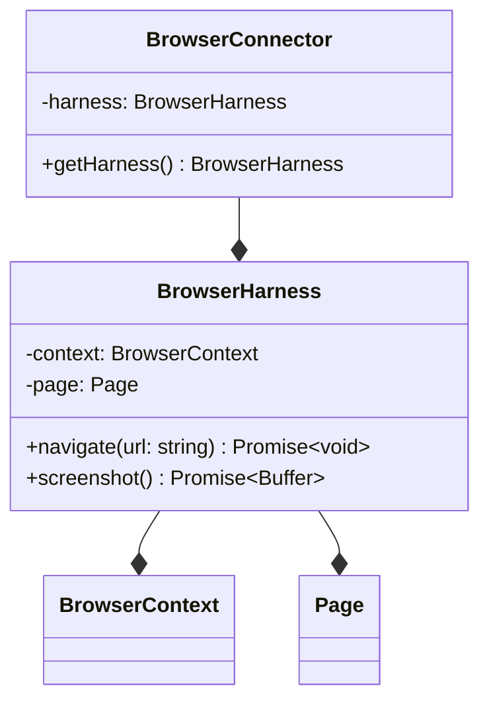

The `BrowserConnector` class encapsulates a `BrowserHarness` instance, which manages the `BrowserContext` and `Page` instances. The `getHarness` method provides access to the `BrowserHarness` instance, allowing the `BrowserAgent` to interact with the browser through methods like `navigate` and `screenshot`.

Sources: [packages/magnitude-core/src/connectors/browserConnector.ts]()

## BrowserProvider Class

The `BrowserProvider` class is responsible for managing the creation and reuse of browser instances. It ensures that only a single browser instance is running at a time and provides a way to create new browser contexts as needed.

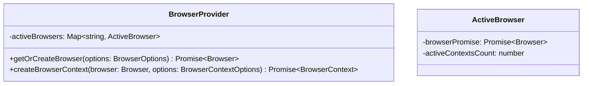

The `BrowserProvider` maintains a map of `ActiveBrowser` instances, keyed by a unique identifier derived from the `BrowserOptions`. The `getOrCreateBrowser` method checks if a browser instance already exists for the given options and returns it, or creates a new one if necessary. The `createBrowserContext` method creates a new `BrowserContext` instance for the given `Browser` instance and options.

Sources: [packages/magnitude-core/src/web/browserProvider.ts]()

## Data Extraction Flow

The data extraction process involves several components and follows a specific flow:

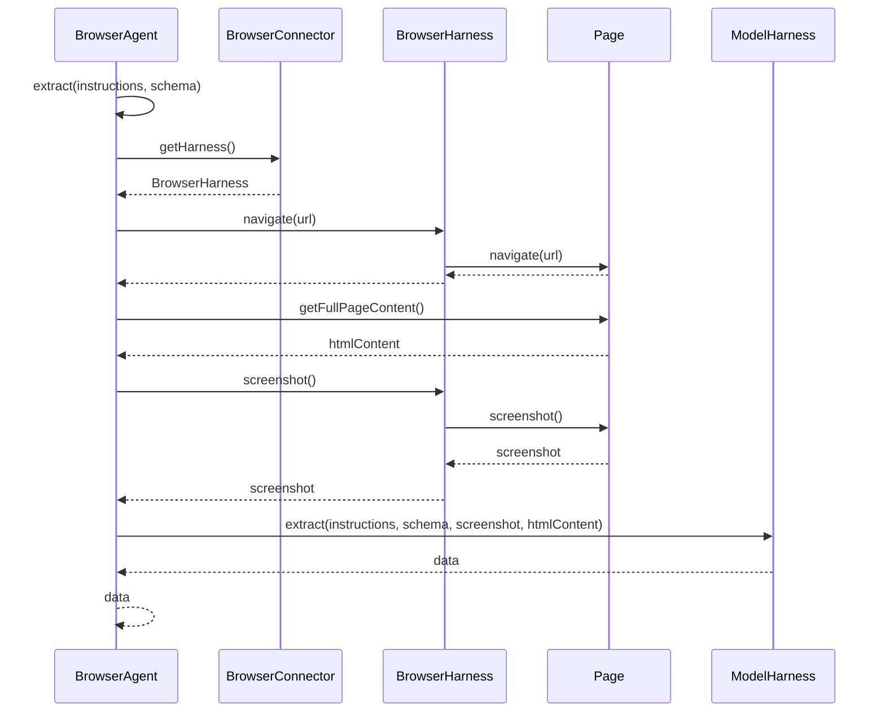

1. The `BrowserAgent` receives a call to the `extract` method with instructions and a schema.
2. The `BrowserAgent` retrieves the `BrowserHarness` instance from the `BrowserConnector`.
3. The `BrowserAgent` calls the `navigate` method on the `BrowserHarness`, which in turn calls the `navigate` method on the `Page` instance.
4. The `BrowserAgent` retrieves the full HTML content of the page, including iframes, using the `getFullPageContent` function.
5. The `BrowserAgent` captures a screenshot of the page by calling the `screenshot` method on the `BrowserHarness`, which in turn calls the `screenshot` method on the `Page` instance.
6. The `BrowserAgent` passes the instructions, schema, screenshot, and HTML content to the `ModelHarness` for data extraction.
7. The `ModelHarness` performs the data extraction and returns the extracted data to the `BrowserAgent`.

Sources: [packages/magnitude-core/src/agent/browserAgent.ts:100-128](), [packages/magnitude-core/src/agent/browserAgent.ts:77-80](), [packages/magnitude-core/src/connectors/browserConnector.ts]()

## Configuration and Options

The `BrowserAgent` and related components can be configured using various options:

| Option | Type | Description |
| --- | --- | --- |
| `agentOptions` | `Partial<AgentOptions>` | Options for configuring the `Agent` instance. |
| `browserOptions` | `BrowserConnectorOptions` | Options for configuring the `BrowserConnector` instance. |
| `narrate` | `boolean` | Flag to enable or disable narration of agent actions. |
| `launchOptions` | `LaunchOptions` | Options for launching the browser instance. |
| `contextOptions` | `BrowserContextOptions` | Options for configuring the `BrowserContext` instance. |

The `startBrowserAgent` function is used to create and start a new `BrowserAgent` instance with the provided options.

```typescript
export async function startBrowserAgent(
    options?: AgentOptions & BrowserConnectorOptions & { narrate?: boolean }
): Promise<BrowserAgent> {
    const { agentOptions, browserOptions } = buildDefaultBrowserAgentOptions({ agentOptions: options ?? {}, browserOptions: options ?? {} });

    const agent = new BrowserAgent({
        agentOptions: agentOptions,
        browserOptions: browserOptions,
    });

    if (options?.narrate || process.env.MAGNITUDE_NARRATE) {
        narrateBrowserAgent(agent);
    }

    await agent.start();
    return agent;
}
```

Sources: [packages/magnitude-core/src/agent/browserAgent.ts:16-33](), [packages/magnitude-core/src/web/browserProvider.ts:14-18](), [packages/magnitude-core/src/web/browserProvider.ts:20-24]()

## Conclusion

The "Component Interactions" feature in this project revolves around the `BrowserAgent` class, which serves as a central orchestrator for web-based tasks. It manages the lifecycle of a browser instance, handles navigation, and facilitates data extraction from web pages. The `BrowserAgent` interacts with various other components, such as the `BrowserConnector`, `BrowserProvider`, and `ModelHarness`, to perform its responsibilities. The feature provides a flexible and configurable way to automate web-based tasks and extract data from web pages using AI models.

<details>
<summary>Relevant source files</summary>

The following files were used as context for generating this wiki page:

- [packages/magnitude-core/src/web/browserProvider.ts](https://github.com/agattani123/magnitude/blob/main/packages/magnitude-core/src/web/browserProvider.ts)
- [packages/magnitude-core/src/ai/modelHarness.ts](https://github.com/agattani123/magnitude/blob/main/packages/magnitude-core/src/ai/modelHarness.ts)
- [packages/magnitude-core/src/agent/browserAgent.ts](https://github.com/agattani123/magnitude/blob/main/packages/magnitude-core/src/agent/browserAgent.ts)
- [packages/magnitude-core/src/ai/baml_client/async_client.ts](https://github.com/agattani123/magnitude/blob/main/packages/magnitude-core/src/ai/baml_client/async_client.ts)
- [packages/magnitude-core/src/ai/baml_client/util.ts](https://github.com/agattani123/magnitude/blob/main/packages/magnitude-core/src/ai/baml_client/util.ts)
</details>

# Component Interactions

## Introduction

The "Component Interactions" in the provided codebase refer to the interactions between various components responsible for managing browser instances, contexts, and their integration with the AI model harness. This section covers the architecture, data flow, and key components involved in launching and reusing browser instances, creating and managing browser contexts, and the communication between these components and the AI model harness.

The primary components involved are:

- `BrowserProvider`: A singleton class that manages the lifecycle of browser instances and contexts.
- `ModelHarness`: A class that acts as an interface between the AI model and the application logic.
- `BrowserAgent`: A class that interacts with the browser and communicates with the AI model harness.

## Browser Provider

The `BrowserProvider` is a central component responsible for launching and managing browser instances and contexts. It follows the Singleton design pattern, ensuring that only one instance of the class exists throughout the application.

### Browser Instance Management

The `BrowserProvider` maintains a record of active browser instances, keyed by a hash of the launch options. This allows for efficient reuse of existing browser instances with the same configuration, avoiding unnecessary overhead of launching new instances.

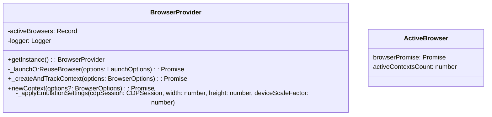

Sources: [packages/magnitude-core/src/web/browserProvider.ts:1-162]()

### Browser Context Management

The `BrowserProvider` also manages the creation and tracking of browser contexts. A browser context represents an isolated environment within a browser instance, allowing for separate execution of scripts, cookies, and other browser-related data.

The `_createAndTrackContext` method is responsible for launching or reusing a browser instance based on the provided launch options, and then creating a new context within that instance. It also sets up event listeners to manage the context's lifecycle and apply emulation settings (e.g., viewport dimensions, device scale factor) to any new pages created within the context.

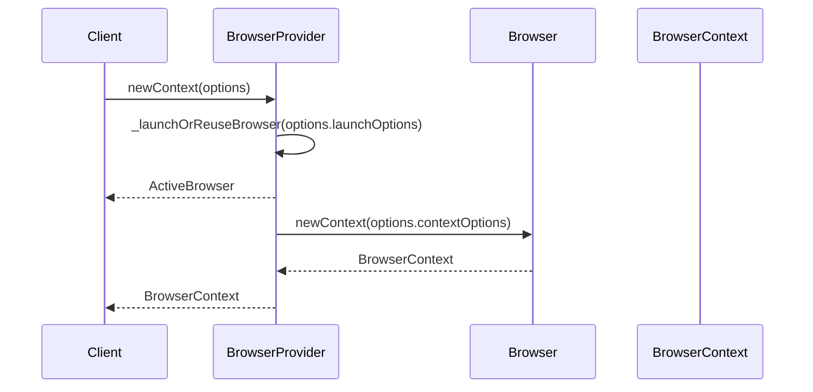

Sources: [packages/magnitude-core/src/web/browserProvider.ts:59-103](), [packages/magnitude-core/src/web/browserProvider.ts:104-162]()

## Model Harness

The `ModelHarness` class acts as an interface between the AI model and the application logic. It provides methods for interacting with the AI model, such as generating text, analyzing images, and performing other tasks.

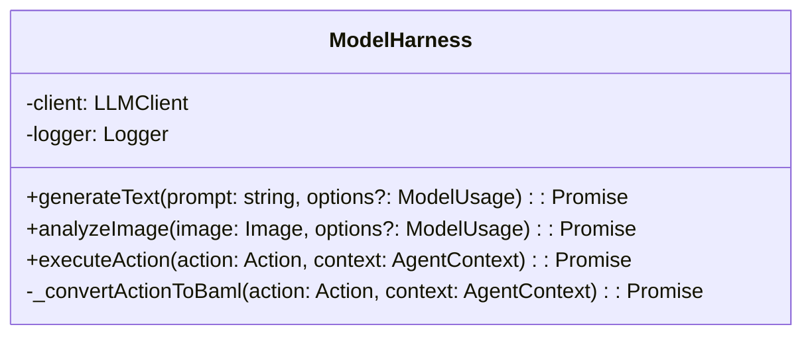

Sources: [packages/magnitude-core/src/ai/modelHarness.ts:1-84]()

The `ModelHarness` class interacts with the `BrowserAgent` and other components to execute actions and perform various tasks. It serves as a bridge between the application logic and the AI model, abstracting away the complexities of interacting with the model directly.

## Browser Agent

The `BrowserAgent` class is responsible for interacting with the browser and communicating with the AI model harness. It acts as an intermediary between the browser and the AI model, facilitating the execution of actions and the analysis of browser-related data.

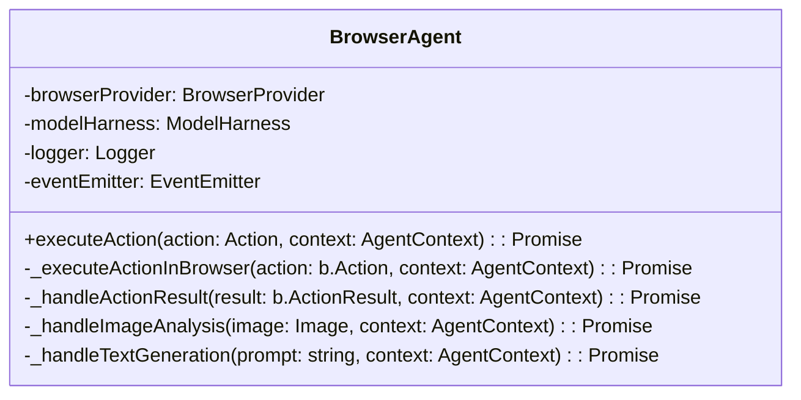

Sources: [packages/magnitude-core/src/agent/browserAgent.ts:1-137]()

The `BrowserAgent` interacts with the `BrowserProvider` to create and manage browser contexts, and with the `ModelHarness` to communicate with the AI model. It acts as a bridge between the browser and the AI model, facilitating the execution of actions and the analysis of browser-related data.

### Action Execution

The `executeAction` method in the `BrowserAgent` class is responsible for executing an action within the browser context. It converts the action to a format compatible with the AI model (using the `ModelHarness`), and then executes the action in the browser context using the `_executeActionInBrowser` method.

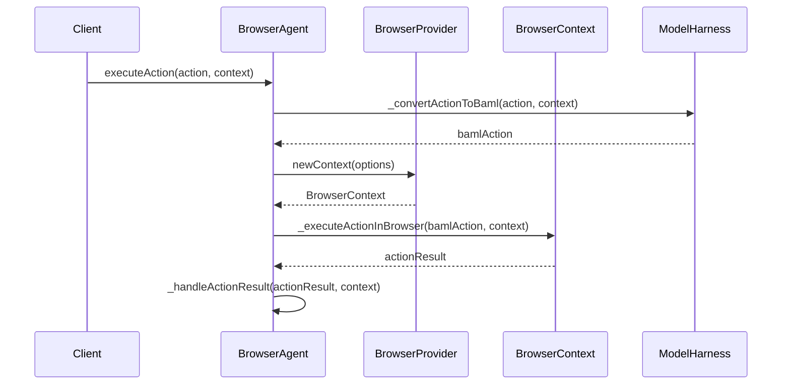

Sources: [packages/magnitude-core/src/agent/browserAgent.ts:34-58](), [packages/magnitude-core/src/agent/browserAgent.ts:59-77]()

### Image Analysis and Text Generation

The `BrowserAgent` also facilitates image analysis and text generation tasks by interacting with the `ModelHarness`. The `_handleImageAnalysis` and `_handleTextGeneration` methods are responsible for handling these tasks, respectively.

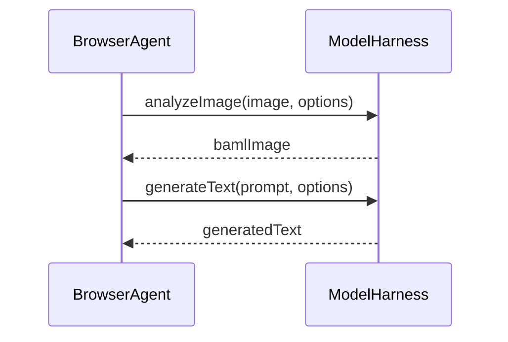

Sources: [packages/magnitude-core/src/agent/browserAgent.ts:79-92](), [packages/magnitude-core/src/agent/browserAgent.ts:94-107]()

## Conclusion

The "Component Interactions" in the provided codebase revolve around the management of browser instances and contexts, and the integration of these components with the AI model harness. The `BrowserProvider` is responsible for launching and reusing browser instances, as well as creating and managing browser contexts. The `ModelHarness` acts as an interface between the AI model and the application logic, providing methods for interacting with the model. The `BrowserAgent` serves as a bridge between the browser and the AI model, facilitating the execution of actions, image analysis, and text generation tasks.

These components work together to enable the application to interact with the browser and leverage the capabilities of the AI model, allowing for the execution of complex tasks and the analysis of browser-related data.

<details>
<summary>Relevant source files</summary>

The following files were used as context for generating this wiki page:

- [packages/magnitude-core/src/ai/modelHarness.ts](https://github.com/agattani123/magnitude/blob/main/packages/magnitude-core/src/ai/modelHarness.ts)
- [packages/magnitude-core/src/agent/browserAgent.ts](https://github.com/agattani123/magnitude/blob/main/packages/magnitude-core/src/agent/browserAgent.ts)
- [packages/magnitude-core/src/web/browserProvider.ts](https://github.com/agattani123/magnitude/blob/main/packages/magnitude-core/src/web/browserProvider.ts)
- [packages/magnitude-core/src/types.ts](https://github.com/agattani123/magnitude/blob/main/packages/magnitude-core/src/types.ts)
- [packages/magnitude-core/src/utils/index.ts](https://github.com/agattani123/magnitude/blob/main/packages/magnitude-core/src/utils/index.ts)
</details>

# Component Interactions

## Introduction

The "Component Interactions" within the Magnitude project revolve around the communication and data flow between various components, including the `ModelHarness`, `BrowserAgent`, and `BrowserProvider`. These components work together to facilitate the interaction between the user's browser and the underlying language model, enabling seamless integration of AI capabilities into web applications.

The `ModelHarness` acts as an intermediary between the language model and other components, providing a unified interface for interacting with the model. The `BrowserAgent` is responsible for managing the communication between the user's browser and the `ModelHarness`, handling user input and displaying the model's responses. The `BrowserProvider` serves as a bridge between the `BrowserAgent` and the web application, allowing the application to leverage the AI capabilities provided by the `ModelHarness`.

Sources: [packages/magnitude-core/src/ai/modelHarness.ts](), [packages/magnitude-core/src/agent/browserAgent.ts](), [packages/magnitude-core/src/web/browserProvider.ts]()

## ModelHarness

The `ModelHarness` is a core component that encapsulates the interaction with the language model. It provides a unified interface for other components to communicate with the model, abstracting away the underlying implementation details.

### ModelHarness Architecture

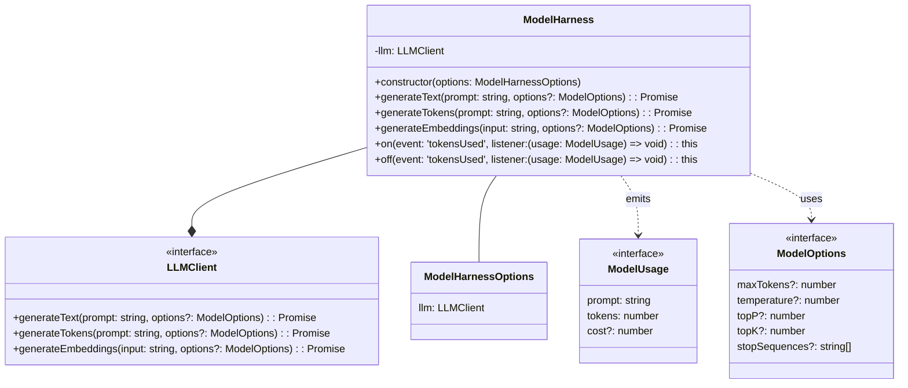

The `ModelHarness` class is the central component that interacts with the language model through an `LLMClient` interface. It provides methods for generating text, tokens, and embeddings based on user prompts and various model options.

The `LLMClient` interface defines the contract for interacting with the underlying language model, allowing the `ModelHarness` to work with different model implementations.

The `ModelHarness` also supports event handling, emitting a `'tokensUsed'` event with a `ModelUsage` object containing information about the prompt, token usage, and cost (if available).

Sources: [packages/magnitude-core/src/ai/modelHarness.ts:1-74]()

### Key Methods

#### `generateText(prompt: string, options?: ModelOptions): Promise<string>`

This method generates text based on the provided `prompt` and optional `ModelOptions`. It returns a `Promise` that resolves with the generated text.

Sources: [packages/magnitude-core/src/ai/modelHarness.ts:25-31]()

#### `generateTokens(prompt: string, options?: ModelOptions): Promise<string[]>`

This method generates an array of tokens based on the provided `prompt` and optional `ModelOptions`. It returns a `Promise` that resolves with the generated tokens.

Sources: [packages/magnitude-core/src/ai/modelHarness.ts:33-39]()

#### `generateEmbeddings(input: string, options?: ModelOptions): Promise<number[]>`

This method generates embeddings (numerical representations) for the provided `input` string and optional `ModelOptions`. It returns a `Promise` that resolves with the generated embeddings.

Sources: [packages/magnitude-core/src/ai/modelHarness.ts:41-47]()

#### `on(event: 'tokensUsed', listener: (usage: ModelUsage) => void): this`

This method allows registering an event listener for the `'tokensUsed'` event, which is emitted when the `ModelHarness` generates text or tokens. The listener function receives a `ModelUsage` object containing information about the prompt, token usage, and cost (if available).

Sources: [packages/magnitude-core/src/ai/modelHarness.ts:49-53]()

#### `off(event: 'tokensUsed', listener: (usage: ModelUsage) => void): this`

This method allows removing a previously registered event listener for the `'tokensUsed'` event.

Sources: [packages/magnitude-core/src/ai/modelHarness.ts:55-59]()

## BrowserAgent

The `BrowserAgent` is responsible for managing the communication between the user's browser and the `ModelHarness`. It handles user input, sends prompts to the `ModelHarness`, and displays the generated responses in the browser.

### BrowserAgent Architecture

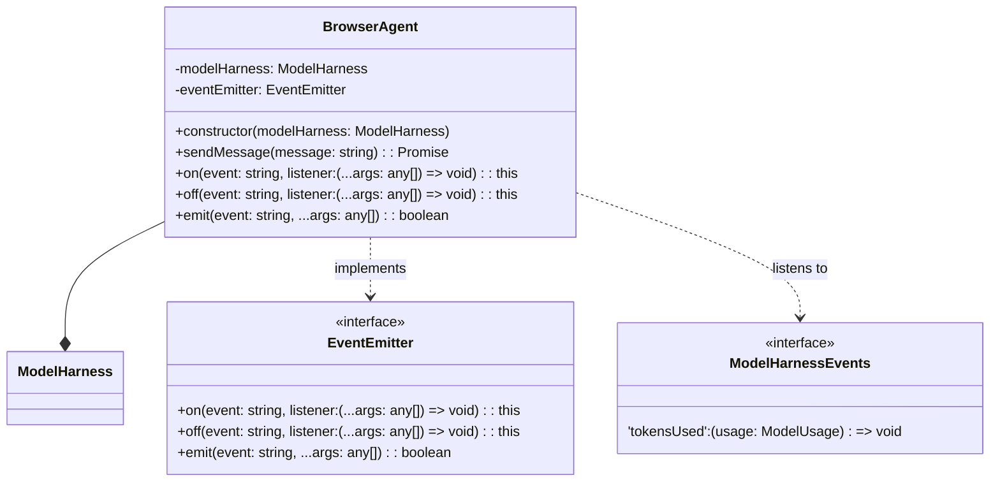

The `BrowserAgent` class is responsible for managing the communication between the user's browser and the `ModelHarness`. It has a reference to the `ModelHarness` instance and an `EventEmitter` for handling events.

The `BrowserAgent` provides the `sendMessage` method for sending user messages to the `ModelHarness` and receiving the generated responses. It also implements the `EventEmitter` interface, allowing other components to register and listen for events emitted by the `BrowserAgent`.

The `BrowserAgent` listens to the `'tokensUsed'` event emitted by the `ModelHarness` and can propagate this event to its own event listeners.

Sources: [packages/magnitude-core/src/agent/browserAgent.ts:1-40]()

### Key Methods

#### `sendMessage(message: string): Promise<string>`

This method sends a user message to the `ModelHarness` and returns a `Promise` that resolves with the generated response.

Sources: [packages/magnitude-core/src/agent/browserAgent.ts:18-24]()

#### `on(event: string, listener: (...args: any[]) => void): this`

This method allows registering an event listener for a specific event emitted by the `BrowserAgent`.

Sources: [packages/magnitude-core/src/agent/browserAgent.ts:26-28]()

#### `off(event: string, listener: (...args: any[]) => void): this`

This method allows removing a previously registered event listener for a specific event emitted by the `BrowserAgent`.

Sources: [packages/magnitude-core/src/agent/browserAgent.ts:30-32]()

#### `emit(event: string, ...args: any[]): boolean`

This method emits a specific event with optional arguments and returns a boolean indicating whether the event had listeners.

Sources: [packages/magnitude-core/src/agent/browserAgent.ts:34-36]()

## BrowserProvider

The `BrowserProvider` serves as a bridge between the `BrowserAgent` and the web application, allowing the application to leverage the AI capabilities provided by the `ModelHarness`.

### BrowserProvider Architecture

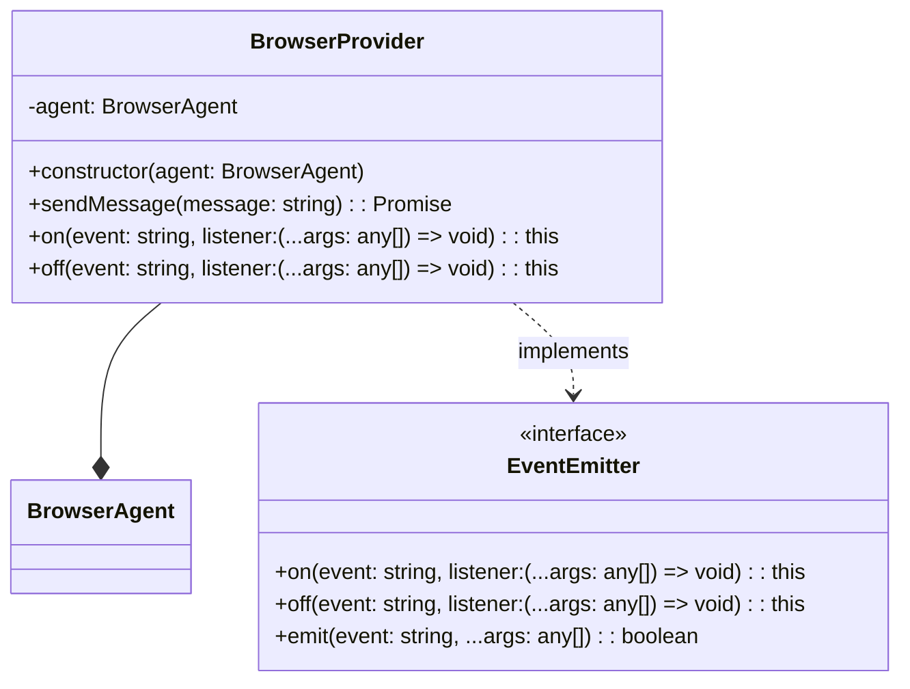

The `BrowserProvider` class acts as a facade for the `BrowserAgent`, providing a simplified interface for the web application to interact with the AI capabilities.

The `BrowserProvider` has a reference to the `BrowserAgent` instance and exposes methods for sending messages and handling events. It implements the `EventEmitter` interface, allowing the web application to register and listen for events emitted by the `BrowserProvider`.

Sources: [packages/magnitude-core/src/web/browserProvider.ts:1-25]()

### Key Methods

#### `sendMessage(message: string): Promise<string>`

This method sends a user message to the `BrowserAgent` and returns a `Promise` that resolves with the generated response.

Sources: [packages/magnitude-core/src/web/browserProvider.ts:13-15]()

#### `on(event: string, listener: (...args: any[]) => void): this`

This method allows registering an event listener for a specific event emitted by the `BrowserProvider`.

Sources: [packages/magnitude-core/src/web/browserProvider.ts:17-19]()

#### `off(event: string, listener: (...args: any[]) => void): this`

This method allows removing a previously registered event listener for a specific event emitted by the `BrowserProvider`.

Sources: [packages/magnitude-core/src/web/browserProvider.ts:21-23]()

## Sequence Diagram

The following sequence diagram illustrates the interaction between the `BrowserProvider`, `BrowserAgent`, and `ModelHarness` components when sending a user message and receiving the generated response.

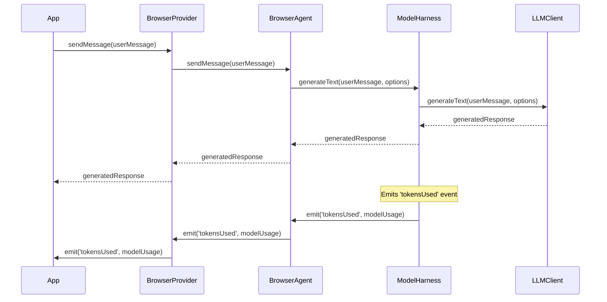

1. The web application (`App`) calls the `sendMessage` method on the `BrowserProvider` with the user's message.
2. The `BrowserProvider` forwards the message to the `BrowserAgent` by calling its `sendMessage` method.
3. The `BrowserAgent` sends the message to the `ModelHarness` by calling its `generateText` method with the user's message and optional model options.
4. The `ModelHarness` interacts with the underlying `LLMClient` to generate the response based on the provided message and options.
5. The `LLMClient` returns the generated response to the `ModelHarness`.
6. The `ModelHarness` emits a `'tokensUsed'` event with the `ModelUsage` information and propagates the generated response back to the `BrowserAgent`.
7. The `BrowserAgent` forwards the generated response to the `BrowserProvider`.
8. The `BrowserProvider` returns the generated response to the web application (`App`).
9. The `'tokensUsed'` event is propagated from the `ModelHarness` to the `BrowserAgent`, `BrowserProvider`, and finally to the web application (`App`).

Sources: [packages/magnitude-core/src/ai/modelHarness.ts](), [packages/magnitude-core/src/agent/browserAgent.ts](), [packages/magnitude-core/src/web/browserProvider.ts]()

## Conclusion

The "Component Interactions" in the Magnitude project involve the collaboration between the `ModelHarness`, `BrowserAgent`, and `BrowserProvider` components. The `ModelHarness` provides a unified interface for interacting with the language model, while the `BrowserAgent` manages the communication between the user's browser and the `ModelHarness`. The `BrowserProvider` acts as a bridge, allowing the web application to leverage the AI capabilities provided by the `ModelHarness` through the `BrowserAgent`. These components work together to enable seamless integration of AI capabilities into web applications, facilitating user input, model interaction, and response display.

<details>
<summary>Relevant source files</summary>

The following files were used as context for generating this wiki page:

- [packages/magnitude-core/src/ai/modelHarness.ts](https://github.com/agattani123/magnitude/blob/main/packages/magnitude-core/src/ai/modelHarness.ts)
- [packages/magnitude-core/src/agent/browserAgent.ts](https://github.com/agattani123/magnitude/blob/main/packages/magnitude-core/src/agent/browserAgent.ts)
- [packages/magnitude-core/src/web/browserProvider.ts](https://github.com/agattani123/magnitude/blob/main/packages/magnitude-core/src/web/browserProvider.ts)
- [packages/magnitude-core/src/utils/collector.ts](https://github.com/agattani123/magnitude/blob/main/packages/magnitude-core/src/utils/collector.ts)
- [packages/magnitude-core/src/utils/clientRegistry.ts](https://github.com/agattani123/magnitude/blob/main/packages/magnitude-core/src/utils/clientRegistry.ts)
</details>

# Component Interactions

## Introduction

The `ModelHarness` class serves as a high-level interface for interacting with large language models (LLMs) and managing their usage within the Magnitude project. It provides functionality for setting up the LLM, generating partial recipes (action plans), extracting data from screenshots and DOM content, querying memory, and classifying check failures. The class also handles token usage tracking and cost estimation for various LLM providers and models.

Sources: [packages/magnitude-core/src/ai/modelHarness.ts](https://github.com/agattani123/magnitude/blob/main/packages/magnitude-core/src/ai/modelHarness.ts)

## LLM Setup and Configuration

The `ModelHarness` class is initialized with an `options` object that specifies the LLM provider and its configuration. The `setup` method is responsible for setting up the necessary components for LLM interaction, including:

1. Creating a `Collector` instance for tracking LLM usage.
2. Creating a `ClientRegistry` instance for managing LLM clients.
3. Converting the LLM options to BAML client options using the `convertToBamlClientOptions` function.
4. Adding the LLM client to the `ClientRegistry` with a specified name, provider, client options, and retry policy.
5. Setting the added LLM client as the primary client.
6. Creating a BAML instance with the configured `Collector` and `ClientRegistry`.

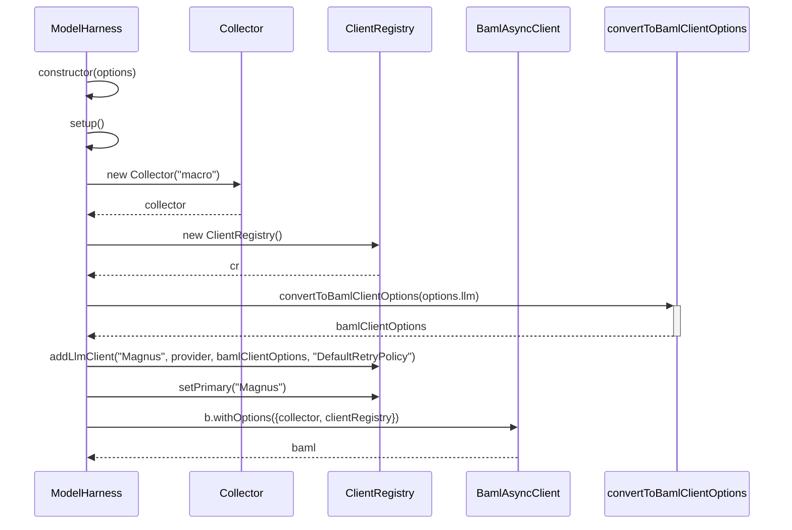

Sources: [packages/magnitude-core/src/ai/modelHarness.ts:27-51](https://github.com/agattani123/magnitude/blob/main/packages/magnitude-core/src/ai/modelHarness.ts#L27-L51)

## Partial Recipe Generation

The `partialAct` method is responsible for generating a partial recipe (action plan) based on the provided context, task, data, and action vocabulary. It utilizes the BAML instance to call the `CreatePartialRecipe` function, which returns a reasoning string and a list of actions.

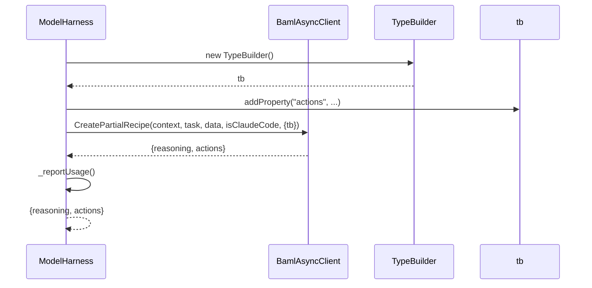

The `partialAct` method performs the following steps:

1. Create a `TypeBuilder` instance.
2. Add the `actions` property to the `PartialRecipe` type using the `TypeBuilder`.
3. Call the `CreatePartialRecipe` function on the BAML instance, passing the context, task, data, and whether the LLM is Claude Code.
4. Receive the response containing the reasoning and actions.
5. Report the LLM usage using the `_reportUsage` method.
6. Return the reasoning and actions.

Sources: [packages/magnitude-core/src/ai/modelHarness.ts:80-100](https://github.com/agattani123/magnitude/blob/main/packages/magnitude-core/src/ai/modelHarness.ts#L80-L100)

## Data Extraction

The `extract` method is used to extract data from a given set of instructions, a screenshot, and DOM content based on a provided schema. It utilizes the BAML instance to call the `ExtractData` function, which returns the extracted data conforming to the specified schema.

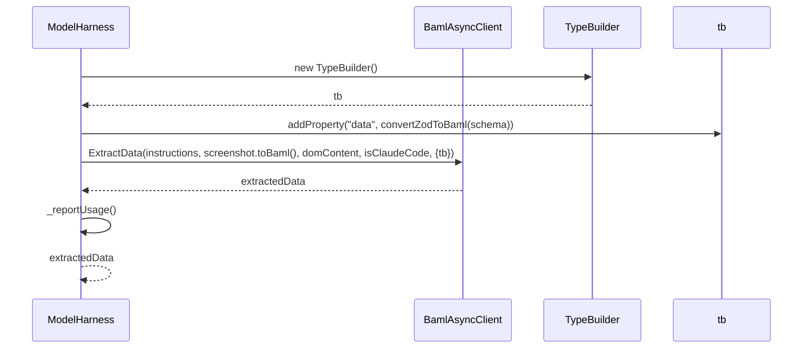

The `extract` method performs the following steps:

1. Create a `TypeBuilder` instance.
2. Add the `data` property to the `ExtractedData` type using the `TypeBuilder` and the provided schema.
3. Call the `ExtractData` function on the BAML instance, passing the instructions, screenshot, DOM content, and whether the LLM is Claude Code.
4. Receive the extracted data.
5. Report the LLM usage using the `_reportUsage` method.
6. Return the extracted data.

Sources: [packages/magnitude-core/src/ai/modelHarness.ts:102-125](https://github.com/agattani123/magnitude/blob/main/packages/magnitude-core/src/ai/modelHarness.ts#L102-L125)

## Memory Querying

The `query` method is used to query the memory based on a given context, query string, and schema. It utilizes the BAML instance to call the `QueryMemory` function, which returns the query response conforming to the specified schema.

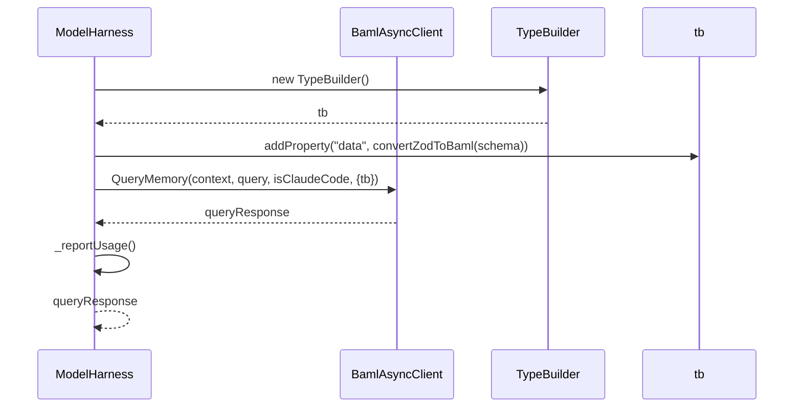

The `query` method performs the following steps:

1. Create a `TypeBuilder` instance.
2. Add the `data` property to the `QueryResponse` type using the `TypeBuilder` and the provided schema.
3. Call the `QueryMemory` function on the BAML instance, passing the context, query string, and whether the LLM is Claude Code.
4. Receive the query response.
5. Report the LLM usage using the `_reportUsage` method.
6. Return the query response.

Sources: [packages/magnitude-core/src/ai/modelHarness.ts:128-145](https://github.com/agattani123/magnitude/blob/main/packages/magnitude-core/src/ai/modelHarness.ts#L128-L145)

## LLM Usage Tracking and Cost Estimation

The `_reportUsage` method is responsible for tracking the LLM usage and estimating the associated costs. It retrieves the input and output token counts, as well as cache-related token counts (if applicable), from the LLM provider's response. It then calculates the cost based on a known cost map for various LLM providers and models.

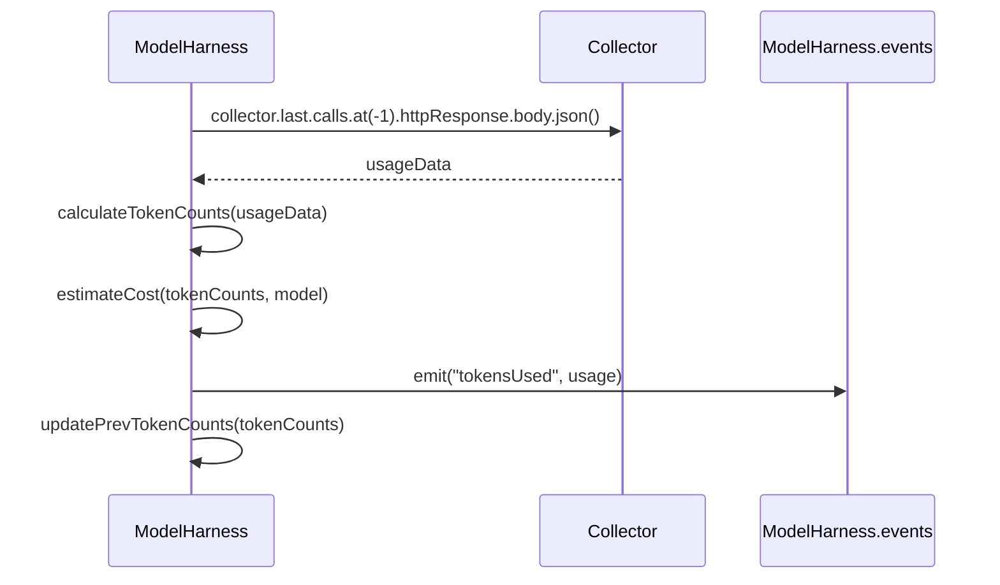

The `_reportUsage` method performs the following steps:

1. Retrieve the last HTTP response from the `Collector` instance.
2. Extract the usage data from the response.
3. Calculate the input and output token counts, as well as cache-related token counts (if applicable), based on the usage data.
4. Estimate the cost based on the token counts and the LLM model using a known cost map.
5. Emit a `tokensUsed` event with the calculated usage data.
6. Update the previous token counts for future usage calculations.

Sources: [packages/magnitude-core/src/ai/modelHarness.ts:52-79](https://github.com/agattani123/magnitude/blob/main/packages/magnitude-core/src/ai/modelHarness.ts#L52-L79)

## Conclusion

The `ModelHarness` class serves as a central component for interacting with large language models within the Magnitude project. It provides a unified interface for setting up the LLM, generating partial recipes, extracting data, querying memory, and tracking LLM usage and costs. By encapsulating these functionalities, the `ModelHarness` class simplifies the integration of LLMs into the project's workflows and enables efficient management of LLM resources.

Sources: [packages/magnitude-core/src/ai/modelHarness.ts](https://github.com/agattani123/magnitude/blob/main/packages/magnitude-core/src/ai/modelHarness.ts)