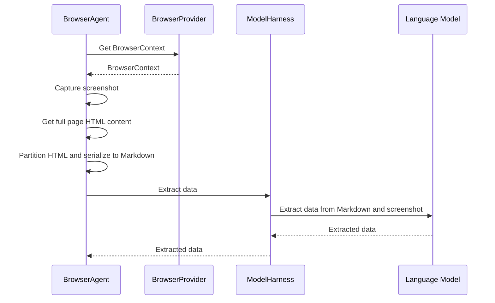
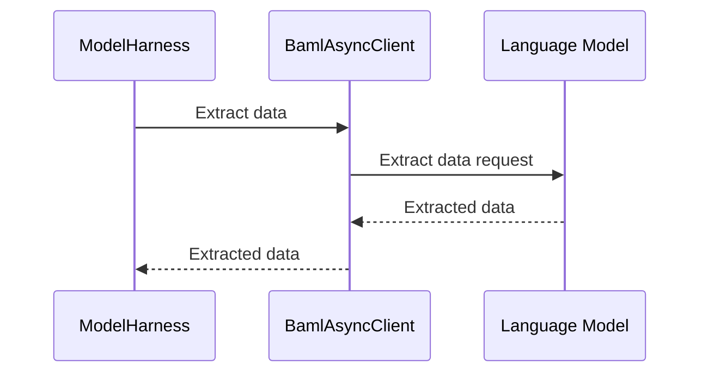
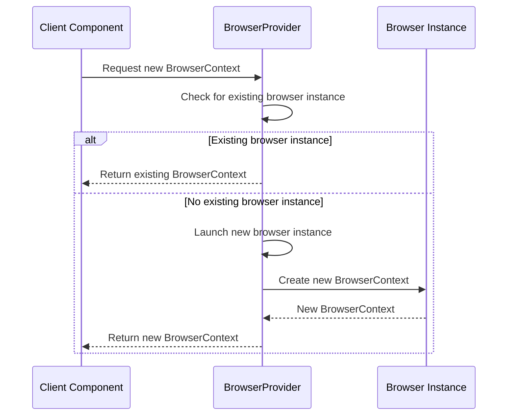
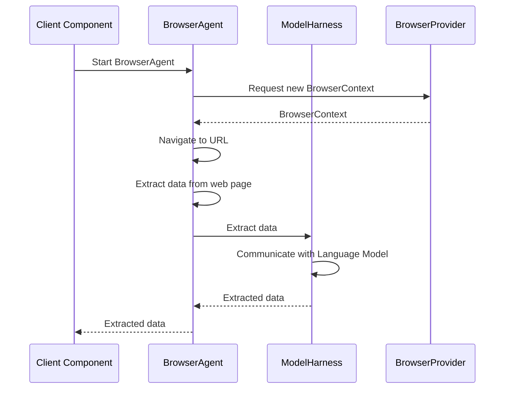

Relevant source files

The following files were used as context for generating this wiki page:

- [packages/magnitude-core/src/agent/browserAgent.ts](https://github.com/agattani123/magnitude/blob/main/packages/magnitude-core/src/agent/browserAgent.ts)
- [packages/magnitude-core/src/ai/modelHarness.ts](https://github.com/agattani123/magnitude/blob/main/packages/magnitude-core/src/ai/modelHarness.ts)
- [packages/magnitude-core/src/web/browserProvider.ts](https://github.com/agattani123/magnitude/blob/main/packages/magnitude-core/src/web/browserProvider.ts)
- [packages/magnitude-core/src/actions/types.ts](https://github.com/agattani123/magnitude/blob/main/packages/magnitude-core/src/actions/types.ts)
- [packages/magnitude-core/src/ai/baml_client/async_client.ts](https://github.com/agattani123/magnitude/blob/main/packages/magnitude-core/src/ai/baml_client/async_client.ts)

# Component Interactions

## Introduction

The "Component Interactions" in the Magnitude project refer to the interactions and communication between various components responsible for web automation, data extraction, and AI-driven decision-making. These interactions involve the BrowserAgent, ModelHarness, and BrowserProvider components, enabling the system to navigate web pages, extract data, and make intelligent decisions based on the extracted information.

The key components involved in this process are:

1. **BrowserAgent**: Responsible for interacting with web browsers, navigating to URLs, and extracting data from web pages using the Playwright library and the `magnitude-extract` package.
2. **ModelHarness**: Handles communication with the language model (LLM) and provides an interface for tasks such as data extraction, query answering, and decision-making.
3. **BrowserProvider**: Manages the lifecycle of browser instances and contexts, ensuring efficient reuse and sharing of resources.

These components work together to enable the Magnitude system to automate web interactions, extract relevant data, and make intelligent decisions based on the extracted information and the guidance provided by the language model.

## BrowserAgent

The `BrowserAgent` class is a subclass of the `Agent` class and is responsible for interacting with web browsers and extracting data from web pages. It utilizes the Playwright library and the `magnitude-extract` package for web automation and data extraction tasks.

### Architecture and Data Flow

The `BrowserAgent` class has the following key components and interactions:

1. **BrowserConnector**: An instance of the `BrowserConnector` class is used by the `BrowserAgent` to interact with the web browser. The `BrowserConnector` encapsulates the Playwright browser instance and provides methods for navigating to URLs and capturing screenshots.

2. **ModelHarness**: The `BrowserAgent` interacts with the `ModelHarness` to leverage the language model's capabilities for data extraction and decision-making tasks.

3. **Data Extraction**: The `extract` method of the `BrowserAgent` is responsible for extracting data from web pages based on provided instructions and a Zod schema. It utilizes the `magnitude-extract` package to partition the HTML content, serialize it to Markdown, and then pass it along with the screenshot to the `ModelHarness` for data extraction.

The data flow for the data extraction process is as follows:

Sources: [packages/magnitude-core/src/agent/browserAgent.ts](https://github.com/agattani123/magnitude/blob/main/packages/magnitude-core/src/agent/browserAgent.ts)

### Key Methods and Classes

- `BrowserAgent` class:
  - `extract`: Extracts data from the web page based on provided instructions and a Zod schema.
  - `nav`: Navigates the browser to the specified URL.

- `startBrowserAgent` function:
  - Creates and starts a new instance of the `BrowserAgent`.

Sources: [packages/magnitude-core/src/agent/browserAgent.ts](https://github.com/agattani123/magnitude/blob/main/packages/magnitude-core/src/agent/browserAgent.ts)

## ModelHarness

The `ModelHarness` class is responsible for interacting with the language model and providing an interface for tasks such as data extraction, query answering, and decision-making.

### Architecture and Data Flow

The `ModelHarness` class has the following key components and interactions:

1. **Language Model Client**: The `ModelHarness` is initialized with a `LLMClient` instance, which encapsulates the details of the language model provider and configuration.

2. **BAML Client**: The `ModelHarness` sets up a `BamlAsyncClient` instance, which is used to communicate with the language model using the Boundary AI Modeling Language (BAML).

3. **Data Extraction**: The `extract` method of the `ModelHarness` is used to extract data from a given set of instructions, a screenshot, and DOM content. It utilizes the `BamlAsyncClient` to send the data to the language model and receive the extracted data.

4. **Query Answering**: The `query` method of the `ModelHarness` is used to answer queries based on the provided context and a Zod schema. It leverages the `BamlAsyncClient` to communicate with the language model and retrieve the query response.

5. **Partial Act**: The `partialAct` method of the `ModelHarness` is used to generate a set of actions based on the provided context, task, and data. It utilizes the `BamlAsyncClient` to communicate with the language model and receive the reasoning and suggested actions.

The data flow for the data extraction process is as follows:

Sources: [packages/magnitude-core/src/ai/modelHarness.ts](https://github.com/agattani123/magnitude/blob/main/packages/magnitude-core/src/ai/modelHarness.ts)

### Key Methods and Classes

- `ModelHarness` class:
  - `extract`: Extracts data from provided instructions, screenshot, and DOM content using the language model.
  - `query`: Answers queries based on the provided context and a Zod schema using the language model.
  - `partialAct`: Generates a set of actions based on the provided context, task, and data using the language model.

- `BamlAsyncClient` class:
  - Provides an interface for communicating with the language model using the Boundary AI Modeling Language (BAML).

Sources: [packages/magnitude-core/src/ai/modelHarness.ts](https://github.com/agattani123/magnitude/blob/main/packages/magnitude-core/src/ai/modelHarness.ts), [packages/magnitude-core/src/ai/baml_client/async_client.ts](https://github.com/agattani123/magnitude/blob/main/packages/magnitude-core/src/ai/baml_client/async_client.ts)

## BrowserProvider

The `BrowserProvider` class is responsible for managing the lifecycle of browser instances and contexts, ensuring efficient reuse and sharing of resources.

### Architecture and Data Flow

The `BrowserProvider` class follows the Singleton pattern to ensure a single instance is shared across the application. It maintains a record of active browser instances and their associated contexts.

The data flow for creating a new browser context is as follows:

Sources: [packages/magnitude-core/src/web/browserProvider.ts](https://github.com/agattani123/magnitude/blob/main/packages/magnitude-core/src/web/browserProvider.ts)

### Key Methods and Classes

- `BrowserProvider` class:
  - `newContext`: Creates a new browser context based on the provided options or reuses an existing one.
  - `_launchOrReuseBrowser`: Launches a new browser instance or reuses an existing one based on the provided launch options.
  - `_createAndTrackContext`: Creates a new browser context and tracks its lifecycle.

Sources: [packages/magnitude-core/src/web/browserProvider.ts](https://github.com/agattani123/magnitude/blob/main/packages/magnitude-core/src/web/browserProvider.ts)

## Component Interactions

The interactions between the `BrowserAgent`, `ModelHarness`, and `BrowserProvider` components enable the Magnitude system to automate web interactions, extract data, and make intelligent decisions based on the extracted information and the guidance provided by the language model.

The high-level flow of component interactions is as follows:

1. The client component initiates the process by starting the `BrowserAgent`.
2. The `BrowserAgent` requests a new `BrowserContext` from the `BrowserProvider`.
3. The `BrowserProvider` either creates a new browser instance and context or reuses an existing one.
4. The `BrowserAgent` navigates to the desired URL using the `BrowserContext`.
5. The `BrowserAgent` extracts data from the web page using the `magnitude-extract` package.
6. The `BrowserAgent` passes the extracted data to the `ModelHarness` for further processing.
7. The `ModelHarness` communicates with the language model using the `BamlAsyncClient` to extract data, answer queries, or generate actions based on the provided data.
8. The `ModelHarness` returns the processed data to the `BrowserAgent`.
9. The `BrowserAgent` passes the processed data back to the client component.

This interaction between the components allows the Magnitude system to leverage the strengths of each component, enabling efficient web automation, data extraction, and intelligent decision-making based on the guidance provided by the language model.

Sources: [packages/magnitude-core/src/agent/browserAgent.ts](https://github.com/agattani123/magnitude/blob/main/packages/magnitude-core/src/agent/browserAgent.ts), [packages/magnitude-core/src/ai/modelHarness.ts](https://github.com/agattani123/magnitude/blob/main/packages/magnitude-core/src/ai/modelHarness.ts), [packages/magnitude-core/src/web/browserProvider.ts](https://github.com/agattani123/magnitude/blob/main/packages/magnitude-core/src/web/browserProvider.ts)

## Conclusion

The "Component Interactions" in the Magnitude project involve the coordination and communication between the `BrowserAgent`, `ModelHarness`, and `BrowserProvider` components. These interactions enable the system to automate web interactions, extract data from web pages, and make intelligent decisions based on the extracted information and the guidance provided by the language model. The `BrowserAgent` handles web automation and data extraction, the `ModelHarness` communicates with the language model, and the `BrowserProvider` manages the lifecycle of browser instances and contexts. By working together, these components enable the Magnitude system to leverage the strengths of each component and provide a powerful web automation and decision-making solution.